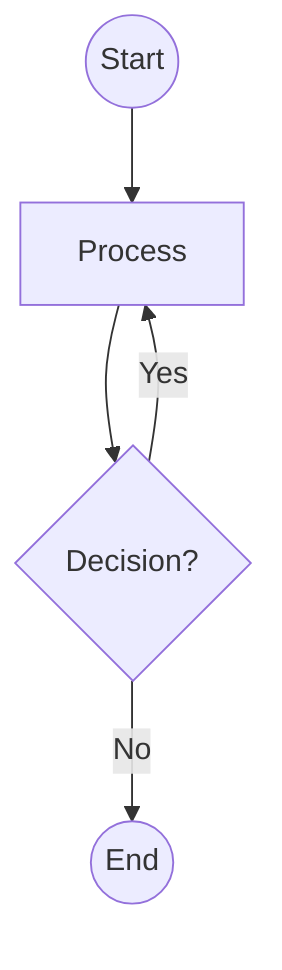
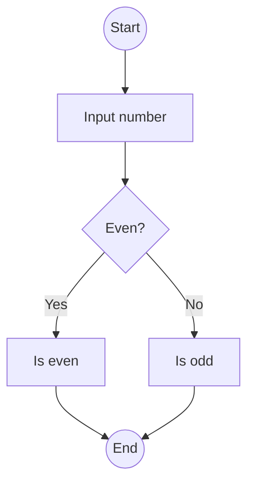
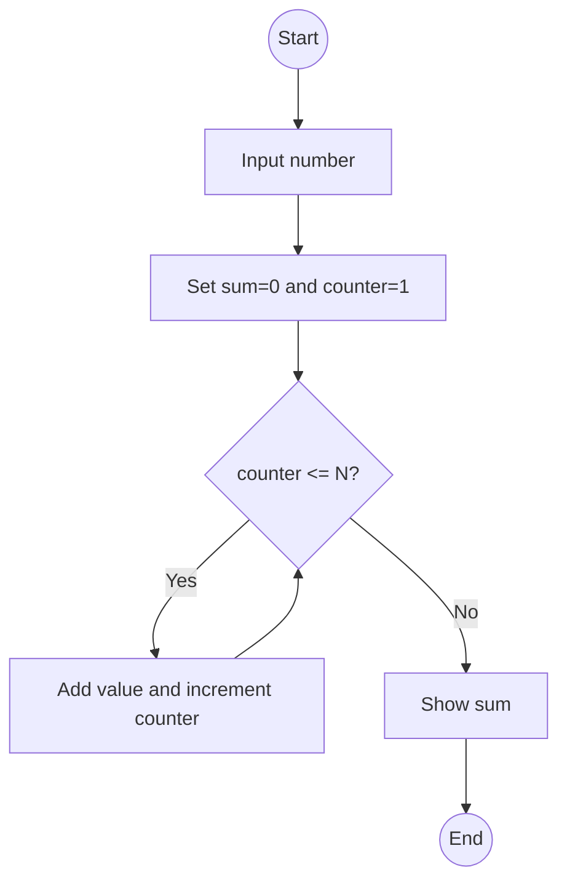

## Conditions: making decisions in code

Life is full of decisions: "If it rains, I'll take an umbrella. Otherwise, I'll wear sunglasses." These decisions are also present in the world of programming. Conditions are like questions the computer asks itself. They allow us to make decisions and execute specific code based on a condition[^1]. They can be as simple as "Is it raining?" or as complex as "Is it the weekend and do I have less than $100 in my bank account?".

### if

The `if` structure allows us to evaluate conditions and make decisions based on the result of that evaluation.

```python
age = 15

if age >= 18:
    print("You are an adult")
```

The code above allows executing a portion of code if a person's age is greater than or equal to 18 years.

### if-else

When you want to execute alternative code if the condition is false, you use the `if-else` structure.

```python
age = 21
if age >= 18:
    print("You are an adult")
else:
    print("You are a minor")
```

In this case, it determines if the person is an adult or a minor, and the message displayed is different.

### if-elif-else

When conditions are multiple and two paths are not enough, the `if-elif-else` structure is used to evaluate them in a chained way.

```python
age = 5
if age <= 13:
    print("You are a child")
elif age > 13 and age < 18:
    print("You are a teenager")
else:
    print("You are an adult")
```

In the code above, there are three clear paths: one for when age is less than or equal to 13, one for when age is between 13 and 18, and another for when age is greater than or equal to 18.

Another way to solve this problem is through the `switch-case` structure, which, although Python does not natively incorporate, other languages like Java or C++ do, and it is an important tool to be familiar with. This structure allows programmers to handle multiple conditions in a more organized way than a series of `if-elif-else`.

In Java, for example:

```java
int day = 3;
switch(day) {
  case 1:
    System.out.println("Monday");
    break;
  case 2:
    System.out.println("Tuesday");
    break;
  case 3:
    System.out.println("Wednesday");
    break;
  // ... and so on
  default:
    System.out.println("Invalid day");
}
```

In the previous example, depending on the value of `day`, the corresponding day will be printed[^2].

---

## Loops: repeating actions

Sometimes in programming we need to repeat an action several times. Instead of writing the same code many times, we can use loops. These allow repeating the execution of a block of code while a condition is met[^3].

### while

The `while` loop is useful when we want to repeat an action based on a condition.

```python
# Prints 1 to 5
i = 1
while i <= 5:
    print(i)
    i = i + 1
```

### do-while

Similar to `while` but guarantees at least one execution since the code block is executed first and then the condition is evaluated. Python does not implement this structure, but other languages like Java and C++ do.

```java
int i = 1;

do {
  System.out.println(i);
  i++;
} while(i <= 5);
```

```c++
int number = 0;
do {
  std::cout << "Hello, world!" << std::endl;
  number++;
} while (number < 5);
```

### for

The `for` loop is useful when we know how many times we want to repeat an action.

```python
for i in range(5):
    print("Hello, world!")
```

The code above will print "Hello, world!" five times.

We can also iterate over the elements of a list or iterable object:

```python
names = ["Maria", "Florencia", "Julian"]
for name in names:
    print(f"Hello {name}")

# Prints
# Hello Maria
# Hello Florencia
# Hello Julian
```

### The `break` and `continue` statements

We can use `break` to terminate the loop and `continue` to skip to the next iteration.

`break` is used to completely terminate the loop when a condition is met, in the following example, when `i` reaches 5.

```python
# break example
i = 0
while i < 10:
  print(i)
  if i == 5:
    break
  i += 1

# Prints:
# 0
# 1
# 2
# 3
# 4
# 5
```

`continue` is used to skip an iteration of the loop and continue with the next one when a condition is met. Here we use it to skip even numbers.

```python
# continue example
i = 0
while i < 10:
  i += 1
  if i % 2 == 0:
    continue
  print(i)

# Prints:
# 1
# 3
# 5
# 7
# 9
```

---

## Nesting: combining structures

Control flow structures can be nested within each other. For example, we can have loops within loops or conditions within loops.

```python
for i in range(5):
  for j in range(10):
    if (i % 2 == 0 and j % 3 == 0):
      print(f"i = {i}, j = {j}")
```

This code will print combinations of `i` and `j` only when `i` is divisible by 2 and `j` is divisible by 3, demonstrating how loops are nested and executed[^3].

---

## Common usage patterns

There are specific patterns to solve common needs with control flow.

### Search

Search for a value in a collection:

```python
fruits = ["apple", "orange"]

searching = "orange"
found = False

for fruit in fruits:
    if fruit == searching:
        found = True
        break

if found:
    print("Fruit found!")
```

### Accumulation

Accumulate incremental values in a loop:

```python
total = 0

for i in range(10):
    total += i

print(total) # Sum from 0..9 = 45
```

---

## Flowcharts: the visual route to understanding code

Programmers, whether beginners or experts, often find themselves facing challenges that require detailed planning before diving into code. This is where flowcharts come into play as an essential tool. These charts are graphical representations of the processes and logic behind a program or system. In this article, we will unravel the world of flowcharts, from basic concepts to advanced techniques, and how they can benefit programmers of all levels.

A flowchart is a graphical representation of a process. It uses specific symbols to represent different types of instructions or actions. Its main purpose is to simplify understanding of a process by showing step by step how information or decisions flow. These charts:

- Facilitate understanding of complex processes.
- Aid in the design and planning phase of a program.
- Serve as documentation and reference for future developments.

Flowcharts are a powerful tool that not only benefits beginners but also experienced programmers. They provide a clear and structured view of a process or program, facilitating planning, design, and communication between team members.

### Basic elements

Flowcharts consist of several symbols, each with a specific meaning:

- **Oval**: Represents the start or end of a process.
- **Rectangle**: Denotes an operation or instruction.
- **Diamond**: Indicates a decision based on a condition.
- **Arrows**: Show the direction of flow.



### Examples

Let's design a flowchart for a program that asks for a number and tells us if it's even or odd.



As programs become more complex, you may need to incorporate loops, multiple conditions, and other advanced elements into your flowchart. For example, here we diagram a program that sums numbers from 1 to a number entered by the user.



---

## Conclusion

Control flow is the heart of programming. Without it, programs would be linear sequences of actions without the ability to make decisions or repeat tasks. By mastering these structures not only do you improve your ability to write code, but also your ability to think logically and solve complex problems.

---

{}
Cheers for making it this far! I hope this journey through the programming universe has been as fascinating for you as it was for me to write down.

We're keen to hear your thoughts, so don't be shy – drop your comments, suggestions, and those bright ideas you're bound to have.

Also, to delve deeper than these lines, take a stroll through the practical examples we've cooked up for you. You'll find all the code and projects in our GitHub repository [learn-software-engineering/examples-programming](https://github.com/learn-software-engineering/examples-programming).

Thanks for being part of this learning community. Keep coding and exploring new territories in this captivating world of software!
{}

---

## References

[^1]: Lutz, M. (2013). Learning Python: Powerful Object-Oriented Programming. O'Reilly Media, Incorporated.
[^2]: Deitel, P., & Deitel, H. (2012). Java: How to program. Upper Saddle River, NJ: Prentice Hall.
[^3]: Matthes, E. (2015). Python crash course: A hands-on, project-based introduction to programming. San Francisco, CA: No Starch Press.
