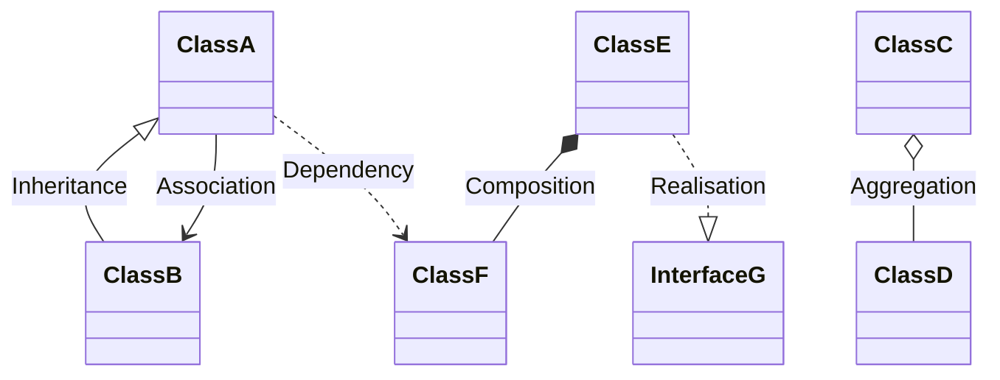
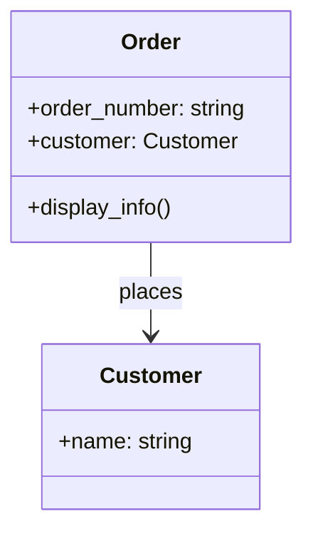
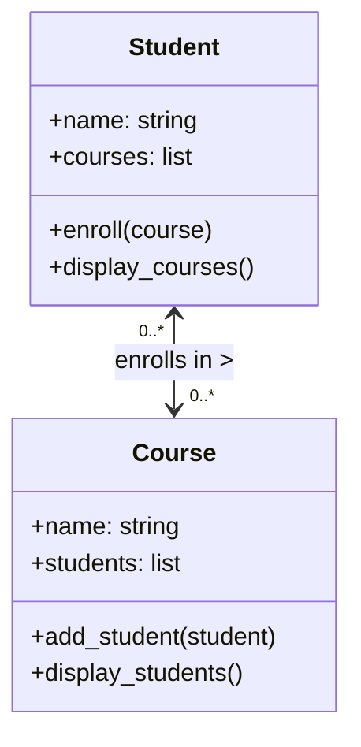
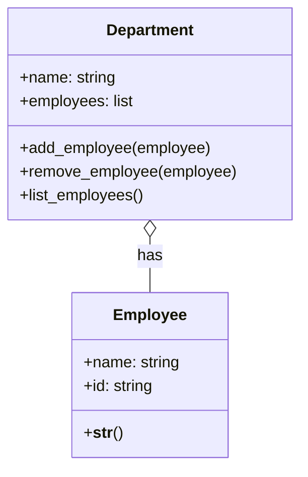
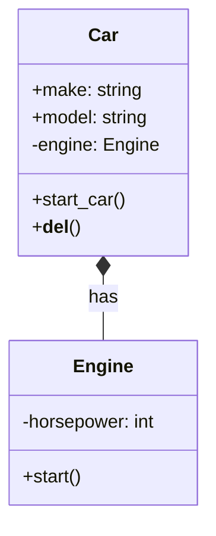
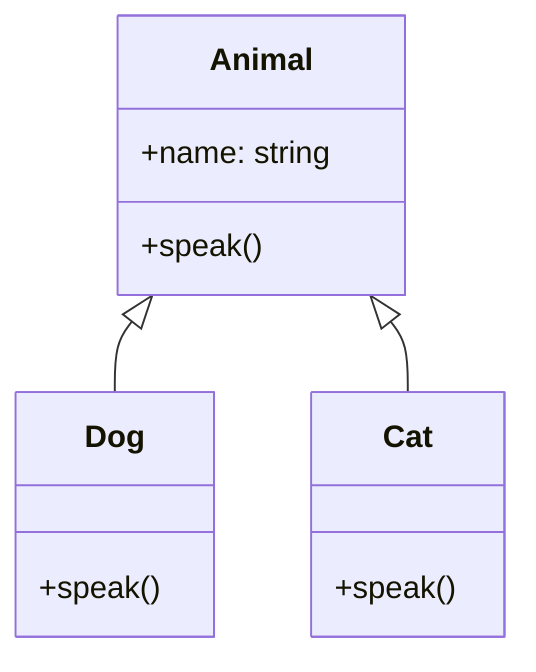
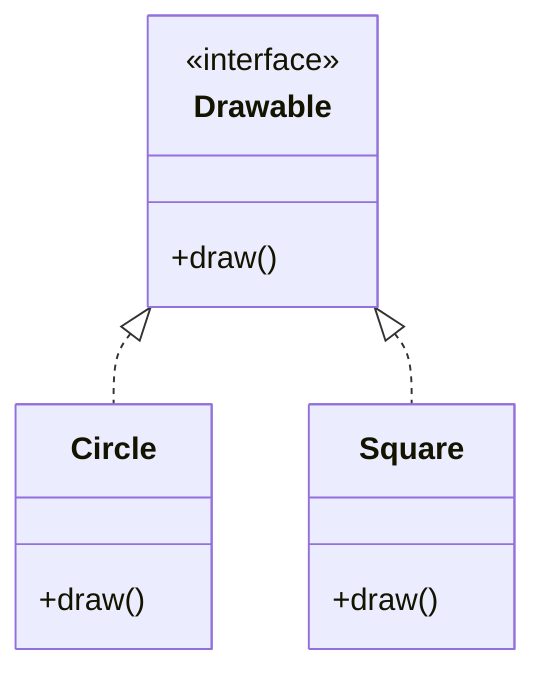
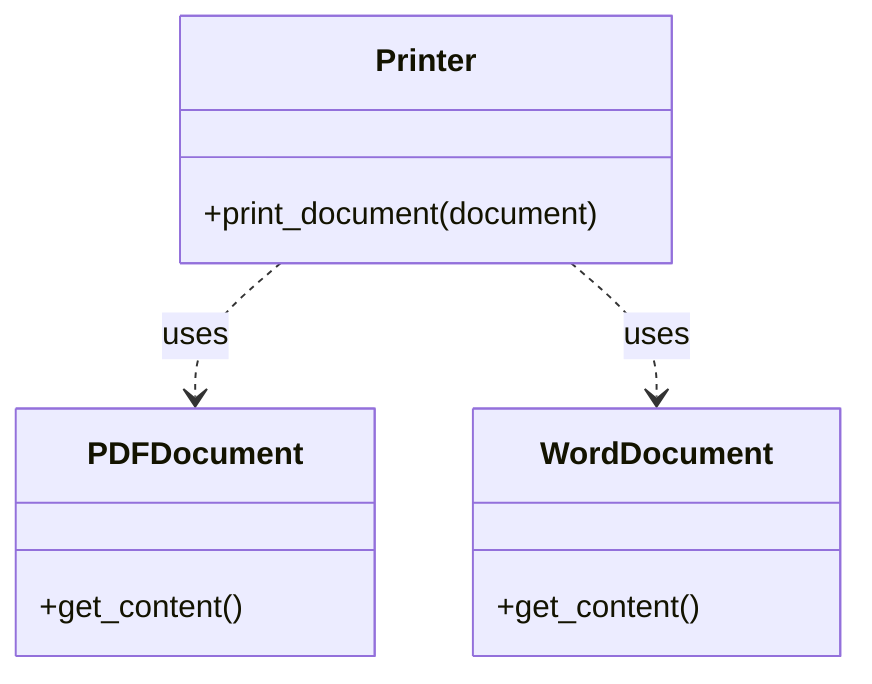

In Object-Oriented Programming, classes don't exist in isolation. They interact and relate to each other in various ways to model complex systems and relationships. Understanding these relationships is crucial for designing effective and maintainable object-oriented systems.

The main types of class relationships we'll explore in depth are:

1. Association (**"uses-a"**)
2. Aggregation (weak **"has-a"** relationship)
3. Composition (strong **"has-a"** relationship)
4. Inheritance (**"is-a"** relationship)
5. Realisation (Implementation)
6. Dependency

Each of these relationships represents a different way that classes can be connected and interact with each other. They vary in terms of the strength of the coupling between classes, the lifecycle dependencies, and the nature of the relationship.

Before we dive into each type of relationship, let's visualise them using a UML class diagram:



This diagram provides a high-level overview of the different types of class relationships. In the following sections, we'll explore each of these relationships in detail, providing explanations, examples, and more specific UML diagrams.

---

## Association

Association is the most basic and generic form of relationship between classes. It represents a connection between two classes where one class is aware of and can interact with another class. This relationship is often described as a **"uses-a"** relationship.

Key characteristics of association:
- It represents a loose coupling between classes.
- The associated classes can exist independently of each other.
- The lifetime of one class is not tied to the lifetime of the other.
- It can be unidirectional or bidirectional.

There are two main types of association:

1. Unidirectional Association
2. Bidirectional Association

Let's explore each of these in more detail.

### Unidirectional association

In a unidirectional association, one class knows about and can interact with another class, but not vice versa. This is a one-way relationship.

Here's an example in Python:

```python
class Customer:
    def __init__(self, name):
        self.name = name

class Order:
    def __init__(self, order_number, customer):
        self.order_number = order_number
        self.customer = customer  # This creates an association

    def display_info(self):
        return f"Order {self.order_number} placed by {self.customer.name}"

# Creating instances
customer = Customer("John Doe")
order = Order("12345", customer)

print(order.display_info())  # Output: Order 12345 placed by John Doe
```

In this example, the `Order` class has a unidirectional association with the `Customer` class. An `Order` knows about its associated `Customer`, but a `Customer` doesn't know about its `Order`s.

Here's a UML diagram representing this relationship:



The arrow in the diagram points from `Order` to `Customer`, indicating that `Order` knows about `Customer`, but not the other way around.

### Bidirectional association

In a bidirectional association, both classes are aware of each other and can interact with each other. This is a two-way relationship.

Here's an example in Python:

```python
class Student:
    def __init__(self, name):
        self.name = name
        self.courses = []

    def enroll(self, course):
        self.courses.append(course)
        course.add_student(self)

    def display_courses(self):
        return f"{self.name} is enrolled in: {', '.join(course.name for course in self.courses)}"

class Course:
    def __init__(self, name):
        self.name = name
        self.students = []

    def add_student(self, student):
        self.students.append(student)

    def display_students(self):
        return f"{self.name} has students: {', '.join(student.name for student in self.students)}"

# Creating instances
student1 = Student("Alice")
student2 = Student("Bob")
math_course = Course("Mathematics")
physics_course = Course("Physics")

# Enrolling students in courses
student1.enroll(math_course)
student1.enroll(physics_course)
student2.enroll(math_course)

print(student1.display_courses())
print(math_course.display_students())
```

In this example, there's a bidirectional association between `Student` and `Course`. A `Student` knows about their `Course`s, and a `Course` knows about its `Student`s.

Here's a UML diagram representing this relationship:



The double-headed arrow in the diagram indicates that both `Student` and `Course` are aware of each other. The "0..*" notation indicates that a `Student` can be enrolled in zero or more `Course`s, and a `Course` can have zero or more `Student`s.

Association is a flexible relationship that can represent many real-world connections between objects. It's important to choose between unidirectional and bidirectional associations carefully, as bidirectional associations can introduce more complexity and potential for errors if not managed properly.

---

## Aggregation

Aggregation is a specialised form of association that represents a **"whole-part"** or **"has-a"** relationship between classes. In aggregation, one class (the whole) contains references to objects of another class (the part), but the part can exist independently of the whole.

Key characteristics of aggregation:
- It's a stronger relationship than a simple association, but weaker than composition.
- The "part" object can exist independently of the "whole" object.
- Multiple "whole" objects can share the same "part" object.
- If the "whole" object is destroyed, the "part" object continues to exist.

Let's look at an example to illustrate aggregation:

```python
class Department:
    def __init__(self, name):
        self.name = name
        self.employees = []

    def add_employee(self, employee):
        self.employees.append(employee)

    def remove_employee(self, employee):
        self.employees.remove(employee)

    def list_employees(self):
        return f"Department {self.name} has employees: {', '.join(emp.name for emp in self.employees)}"

class Employee:
    def __init__(self, name, id):
        self.name = name
        self.id = id

    def __str__(self):
        return f"Employee(name={self.name}, id={self.id})"

# Creating instances
hr_dept = Department("Human Resources")
it_dept = Department("Information Technology")

emp1 = Employee("Alice", "E001")
emp2 = Employee("Bob", "E002")
emp3 = Employee("Charlie", "E003")

# Adding employees to departments
hr_dept.add_employee(emp1)
hr_dept.add_employee(emp2)
it_dept.add_employee(emp2)  # Note: Bob works in both HR and IT
it_dept.add_employee(emp3)

print(hr_dept.list_employees())
print(it_dept.list_employees())

# If we remove the HR department, the employees still exist
del hr_dept
print(emp1)  # Employee still exists
```

In this example, we have an aggregation relationship between `Department` and `Employee`. A `Department` has `Employee`s, but `Employee`s can exist independently of any particular `Department`. Also, an `Employee` can belong to multiple `Department`s (as we see with Bob).

Here's a UML diagram representing this aggregation relationship:



In this diagram, the open diamond on the `Department` side of the relationship indicates aggregation. This shows that `Department` is the "whole" and `Employee` is the "part" in this relationship.

It's important to note that while aggregation implies a whole-part relationship, the "part" (in this case, `Employee`) can exist independently and can even be part of multiple "wholes" (multiple `Department`s).

---

## Composition

Composition is a stronger form of aggregation. It's a **"whole-part"** relationship where the part cannot exist independently of the whole. In other words, the lifetime of the part is tied to the lifetime of the whole.

Key characteristics of composition:
- It represents a strong "has-a" relationship.
- The "part" object cannot exist independently of the "whole" object.
- When the "whole" object is destroyed, all its "part" objects are also destroyed.
- A "part" object belongs to only one "whole" object at a time.

Let's look at an example to illustrate composition:

```python
class Engine:
    def __init__(self, horsepower):
        self.horsepower = horsepower

    def start(self):
        return "Engine started"

class Car:
    def __init__(self, make, model, horsepower):
        self.make = make
        self.model = model
        self.engine = Engine(horsepower)  # Composition: Car creates its own Engine

    def start_car(self):
        return f"{self.make} {self.model}: {self.engine.start()}"

    def __del__(self):
        print(f"{self.make} {self.model} is being destroyed, and so is its engine.")

# Creating a Car instance
my_car = Car("Toyota", "Corolla", 150)
print(my_car.start_car())  # Output: Toyota Corolla: Engine started

# When we delete the Car, its Engine is also deleted
del my_car  # This will print: Toyota Corolla is being destroyed, and so is its engine.
```

In this example, we have a composition relationship between `Car` and `Engine`. A `Car` has an `Engine`, and the `Engine` cannot exist independently of the `Car`. When a `Car` object is created, it creates its own `Engine`. When the `Car` object is destroyed, its `Engine` is also destroyed.

Here's a UML diagram representing this composition relationship:



In this diagram, the filled diamond on the `Car` side of the relationship indicates composition. This shows that `Car` is the "whole" and `Engine` is the "part" in this relationship, and that the `Engine`'s lifetime is tied to the `Car`'s lifetime.

The key difference between aggregation and composition is the strength of the relationship and the lifecycle dependency. In aggregation, the "part" can exist independently of the "whole", while in composition, the "part" cannot exist without the "whole".

---

## Inheritance

Inheritance is a fundamental concept in OOP that allows a class (subclass or derived class) to inherit properties and methods from another class (superclass or base class). It represents an **"is-a"** relationship between classes.

Key characteristics of inheritance:
- It promotes code reuse and establishes a hierarchy between classes.
- The subclass inherits all public and protected members from the superclass.
- The subclass can add its own members and override inherited members.
- It supports the concept of polymorphism.

Let's look at an example to illustrate inheritance:

```python
class Animal:
    def __init__(self, name):
        self.name = name

    def speak(self):
        pass

class Dog(Animal):
    def speak(self):
        return f"{self.name} says Woof!"

class Cat(Animal):
    def speak(self):
        return f"{self.name} says Meow!"

# Creating instances
dog = Dog("Buddy")
cat = Cat("Whiskers")

print(dog.speak())  # Output: Buddy says Woof!
print(cat.speak())  # Output: Whiskers says Meow!

# Demonstrating polymorphism
def animal_sound(animal):
    print(animal.speak())

animal_sound(dog)  # Output: Buddy says Woof!
animal_sound(cat)  # Output: Whiskers says Meow!
```

In this example, we have a base class `Animal` and two derived classes `Dog` and `Cat`. Both `Dog` and `Cat` inherit from `Animal` and override the `speak` method.

Here's a UML diagram representing this inheritance relationship:



In this diagram, the arrows pointing from `Dog` and `Cat` to `Animal` indicate inheritance. This shows that `Dog` and `Cat` are subclasses of `Animal`.

Inheritance is a powerful feature of OOP, but it should be used judiciously. Overuse of inheritance can lead to complex class hierarchies that are difficult to understand and maintain. The principle of **"composition over inheritance"** suggests that it's often better to use composition (*has-a* relationship) rather than inheritance (*is-a* relationship) when designing class relationships.

---

## Realisation (Implementation)

Realisation, also known as implementation, is a relationship between a class and an interface. It indicates that a class implements the behaviour specified by an interface.

Key characteristics of realisation:
- It represents a contract that the implementing class must fulfill.
- The class must provide implementations for all methods declared in the interface.
- It allows for polymorphism through interfaces.

Python doesn't have a built-in interface concept like some other languages (e.g., Java), but we can simulate interfaces using abstract base classes. Here's an example:

```python
from abc import ABC, abstractmethod

class Drawable(ABC):
    @abstractmethod
    def draw(self):
        pass

class Circle(Drawable):
    def draw(self):
        return "Drawing a circle"

class Square(Drawable):
    def draw(self):
        return "Drawing a square"

def draw_shape(shape: Drawable):
    print(shape.draw())

# Creating instances
circle = Circle()
square = Square()

# Using polymorphism through the interface
draw_shape(circle)  # Output: Drawing a circle
draw_shape(square)  # Output: Drawing a square
```

In this example, `Drawable` is an abstract base class that acts like an interface. Both `Circle` and `Square` implement the `Drawable` interface by providing their own implementation of the `draw` method.

Here's a UML diagram representing this realisation relationship:



In this diagram, the dashed arrows pointing from `Circle` and `Square` to `Drawable` indicate realisation. This shows that `Circle` and `Square` implement the `Drawable` interface.

Realisation is a powerful concept that allows for designing loosely coupled systems. By programming to interfaces rather than concrete implementations, we can create more flexible and extensible software.

---

## Dependency

Dependency is the weakest form of relationship between classes. It exists when one class uses another class, typically as a method parameter, local variable, or return type.

Key characteristics of dependency:
- It represents a "uses" relationship between classes.
- It's a weaker relationship compared to association, aggregation, or composition.
- Changes in the used class may affect the using class.

Here's an example to illustrate dependency:

```python
class Printer:
    def print_document(self, document):
        return f"Printing: {document.get_content()}"

class PDFDocument:
    def get_content(self):
        return "PDF content"

class WordDocument:
    def get_content(self):
        return "Word document content"

# Using the Printer
printer = Printer()
pdf = PDFDocument()
word = WordDocument()

print(printer.print_document(pdf))   # Output: Printing: PDF content
print(printer.print_document(word))  # Output: Printing: Word document content
```

In this example, the `Printer` class has a dependency on both `PDFDocument` and `WordDocument` classes. The `Printer` uses these classes in its `print_document` method, but it doesn't maintain a long-term relationship with them.

Here's a UML diagram representing these dependency relationships:



In this diagram, the dashed arrows pointing from `Printer` to `PDFDocument` and `WordDocument` indicate dependency. This shows that `Printer` uses these classes, but doesn't have a stronger relationship with them.

Dependency is often used to reduce coupling between classes. By depending on abstractions (like interfaces) rather than concrete classes, we can make our code more flexible and easier to change.

---

## Comparing and contrasting relations

Now that we've explored the various types of class relations, let's compare and contrast them to better understand when to use each:

1. **Association vs Aggregation vs Composition**
   - Association is the most general relationship, representing any connection between classes.
   - Aggregation is a specialised association representing a whole-part relationship where the part can exist independently.
   - Composition is the strongest whole-part relationship where the part cannot exist independently of the whole.

2. **Inheritance vs Composition**
   - Inheritance represents an "is-a" relationship (e.g., a Dog is an Animal).
   - Composition represents a "has-a" relationship (e.g., a Car has an Engine).
   - The principle of "composition over inheritance" suggests favoring composition for more flexible designs.

3. **Realisation vs Inheritance**
   - Realisation is about implementing an interface, focusing on behaviour.
   - Inheritance is about extending a class, inheriting both state and behaviour.

4. **Dependency vs Association**
   - Dependency is a weaker, often temporary relationship (e.g., a method parameter).
   - Association implies a more permanent relationship, often represented by a class attribute.

Here's a comparison table summarising these relationships:

| Relationship | Strength | Lifecycle Binding | "Is-a" or "Has-a" | Symbol in UML |
|--------------|----------|-------------------|-------------------|---------------|
| Dependency   | Weakest  | None              | Uses              | - - - - >     |
| Association  | Weak     | Independent       | Has-a (loose)     | ———>          |
| Aggregation  | Medium   | Independent       | Has-a             | ◇———>         |
| Composition  | Strong   | Dependent         | Has-a (strong)    | ♦———>         |
| Inheritance  | Strong   | N/A               | Is-a              | ———|>         |
| Realisation  | Medium   | N/A               | Behaves-as        | - - - |>      |

---

## Common pitfalls

While class relationships are powerful tools in OOP, they can also lead to common pitfalls if not used carefully. Here are some common issues and how to avoid them:

1. **Overuse of inheritance**
   - *Problem*: Creating deep inheritance hierarchies that are hard to understand and maintain.
   - *Solution*: Prefer composition over inheritance. Use inheritance only for genuine "is-a" relationships.

2. **Tight coupling**
   - *Problem*: Creating strong dependencies between classes, making the system rigid and hard to change.
   - *Solution*: Use interfaces and dependency injection to reduce coupling. Depend on abstractions rather than concrete classes.

3. **God objects**
   - *Problem*: Creating classes that try to do too much, violating the Single Responsibility Principle.
   - *Solution*: Break large classes into smaller, more focused classes. Use composition to bring functionality together.

4. **Circular dependencies**
   - *Problem*: Creating mutual dependencies between classes, leading to complex and hard-to-maintain code.
   - *Solution*: Refactor to remove circular dependencies. Consider using interfaces or introducing a new class to break the cycle.

5. **Leaky abstractions**
   - *Problem*: Exposing implementation details through interfaces or base classes.
   - *Solution*: Design interfaces and base classes carefully. Hide implementation details and expose only what's necessary.

6. **Inappropriate intimacy**
   - *Problem*: Classes that know too much about each other's internal details.
   - *Solution*: Encapsulate data and behaviour. Use public interfaces to interact between classes.

7. **Brittle base classes**
   - *Problem*: Changes to base classes breaking derived classes in unexpected ways.
   - *Solution*: Design base classes for extension. Document how derived classes should interact with base classes.

8. **Diamond problem in multiple inheritance**
   - *Problem*: Ambiguity in method resolution when a class inherits from two classes with a common ancestor.
   - *Solution*: Avoid multiple inheritance if possible. Use interfaces or mixins instead.

9. **Overuse of getters and setters**
   - *Problem*: Breaking encapsulation by providing unrestricted access to internal state.
   - *Solution*: Use meaningful methods that represent behaviors rather than exposing internal data directly.

10. **Violation of Liskov Substitution Principle**
    - *Problem*: Derived classes that can't be used interchangeably with their base classes.
    - *Solution*: Ensure that derived classes truly represent specialisations of their base classes. Use composition if the "is-a" relationship doesn't hold.

By being aware of these pitfalls and following best practices, you can create more robust and maintainable object-oriented designs.

---

## Conclusion

Understanding class relationships is crucial for effective object-oriented design and programming. We've explored various types of relationships including association, aggregation, composition, inheritance, realisation, and dependency. Each of these relationships serves a specific purpose and has its own strengths and weaknesses.

Key takeaways:

1. **Association** is a general relationship between classes.
2. **Aggregation** represents a whole-part relationship where parts can exist independently.
3. **Composition** is a stronger whole-part relationship where parts cannot exist independently.
4. **Inheritance** represents an "is-a" relationship and promotes code reuse.
5. **Realisation** is about implementing interfaces and focusing on behaviour.
6. **Dependency** is a weak, often temporary relationship between classes.

Remember that good object-oriented design is not just about using these relationships, but about using them appropriately. Always consider the SOLID principles and the "composition over inheritance" guideline.

---

## References

1. Gamma, E., Helm, R., Johnson, R., & Vlissides, J. (1994). Design Patterns: Elements of Reusable Object-Oriented Software. Addison-Wesley.
2. Martin, R. C. (2017). Clean Architecture: A Craftsman's Guide to Software Structure and Design. Prentice Hall.
3. Fowler, M. (2002). Patterns of Enterprise Application Architecture. Addison-Wesley.
4. Bloch, J. (2018). Effective Java (3rd ed.). Addison-Wesley.
5. Phillips, D. (2018). Python 3 Object-Oriented Programming (3rd ed.). Packt Publishing.
6. Lott, S. F. (2020). Object-Oriented Python: Master OOP by Building Games and GUIs. No Starch Press.
7. Booch, G., Rumbaugh, J., & Jacobson, I. (2005). The Unified Modeling Language User Guide (2nd ed.). Addison-Wesley.

---

{}
Cheers for making it this far! I hope this journey through the programming universe has been as fascinating for you as it was for me to write down.

We're keen to hear your thoughts, so don't be shy – drop your comments, suggestions, and those bright ideas you're bound to have.

Also, to delve deeper than these lines, take a stroll through the practical examples we've cooked up for you. You'll find all the code and projects in our GitHub repository [learn-software-engineering/examples-programming](https://github.com/learn-software-engineering/examples-programming).

Thanks for being part of this learning community. Keep coding and exploring new territories in this captivating world of software!
{}

---
