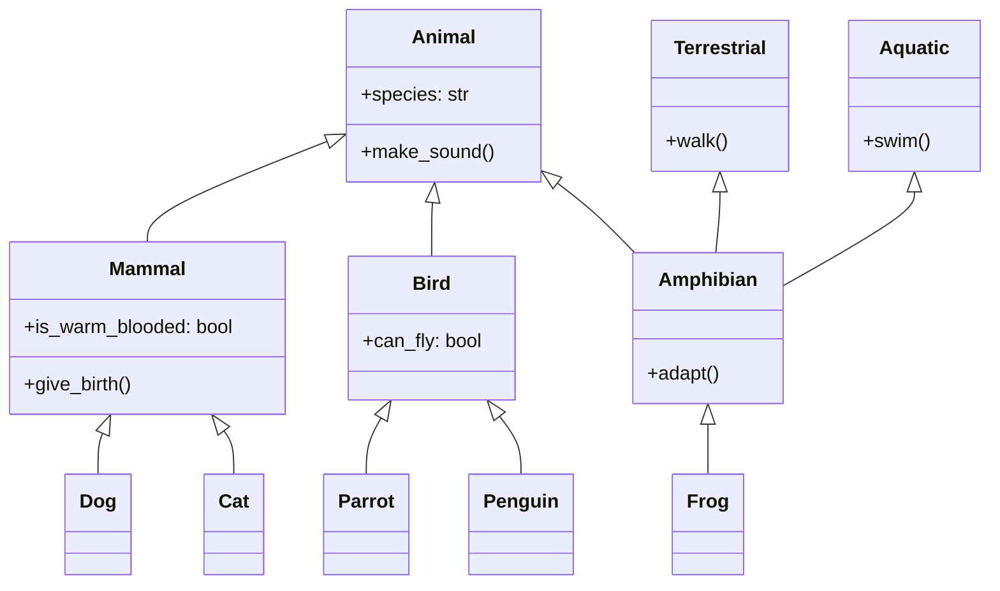

## Encapsulation

Encapsulation is often described as the first pillar of object-oriented programming. It is the mechanism of bundling the data (attributes) and the methods (functions) that operate on the data within a single unit or object. This concept is also often referred to as data hiding because the object's internal representation is hidden from the outside world.

The importance of encapsulation lies in several key aspects:

1. **Data protection**: By controlling access to object data through methods, we can ensure that the data remains consistent and valid.
2. **Modularity**: Encapsulation allows objects to be self-contained, making it easier to understand and maintain code.
3. **Flexibility**: The internal implementation can be changed without affecting other parts of the code that use the object.
4. **Reduced complexity**: By hiding the details of internal workings, encapsulation reduces the complexity of the overall system from an external perspective.

### Implementation in Python

Python provides several mechanisms to implement encapsulation. Let's explore these with examples:

#### 1. Using private attributes

In Python, we can create private attributes by prefixing the attribute name with double underscores (`__`). This triggers name mangling, which makes the attribute harder to access from outside the class.

```python
class BankAccount:
    def __init__(self, account_number, balance):
        self.__account_number = account_number  # Private attribute
        self.__balance = balance  # Private attribute

    def deposit(self, amount):
        if amount > 0:
            self.__balance += amount
            return True
        return False

    def withdraw(self, amount):
        if 0 < amount <= self.__balance:
            self.__balance -= amount
            return True
        return False

    def get_balance(self):
        return self.__balance

# Usage
account = BankAccount("1234567890", 1000)
print(account.get_balance())  # Output: 1000
account.deposit(500)
print(account.get_balance())  # Output: 1500
account.withdraw(200)
print(account.get_balance())  # Output: 1300

# This will raise an AttributeError
# print(account.__balance)
```

In this example:
- `__account_number` and `__balance` are private attributes.
- We provide public methods (`deposit`, `withdraw`, `get_balance`) to interact with these private attributes.
- Direct access to `__balance` from outside the class will raise an `AttributeError` exception.

#### 2. Using properties

Python's `@property` decorator allows us to define methods that can be accessed like attributes, providing a more Pythonic way of implementing getters and setters.

```python
class Circle:
    def __init__(self, radius):
        self._radius = radius

    @property
    def radius(self):
        return self._radius

    @radius.setter
    def radius(self, value):
        if value > 0:
            self._radius = value
        else:
            raise ValueError("Radius must be positive")

    @property
    def area(self):
        return 3.14159 * self._radius ** 2

# Usage
circle = Circle(5)
print(circle.radius)  # Output: 5
print(circle.area)    # Output: 78.53975

circle.radius = 7
print(circle.radius)  # Output: 7
print(circle.area)    # Output: 153.93791

# This will raise a ValueError
# circle.radius = -1
```

In this example:
- `_radius` is a protected attribute (single underscore is a convention for protected attributes in Python).
- The `radius` property provides get and set access to `_radius` with validation.
- The `area` property is read-only and calculated on-the-fly.

### Benefits and best practices

The benefits of encapsulation are numerous:

1. **Improved maintainability**: Changes to the internal implementation don't affect external code that uses the class.
2. **Enhanced security**: Private attributes can't be accidentally modified from outside the class.
3. **Flexibility in implementation**: You can change how data is stored or calculated without changing the public interface.
4. **Better abstraction**: Users of the class don't need to know about its internal workings.

Best practices for encapsulation in Python include:

- Use private attributes (double underscore prefix) for data that should not be accessed directly from outside the class.
- Provide public methods or properties for controlled access to internal data.
- Use properties instead of get/set methods for a more Pythonic approach.
- Document the public interface clearly, including any side effects of methods.

Let's look at a more complex example that demonstrates these practices:

```python
class Employee:
    def __init__(self, name, salary):
        self.__name = name
        self.__salary = salary
        self.__projects = []

    @property
    def name(self):
        return self.__name

    @property
    def salary(self):
        return self.__salary

    @salary.setter
    def salary(self, value):
        if value > 0:
            self.__salary = value
        else:
            raise ValueError("Salary must be positive")

    def add_project(self, project):
        """
        Add a project to the employee's project list.

        :param project: string representing the project name
        """
        self.__projects.append(project)

    def remove_project(self, project):
        """
        Remove a project from the employee's project list.

        :param project: string representing the project name
        :return: True if project was removed, False if not found
        """
        if project in self.__projects:
            self.__projects.remove(project)
            return True
        return False

    @property
    def project_count(self):
        return len(self.__projects)

    def __str__(self):
        return f"Employee: {self.__name}, Salary: ${self.__salary}, Projects: {self.project_count}"

# Usage
emp = Employee("John Doe", 50000)
print(emp.name)  # Output: John Doe
print(emp.salary)  # Output: 50000

emp.add_project("Project A")
emp.add_project("Project B")
print(emp.project_count)  # Output: 2

emp.salary = 55000
print(emp)  # Output: Employee: John Doe, Salary: $55000, Projects: 2

emp.remove_project("Project A")
print(emp.project_count)  # Output: 1

# This will raise an AttributeError
# print(emp.__projects)
```

This example demonstrates:
- Private attributes (`__name`, `__salary`, `__projects`)
- Properties for controlled access (`name`, `salary`, `project_count`)
- Public methods for manipulating private data (`add_project`, `remove_project`)
- Clear documentation of method behavior
- A custom `__str__` method for a nice string representation of the object

By following these practices, we create a class that is both flexible and robust, embodying the principle of encapsulation.

---

## Inheritance

Inheritance is a fundamental concept in object-oriented programming that allows a new class to be based on an existing class. The new class, known as the derived or child class, inherits attributes and methods from the existing class, called the base or parent class. This mechanism promotes code reuse and establishes a relationship between classes.

Key aspects of inheritance include:

1. **Code reusability**: Inheritance allows us to reuse code from existing classes, reducing redundancy and promoting efficient development.
2. **Hierarchical classification**: It enables the creation of class hierarchies, representing relationships and commonalities among objects.
3. **Extensibility**: New functionality can be added to existing classes without modifying them, following the open-closed principle.
4. **Polymorphism**: Inheritance is a prerequisite for runtime polymorphism (which we'll discuss in detail later).

### Types of inheritance

There are several types of inheritance, though not all programming languages support all types. The main types are:

1. **Single inheritance**: A derived class inherits from a single base class.
2. **Multiple inheritance**: A derived class inherits from multiple base classes.
3. **Multilevel inheritance**: A derived class inherits from another derived class.
4. **Hierarchical inheritance**: Multiple derived classes inherit from a single base class.
5. **Hybrid inheritance**: A combination of two or more types of inheritance.

Python supports all these types of inheritance. Let's explore each with examples.

#### Single inheritance

Single inheritance is the simplest form of inheritance, where a class inherits from one base class.

```python
class Animal:
    def __init__(self, species):
        self.species = species

    def make_sound(self):
        pass

class Dog(Animal):
    def __init__(self, name):
        super().__init__("Canine")
        self.name = name

    def make_sound(self):
        return "Woof!"

# Usage
dog = Dog("Buddy")
print(f"{dog.name} is a {dog.species}")  # Output: Buddy is a Canine
print(dog.make_sound())  # Output: Woof!
```

In this example:
- `Animal` is the base class with a generic `make_sound` method.
- `Dog` is derived from `Animal`, inheriting its attributes and methods.
- `Dog` overrides the `make_sound` method with its own implementation.
- We use `super().__init__()` to call the initialiser of the base class.

#### Multiple inheritance

Multiple inheritance allows a class to inherit from multiple base classes.

```python
class Flyer:
    def fly(self):
        return "I can fly!"

class Swimmer:
    def swim(self):
        return "I can swim!"

class Duck(Animal, Flyer, Swimmer):
    def __init__(self, name):
        Animal.__init__(self, "Aves")
        self.name = name

    def make_sound(self):
        return "Quack!"

# Usage
duck = Duck("Donald")
print(f"{duck.name} is a {duck.species}")  # Output: Donald is a Aves
print(duck.make_sound())  # Output: Quack!
print(duck.fly())  # Output: I can fly!
print(duck.swim())  # Output: I can swim!
```

Here, `Duck` inherits from `Animal`, `Flyer`, and `Swimmer`, combining attributes and methods from all three.

#### Multilevel inheritance

In multilevel inheritance, a derived class inherits from another derived class.

```python
class Mammal(Animal):
    def __init__(self, species, is_warm_blooded=True):
        super().__init__(species)
        self.is_warm_blooded = is_warm_blooded

    def give_birth(self):
        return "Giving birth to live young"

class Cat(Mammal):
    def __init__(self, name):
        super().__init__("Feline")
        self.name = name

    def make_sound(self):
        return "Meow!"

# Usage
cat = Cat("Whiskers")
print(f"{cat.name} is a {cat.species}")  # Output: Whiskers is a Feline
print(cat.make_sound())  # Output: Meow!
print(cat.give_birth())  # Output: Giving birth to live young
print(f"Is warm-blooded: {cat.is_warm_blooded}")  # Output: Is warm-blooded: True
```

In this example, `Cat` inherits from `Mammal`, which in turn inherits from `Animal`, forming a multilevel inheritance chain.

#### Hierarchical inheritance

Hierarchical inheritance involves multiple derived classes inheriting from a single base class.

```python
class Bird(Animal):
    def __init__(self, species, can_fly=True):
        super().__init__(species)
        self.can_fly = can_fly

class Parrot(Bird):
    def __init__(self, name):
        super().__init__("Psittacine", can_fly=True)
        self.name = name

    def make_sound(self):
        return "Squawk!"

class Penguin(Bird):
    def __init__(self, name):
        super().__init__("Spheniscidae", can_fly=False)
        self.name = name

    def make_sound(self):
        return "Honk!"

# Usage
parrot = Parrot("Polly")
penguin = Penguin("Pingu")

print(f"{parrot.name} can fly: {parrot.can_fly}")  # Output: Polly can fly: True
print(f"{penguin.name} can fly: {penguin.can_fly}")  # Output: Pingu can fly: False
```

Here, both `Parrot` and `Penguin` inherit from `Bird`, which demonstrates hierarchical inheritance.

#### Hybrid inheritance

Hybrid inheritance is a combination of multiple inheritance types. Let's create a more complex example to illustrate this:

```python
class Terrestrial:
    def walk(self):
        return "Walking on land"

class Aquatic:
    def swim(self):
        return "Swimming in water"

class Amphibian(Animal, Terrestrial, Aquatic):
    def __init__(self, species):
        Animal.__init__(self, species)

    def adapt(self):
        return "Can survive both on land and in water"

class Frog(Amphibian):
    def __init__(self, name):
        super().__init__("Anura")
        self.name = name

    def make_sound(self):
        return "Ribbit!"

# Usage
frog = Frog("Kermit")
print(f"{frog.name} is a {frog.species}")  # Output: Kermit is a Anura
print(frog.make_sound())  # Output: Ribbit!
print(frog.walk())  # Output: Walking on land
print(frog.swim())  # Output: Swimming in water
print(frog.adapt())  # Output: Can survive both on land and in water
```

This example demonstrates hybrid inheritance:
- `Frog` inherits from `Amphibian`
- `Amphibian` inherits from `Animal`, `Terrestrial`, and `Aquatic`
- This creates a combination of multilevel and multiple inheritance

### Considerations

Inheritance offers several advantages. However, there are also important considerations:

1. **Complexity**: Deep inheritance hierarchies can become difficult to understand and maintain.
2. **Tight coupling**: Inheritance creates a tight coupling between base and derived classes.
3. **Fragile base class problem**: Changes in the base class can unexpectedly affect derived classes.
4. **Diamond problem**: In multiple inheritance, conflicts can arise if two base classes have methods with the same name.

To address these considerations:

- Prefer composition over inheritance when possible.
- Keep inheritance hierarchies shallow and focused.
- Use abstract base classes to define clear interfaces.
- Be cautious with multiple inheritance and resolve conflicts explicitly.

Let's visualise the inheritance relationships we've discussed using an UML class diagram:



This diagram illustrates the inheritance relationships between the classes we've discussed, showing both single and multiple inheritance.

---

## Polymorphism

Polymorphism is a core concept in object-oriented programming that allows objects of different classes to be treated as objects of a common base class. The term "polymorphism" comes from Greek, meaning "many forms". In OOP, it refers to the ability of a single interface to represent different underlying forms (data types or classes).

Polymorphism enables writing flexible and reusable code by allowing us to work with objects at a more abstract level, without needing to know their specific types.

There are two main types of polymorphism in object-oriented programming:

1. **Compile-time polymorphism (Static polymorphism)**
   - Achieved through method *overloading*.
   - Resolved at compile time.

2. **Runtime polymorphism (Dynamic polymorphism)**
   - Achieved through method *overriding*.
   - Resolved at runtime.

Python primarily supports runtime polymorphism, as it is a dynamically typed language. However, we can demonstrate concepts similar to compile-time polymorphism as well.

Let's explore different aspects of polymorphism in Python:

### Duck typing

Python uses duck typing, which is a form of polymorphism. The idea is: "If it walks like a duck and quacks like a duck, then it must be a duck." In other words, Python cares more about the methods an object has than the type of the object itself.

```python
class Duck:
    def speak(self):
        return "Quack quack!"

class Dog:
    def speak(self):
        return "Woof woof!"

class Cat:
    def speak(self):
        return "Meow meow!"

def animal_sound(animal):
    return animal.speak()

# Usage
duck = Duck()
dog = Dog()
cat = Cat()

print(animal_sound(duck))  # Output: Quack quack!
print(animal_sound(dog))   # Output: Woof woof!
print(animal_sound(cat))   # Output: Meow meow!
```

In this example, `animal_sound()` works with any object that has a `speak()` method, regardless of its class.

### Method overriding

Method overriding is a key aspect of runtime polymorphism. It occurs when a derived class defines a method with the same name as a method in its base class.

```python
class Shape:
    def area(self):
        pass

class Rectangle(Shape):
    def __init__(self, width, height):
        self.width = width
        self.height = height

    def area(self):
        return self.width * self.height

class Circle(Shape):
    def __init__(self, radius):
        self.radius = radius

    def area(self):
        return 3.14159 * self.radius ** 2

# Usage
shapes = [Rectangle(5, 4), Circle(3)]

for shape in shapes:
    print(f"Area: {shape.area()}")

# Output:
# Area: 20
# Area: 28.27431
```

Here, `Rectangle` and `Circle` both override the `area()` method of the `Shape` class.

### Operator overloading

Python allows operator overloading, which is a form of compile-time polymorphism. It allows the same operator to have different meanings depending on the operands.

```python
class Vector:
    def __init__(self, x, y):
        self.x = x
        self.y = y

    def __add__(self, other):
        return Vector(self.x + other.x, self.y + other.y)

    def __str__(self):
        return f"Vector({self.x}, {self.y})"

# Usage
v1 = Vector(2, 3)
v2 = Vector(3, 4)
v3 = v1 + v2

print(v3)  # Output: Vector(5, 7)
```

Here, we've overloaded the `+` operator for our `Vector` class.

### Abstract base classes

Python's `abc` module provides infrastructure for defining abstract base classes, which are a powerful way to define interfaces in Python.

```python
from abc import ABC, abstractmethod

class Animal(ABC):
    @abstractmethod
    def make_sound(self):
        pass

class Dog(Animal):
    def make_sound(self):
        return "Woof!"

class Cat(Animal):
    def make_sound(self):
        return "Meow!"

# Usage
def animal_sound(animal):
    return animal.make_sound()

dog = Dog()
cat = Cat()

print(animal_sound(dog))  # Output: Woof!
print(animal_sound(cat))  # Output: Meow!

# This will raise a TypeError
# animal = Animal()
```

Abstract base classes cannot be instantiated and force derived classes to implement certain methods, ensuring a consistent interface.

### Real-world Applications <a name="polymorphism-applications"></a>

Polymorphism is widely used in real-world applications:

1. **GUI frameworks**: Different widgets (buttons, text boxes) can respond to common events (click, hover) in their own ways.
2. **Database interfaces**: Different database systems can implement a common interface for querying, allowing applications to work with various databases without changing code.
3. **Plugin systems**: Applications can work with plugins through a common interface, regardless of the specific implementation of each plugin.
4. **Game development**: Different game entities can share common behaviors (move, collide) but implement them differently.

Here's a simple example of a plugin system:

```python
class Plugin(ABC):
    @abstractmethod
    def process(self, data):
        pass

class UppercasePlugin(Plugin):
    def process(self, data):
        return data.upper()

class ReversePlugin(Plugin):
    def process(self, data):
        return data[::-1]

class Application:
    def __init__(self):
        self.plugins = []

    def add_plugin(self, plugin):
        self.plugins.append(plugin)

    def process_data(self, data):
        for plugin in self.plugins:
            data = plugin.process(data)
        return data

# Usage
app = Application()
app.add_plugin(UppercasePlugin())
app.add_plugin(ReversePlugin())

result = app.process_data("Hello, World!")
print(result)  # Output: !DLROW ,OLLEH
```

This example demonstrates how polymorphism allows the `Application` class to work with different plugins through a common interface.

---

## Abstraction

Abstraction is the process of hiding the complex implementation details and showing only the necessary features of an object. It's about creating a simplified view of an object that represents its essential characteristics without including background details or explanations.

Key aspects of abstraction include:

1. **Simplification**: Abstraction reduces complexity by hiding unnecessary details.
2. **Focusing on essential features**: It emphasises what an object does rather than how it does it.
3. **Separation of concerns**: It allows separating the interface of a class from its implementation.
4. **Modularity**: Abstraction promotes modular design by defining clear boundaries between components.

### Abstract classes and interfaces

In many object-oriented languages, abstraction is implemented through abstract classes and interfaces. While Python doesn't have a built-in interface concept, we can achieve similar functionality using abstract base classes. Python's `abc` module provides infrastructure for defining abstract base classes:

```python
from abc import ABC, abstractmethod

class Shape(ABC):
    @abstractmethod
    def area(self):
        pass

    @abstractmethod
    def perimeter(self):
        pass

class Rectangle(Shape):
    def __init__(self, width, height):
        self.width = width
        self.height = height

    def area(self):
        return self.width * self.height

    def perimeter(self):
        return 2 * (self.width + self.height)

class Circle(Shape):
    def __init__(self, radius):
        self.radius = radius

    def area(self):
        return 3.14159 * self.radius ** 2

    def perimeter(self):
        return 2 * 3.14159 * self.radius

# Usage
# shapes = [Shape()]  # This would raise TypeError
shapes = [Rectangle(5, 4), Circle(3)]

for shape in shapes:
    print(f"Area: {shape.area()}, Perimeter: {shape.perimeter()}")

# Output:
# Area: 20, Perimeter: 18
# Area: 28.27431, Perimeter: 18.84954
```

In this example:
- `Shape` is an abstract base class that defines the interface for all shapes.
- `Rectangle` and `Circle` are concrete classes that implement the `Shape` interface.
- We can't instantiate `Shape` directly, but we can use it as a common type for all shapes.

### Implementing abstraction in Python

While abstract base classes provide a formal way to define interfaces in Python, abstraction can also be achieved through convention and documentation. Here's an example of abstraction without using `ABC`:

```python
class Database:
    def connect(self):
        raise NotImplementedError("Subclass must implement abstract method")

    def execute(self, query):
        raise NotImplementedError("Subclass must implement abstract method")

class MySQLDatabase(Database):
    def connect(self):
        print("Connecting to MySQL database...")

    def execute(self, query):
        print(f"Executing MySQL query: {query}")

class PostgreSQLDatabase(Database):
    def connect(self):
        print("Connecting to PostgreSQL database...")

    def execute(self, query):
        print(f"Executing PostgreSQL query: {query}")

def perform_database_operation(database):
    database.connect()
    database.execute("SELECT * FROM users")

# Usage
mysql_db = MySQLDatabase()
postgres_db = PostgreSQLDatabase()

perform_database_operation(mysql_db)
perform_database_operation(postgres_db)

# Output:
# Connecting to MySQL database...
# Executing MySQL query: SELECT * FROM users
# Connecting to PostgreSQL database...
# Executing PostgreSQL query: SELECT * FROM users
```

In this example:
- `Database` is an abstract base class (though not using `ABC`) that defines the interface for all database types.
- `MySQLDatabase` and `PostgreSQLDatabase` are concrete implementations.
- `perform_database_operation` works with any object that adheres to the `Database` interface.

### Design principles and patterns

Abstraction is a key component of several important design principles and patterns:

1. **SOLID Principles**:
   - Single Responsibility Principle (SRP).
   - Open/Closed Principle (OCP).
   - Liskov Substitution Principle (LSP).
   - Interface Segregation Principle (ISP).
   - Dependency Inversion Principle (DIP).

2. **Design Patterns**:
   - Factory method pattern.
   - Abstract factory pattern.
   - Strategy pattern.
   - Template method pattern.

Let's implement the Strategy Pattern as an example:

```python
from abc import ABC, abstractmethod

class SortStrategy(ABC):
    @abstractmethod
    def sort(self, data):
        pass

class BubbleSort(SortStrategy):
    def sort(self, data):
        print("Performing bubble sort")
        return sorted(data)  # Using Python's built-in sort for simplicity

class QuickSort(SortStrategy):
    def sort(self, data):
        print("Performing quick sort")
        return sorted(data)  # Using Python's built-in sort for simplicity

class Sorter:
    def __init__(self, strategy):
        self.strategy = strategy

    def sort(self, data):
        return self.strategy.sort(data)

# Usage
data = [3, 1, 4, 1, 5, 9, 2, 6, 5, 3, 5]

bubble_sorter = Sorter(BubbleSort())
print(bubble_sorter.sort(data))

quick_sorter = Sorter(QuickSort())
print(quick_sorter.sort(data))

# Output:
# Performing bubble sort
# [1, 1, 2, 3, 3, 4, 5, 5, 5, 6, 9]
# Performing quick sort
# [1, 1, 2, 3, 3, 4, 5, 5, 5, 6, 9]
```

This Strategy Pattern example demonstrates how abstraction allows us to define a family of algorithms, encapsulate each one, and make them interchangeable. The `Sorter` class doesn't need to know the details of how each sorting algorithm works; it just knows that it can call the `sort` method on any `SortStrategy` object.

---

## Interplay of OOP concepts

While we've discussed encapsulation, inheritance, polymorphism, and abstraction separately, in practice, these concepts work together to create powerful and flexible software designs. Let's explore how these concepts interact:

### Encapsulation and Abstraction

Encapsulation and abstraction often work hand-in-hand. Encapsulation provides the mechanism for hiding implementation details, while abstraction decides what to hide and what to expose.

```python
class Car:
    def __init__(self):
        self.__fuel_level = 0  # Encapsulated attribute

    def add_fuel(self, amount):
        if amount > 0:
            self.__fuel_level += amount

    def drive(self):
        if self.__fuel_level > 0:
            print("The car is driving.")
            self.__consume_fuel()
        else:
            print("The car is out of fuel.")

    def __consume_fuel(self):
        self.__fuel_level -= 1

# Usage
car = Car()
car.add_fuel(10)
car.drive()  # Output: The car is driving.
```

In this example, the `__fuel_level` and `__consume_fuel()` are encapsulated (hidden), while `add_fuel()` and `drive()` provide an abstraction of the car's behavior.

### Inheritance and Polymorphism

Inheritance provides the structure for polymorphism to operate. Method overriding, a key aspect of polymorphism, is only possible because of inheritance.

```python
class Animal:
    def speak(self):
        pass

class Dog(Animal):
    def speak(self):
        return "Woof!"

class Cat(Animal):
    def speak(self):
        return "Meow!"

def animal_sound(animal):
    return animal.speak()

# Usage
dog = Dog()
cat = Cat()

print(animal_sound(dog))  # Output: Woof!
print(animal_sound(cat))  # Output: Meow!
```

Here, inheritance allows `Dog` and `Cat` to inherit from `Animal`, while polymorphism allows `animal_sound()` to work with any `Animal` subclass.

### Abstraction and Polymorphism

Abstract base classes provide a powerful way to define interfaces that support polymorphism:

```python
from abc import ABC, abstractmethod

class Shape(ABC):
    @abstractmethod
    def area(self):
        pass

class Rectangle(Shape):
    def __init__(self, width, height):
        self.width = width
        self.height = height

    def area(self):
        return self.width * self.height

class Circle(Shape):
    def __init__(self, radius):
        self.radius = radius

    def area(self):
        return 3.14159 * self.radius ** 2

def print_area(shape):
    print(f"The area is: {shape.area()}")

# Usage
rectangle = Rectangle(5, 4)
circle = Circle(3)

print_area(rectangle)  # Output: The area is: 20
print_area(circle)     # Output: The area is: 28.27431
```

The abstract `Shape` class defines an interface that allows for polymorphic behavior in the `print_area()` function.

### Encapsulation and Inheritance

Encapsulation affects how attributes and methods are inherited:

```python
class Parent:
    def __init__(self):
        self.public_attr = "I'm public"
        self._protected_attr = "I'm protected"
        self.__private_attr = "I'm private"

    def public_method(self):
        return "Public method"

    def _protected_method(self):
        return "Protected method"

    def __private_method(self):
        return "Private method"

class Child(Parent):
    def access_parent_members(self):
        print(self.public_attr)
        print(self._protected_attr)
        # print(self.__private_attr)  # This would raise an AttributeError
        print(self.public_method())
        print(self._protected_method())
        # print(self.__private_method())  # This would raise an AttributeError

# Usage
child = Child()
child.access_parent_members()
```

In this example, the child class can access public and protected members of the parent class, but not private members.

---

## Conclusion

Object-Oriented Programming is a powerful paradigm that provides a way to structure code that closely mirrors real-world entities and their interactions. The four fundamental concepts we've explored - encapsulation, inheritance, polymorphism, and abstraction - work together to create flexible, maintainable, and reusable code.

- **Encapsulation** allows us to bundle data and methods together, hiding internal details and protecting data integrity.
- **Inheritance** enables code reuse and the creation of hierarchical relationships between classes.
- **Polymorphism** provides a way to use objects of different types through a common interface, enhancing flexibility and extensibility.
- **Abstraction** allows us to create simplified models of complex systems, focusing on essential features and hiding unnecessary details.

As you continue your journey in software development, you'll find that mastering these concepts opens up new ways of thinking about and solving problems. Remember that OOP is not just about syntax or language features - it's a mindset for modeling complex systems and managing complexity in software.

While this guide provides a comprehensive overview, OOP is a vast field with many nuances and advanced topics. Continuous learning, practice, and application of these concepts in real-world projects will help you become proficient in object-oriented design and programming.

---

## References

1. Gamma, E., Helm, R., Johnson, R., & Vlissides, J. (1994). Design Patterns: Elements of Reusable Object-Oriented Software. Addison-Wesley.
2. Martin, R. C. (2017). Clean Architecture: A Craftsman's Guide to Software Structure and Design. Prentice Hall.
3. Phillips, D. (2010). Python 3 Object Oriented Programming. Packt Publishing.
4. Lutz, M. (2013). Learning Python: Powerful Object-Oriented Programming. O'Reilly Media.
5. Ramalho, L. (2015). Fluent Python: Clear, Concise, and Effective Programming. O'Reilly Media.
6. Van Rossum, G., Warsaw, B., & Coghlan, N. (2001). PEP 8 -- Style Guide for Python Code. Python.org. https://www.python.org/dev/peps/pep-0008/
7. Python Software Foundation. (n.d.). The Python Standard Library. Python.org. https://docs.python.org/3/library/

---

{}
Cheers for making it this far! I hope this journey through the programming universe has been as fascinating for you as it was for me to write down.

We're keen to hear your thoughts, so don't be shy – drop your comments, suggestions, and those bright ideas you're bound to have.

Also, to delve deeper than these lines, take a stroll through the practical examples we've cooked up for you. You'll find all the code and projects in our GitHub repository [learn-software-engineering/examples-programming](https://github.com/learn-software-engineering/examples-programming).

Thanks for being part of this learning community. Keep coding and exploring new territories in this captivating world of software!
{}

---
