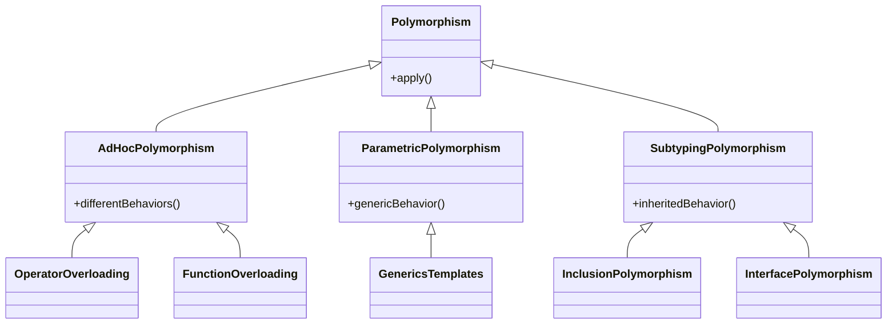

Polymorphism is one of the four fundamental principles of Object-Oriented Programming, alongside encapsulation, inheritance, and abstraction. The term comes from Greek words "poly" (many) and "morphos" (forms), literally meaning "many forms." While this etymological definition is straightforward, the concept's application in programming can be both powerful and complex.

> Note: The concepts discussed here are based on various authoritative sources, including "Design Patterns: Elements of Reusable Object-Oriented Software" by the Gang of Four, and "Clean Code" by Robert C. Martin. However, as with any programming concept, implementations and best practices may evolve over time.

At its core, polymorphism is the ability of different objects to respond to the same method call in different ways. It allows us to perform a single action in different ways and enables us to process objects differently based on their data type or class.

Let's start with a simple example:

```python
class Animal:
    def speak(self):
        pass

class Dog(Animal):
    def speak(self):
        return "Woof!"

class Cat(Animal):
    def speak(self):
        return "Meow!"

class Duck(Animal):
    def speak(self):
        return "Quack!"

# Function demonstrating polymorphic behavior
def animal_sound(animal: Animal):
    # The same method call works for different types of animals
    return animal.speak()

# Creating instances
dog = Dog()
cat = Cat()
duck = Duck()

# Same function call, different behaviors
print(animal_sound(dog))  # Output: Woof!
print(animal_sound(cat))  # Output: Meow!
print(animal_sound(duck)) # Output: Quack!
```

This simple example demonstrates polymorphism in action. The `animal_sound` function accepts any object of type `Animal` and calls its `speak` method. Despite being the same method call, each animal responds differently based on its specific implementation.

---

## Types of Polymorphism

Polymorphism can be categorized into several types. Let's examine each with detailed explanations and examples.

### Class Diagram of Different Types of Polymorphism



### Ad-hoc Polymorphism

Ad-hoc polymorphism, also known as function overloading or operator overloading, allows functions with the same name to behave differently based on the arguments passed to them.

```python
class Vector:
    def __init__(self, x, y):
        self.x = x
        self.y = y

    # Operator overloading for addition
    def __add__(self, other):
        if isinstance(other, Vector):
            return Vector(self.x + other.x, self.y + other.y)
        elif isinstance(other, (int, float)):
            return Vector(self.x + other, self.y + other)
        else:
            raise TypeError("Unsupported operand type")

    def __str__(self):
        return f"Vector({self.x}, {self.y})"

# Example usage
v1 = Vector(1, 2)
v2 = Vector(3, 4)
scalar = 2

# Vector addition
print(v1 + v2)      # Output: Vector(4, 6)
# Scalar addition
print(v1 + scalar)  # Output: Vector(3, 4)
```

### Parametric Polymorphism

Parametric polymorphism, often associated with generics or templates in other languages, allows functions or classes to work with multiple types without explicitly specifying them. While Python's dynamic typing means we don't need explicit generic type declarations, we can use type hints to demonstrate the concept:

```python
from typing import TypeVar, List, Any

T = TypeVar('T')

class Stack:
    def __init__(self):
        self._items: List[Any] = []

    def push(self, item: T) -> None:
        """Push an item onto the stack."""
        self._items.append(item)

    def pop(self) -> T:
        """Remove and return the top item from the stack."""
        if not self._items:
            raise IndexError("Stack is empty")
        return self._items.pop()

    def peek(self) -> T:
        """Return the top item without removing it."""
        if not self._items:
            raise IndexError("Stack is empty")
        return self._items[-1]

    def is_empty(self) -> bool:
        """Check if the stack is empty."""
        return len(self._items) == 0

# The same Stack class works with different types
number_stack = Stack()
number_stack.push(1)
number_stack.push(2)
number_stack.push(3)

string_stack = Stack()
string_stack.push("hello")
string_stack.push("world")

print(number_stack.pop())  # Output: 3
print(string_stack.pop())  # Output: "world"
```

### Subtyping Polymorphism

Subtyping polymorphism, also known as inheritance polymorphism, is perhaps the most common form in OOP. It allows a child class to be treated as an instance of its parent class.

Let's explore a more complex example involving a shape hierarchy:

```python
from abc import ABC, abstractmethod
import math

class Shape(ABC):
    @abstractmethod
    def area(self) -> float:
        """Calculate the area of the shape."""
        pass

    @abstractmethod
    def perimeter(self) -> float:
        """Calculate the perimeter of the shape."""
        pass

    def describe(self) -> str:
        """Return a description of the shape with its measurements."""
        return f"This {self.__class__.__name__} has an area of {self.area():.2f} " \
               f"and a perimeter of {self.perimeter():.2f}"

class Circle(Shape):
    def __init__(self, radius: float):
        self.radius = radius

    def area(self) -> float:
        return math.pi * self.radius ** 2

    def perimeter(self) -> float:
        return 2 * math.pi * self.radius

class Rectangle(Shape):
    def __init__(self, width: float, height: float):
        self.width = width
        self.height = height

    def area(self) -> float:
        return self.width * self.height

    def perimeter(self) -> float:
        return 2 * (self.width + self.height)

class Triangle(Shape):
    def __init__(self, a: float, b: float, c: float):
        # Validate triangle inequality theorem
        if not (a + b > c and b + c > a and a + c > b):
            raise ValueError("Invalid triangle sides")
        self.a = a
        self.b = b
        self.c = c

    def area(self) -> float:
        # Using Heron's formula
        s = (self.a + self.b + self.c) / 2
        return math.sqrt(s * (s - self.a) * (s - self.b) * (s - self.c))

    def perimeter(self) -> float:
        return self.a + self.b + self.c

# Function demonstrating polymorphic behavior
def print_shape_info(shapes: List[Shape]) -> None:
    """Print information about multiple shapes."""
    for shape in shapes:
        print(shape.describe())

# Creating various shapes
circle = Circle(5)
rectangle = Rectangle(4, 6)
triangle = Triangle(3, 4, 5)

# Using polymorphism to process different shapes uniformly
shapes = [circle, rectangle, triangle]
print_shape_info(shapes)
```

---

## Real-world Applications

Polymorphism is extensively used in many real-world applications. Here are some common scenarios:

### Plugin Systems

```python
class Plugin(ABC):
    @abstractmethod
    def process(self, data: Any) -> Any:
        pass

class ImagePlugin(Plugin):
    def process(self, data: bytes) -> bytes:
        # Image processing logic
        return processed_image

class AudioPlugin(Plugin):
    def process(self, data: bytes) -> bytes:
        # Audio processing logic
        return processed_audio

class VideoPlugin(Plugin):
    def process(self, data: bytes) -> bytes:
        # Video processing logic
        return processed_video

class MediaProcessor:
    def __init__(self):
        self.plugins: Dict[str, Plugin] = {}

    def register_plugin(self, name: str, plugin: Plugin):
        self.plugins[name] = plugin

    def process_media(self, plugin_name: str, data: bytes) -> bytes:
        if plugin_name not in self.plugins:
            raise ValueError(f"Plugin {plugin_name} not found")
        return self.plugins[plugin_name].process(data)
```

### GUI Frameworks

```python
class Widget(ABC):
    @abstractmethod
    def draw(self):
        pass

    @abstractmethod
    def handle_click(self, x: int, y: int):
        pass

class Button(Widget):
    def __init__(self, label: str):
        self.label = label

    def draw(self):
        # Draw button with label
        pass

    def handle_click(self, x: int, y: int):
        # Handle button click
        pass

class Checkbox(Widget):
    def __init__(self):
        self.checked = False

    def draw(self):
        # Draw checkbox
        pass

    def handle_click(self, x: int, y: int):
        self.checked = not self.checked
```

---

## Common Pitfalls

1. **Violation of LSP**: Creating subclasses that don't fully support the behavior of their parent class.
2. **Deep Inheritance Hierarchies**: Making inheritance chains too long, which can lead to maintenance issues.
3. **Type Checking Anti-Pattern**: Overusing isinstance() checks instead of proper polymorphic design.

Here's an example of violation of LSP and type checking anti-pattern:

```python
class Vehicle:
    def start_engine(self):
        return "Engine started"

class Bicycle(Vehicle):  # Violates LSP
    def start_engine(self):
        raise NotImplementedError("Bicycles don't have engines")

def start_vehicle(vehicle):
    # Anti-pattern: type checking
    if isinstance(vehicle, Bicycle):
        return "Push the pedals"
    return vehicle.start_engine()
```

How to avoid them:

```python
class Vehicle(ABC):
    @abstractmethod
    def start(self):
        pass

class MotorizedVehicle(Vehicle):
    def start(self):
        return "Engine started"

class HumanPoweredVehicle(Vehicle):
    def start(self):
        return "Ready to pedal"

class Bicycle(HumanPoweredVehicle):
    pass

class Car(MotorizedVehicle):
    pass

# Now we can use polymorphism properly
def start_vehicle(vehicle: Vehicle):
    return vehicle.start()
```

---

## Performance Considerations

When implementing polymorphism, consider these performance aspects:

1. **Virtual Method Table (VMT) Overhead**: Method calls through virtual tables have a small performance cost compared to direct function calls.

2. **Memory Usage**: Each instance of a class with virtual methods includes a pointer to its VMT.

3. **Cache Performance**: Virtual method calls can lead to cache misses due to indirect jumps.

Here's an example comparing polymorphic and non-polymorphic approaches:

```python
import timeit
from typing import List

# Non-polymorphic approach
def process_shapes_direct(shapes: List[tuple]) -> List[float]:
    results = []
    for shape_type, *params in shapes:
        if shape_type == "circle":
            results.append(3.14159 * params[0] ** 2)
        elif shape_type == "rectangle":
            results.append(params[0] * params[1])
    return results

# Polymorphic approach
class Shape(ABC):
    @abstractmethod
    def area(self) -> float:
        pass

class Circle(Shape):
    def __init__(self, radius: float):
        self.radius = radius

    def area(self) -> float:
        return 3.14159 * self.radius ** 2

class Rectangle(Shape):
    def __init__(self, width: float, height: float):
        self.width = width
        self.height = height

    def area(self) -> float:
        return self.width * self.height

def process_shapes_polymorphic(shapes: List[Shape]) -> List[float]:
    return [shape.area() for shape in shapes]

# Performance comparison
shapes_direct = [("circle", 5), ("rectangle", 4, 6)] * 1000
shapes_poly = [Circle(5), Rectangle(4, 6)] * 1000

time_direct = timeit.timeit(lambda: process_shapes_direct(shapes_direct), number=1000)
time_poly = timeit.timeit(lambda: process_shapes_polymorphic(shapes_poly), number=1000)

print(f"Direct approach: {time_direct:.4f} seconds")
print(f"Polymorphic approach: {time_poly:.4f} seconds")
```

---

## Conclusion

Polymorphism is a fundamental concept in object-oriented programming that provides flexibility, extensibility, and cleaner code design. By understanding its various forms and applying appropriate patterns, developers can create more maintainable and scalable applications. While there are performance considerations to keep in mind, the benefits of polymorphism often outweigh the minimal overhead it introduces.

Remember that polymorphism is not just a technical feature but a design tool. Used appropriately, it can lead to more elegant solutions and better code organization. However, like any tool, it should be used judiciously and in conjunction with other design principles and patterns.

The examples and patterns presented in this article serve as a foundation, but the real learning comes from applying these concepts in real-world scenarios and understanding their implications in your specific context.

---

## References

1. Gamma, E., Helm, R., Johnson, R., & Vlissides, J. (1994). Design Patterns: Elements of Reusable Object-Oriented Software. Addison-Wesley.
2. Martin, R. C. (2008). Clean Code: A Handbook of Agile Software Craftsmanship. Prentice Hall.
3. Meyer, B. (1988). Object-Oriented Software Construction. Prentice Hall.
4. Liskov, B. H., & Wing, J. M. (1994). A behavioral notion of subtyping. ACM Transactions on Programming Languages and Systems.

---

{}
Cheers for making it this far! I hope this journey through the programming universe has been as fascinating for you as it was for me to write down.

We're keen to hear your thoughts, so don't be shy – drop your comments, suggestions, and those bright ideas you're bound to have.

Also, to delve deeper than these lines, take a stroll through the practical examples we've cooked up for you. You'll find all the code and projects in our GitHub repository [learn-software-engineering/examples-programming](https://github.com/learn-software-engineering/examples-programming).

Thanks for being part of this learning community. Keep coding and exploring new territories in this captivating world of software!
{}

---
