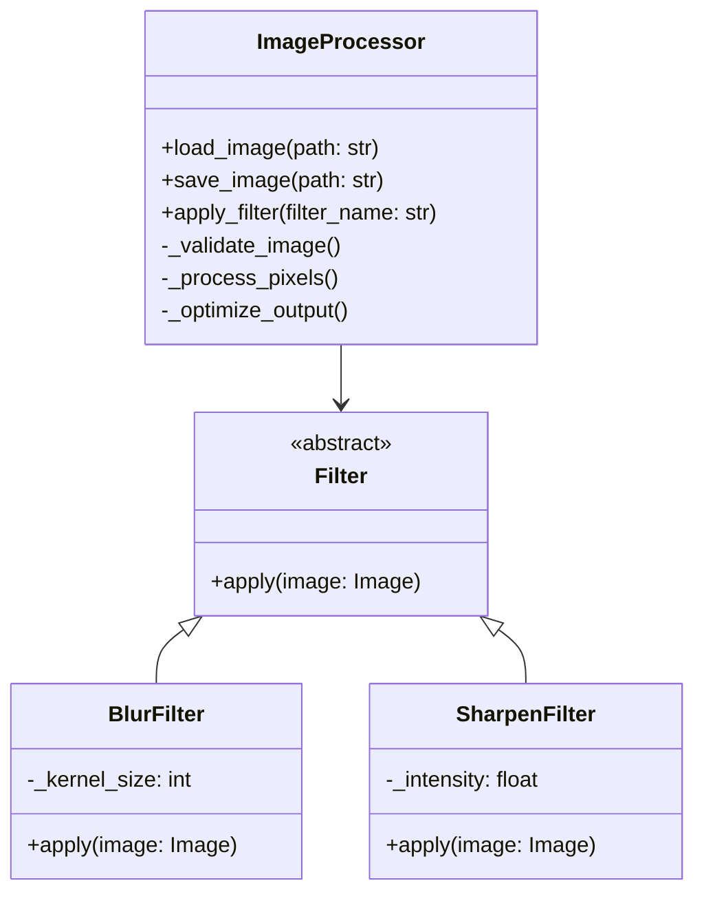
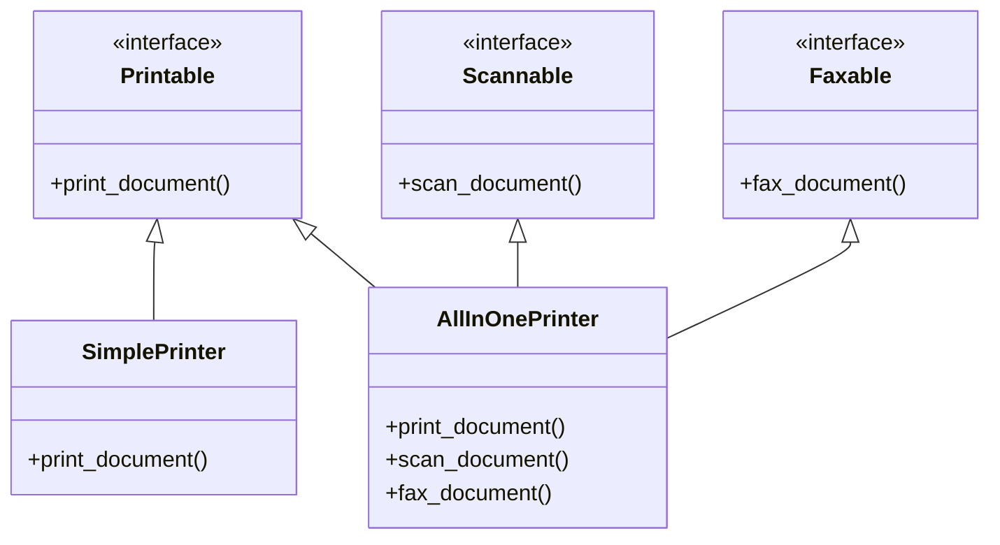
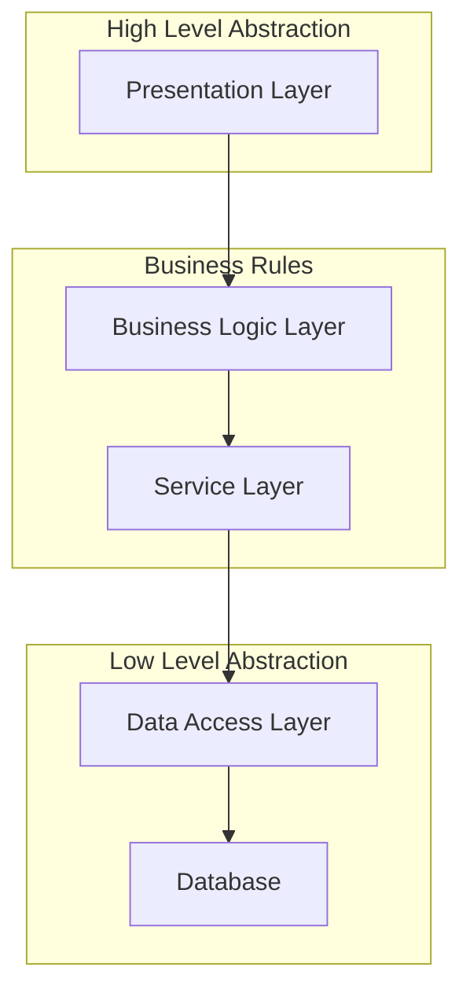

Abstraction is the process of hiding complex implementation details and showing only the necessary features of an object. Think of it as creating a *black box* where users of your code need to know what the box does, but not how it does it.

Consider driving a car:
- You interact with the steering wheel, pedals, and gear shift.
- You don't need to know how the engine converts fuel into motion.
- The complex mechanics are *abstracted away* behind a simple interface.

### Key Benefits

1. **Complexity Management**
   - Breaks down complex systems into manageable pieces.
   - Allows developers to focus on what matters at each level.

2. **Code Organization**
   - Creates clear boundaries between different parts of the system.
   - Makes code more maintainable and easier to understand.

3. **Reusability**
   - Promotes code reuse through well-defined interfaces.
   - Reduces duplication and increases efficiency.

---

## Levels of Abstraction

Abstraction occurs at multiple levels in software development:

### Data Abstraction

Data abstraction involves hiding the complex data structures and providing a simple interface to work with the data.

```python
# Example of data abstraction
class BankAccount:
    def __init__(self):
        # Complex implementation details hidden from the user
        self._balance = 0
        self._transaction_history = []
        self._account_number = self._generate_account_number()

    # Public interface - simple and clear
    def deposit(self, amount):
        if amount > 0:
            self._balance += amount
            self._record_transaction("deposit", amount)
            return True
        return False

    def get_balance(self):
        return self._balance

    # Private implementation details
    def _generate_account_number(self):
        # Complex algorithm to generate unique account numbers
        pass

    def _record_transaction(self, type_of_transaction, amount):
        # Complex logic for maintaining transaction history
        pass
```

### Procedural Abstraction

Procedural abstraction involves hiding the implementation details of operations behind simple interfaces.

Let's visualize this with a class diagram:



Implementation example:

```python
from abc import ABC, abstractmethod
import numpy as np

class Filter(ABC):
    @abstractmethod
    def apply(self, image):
        pass

class ImageProcessor:
    def __init__(self):
        self._image = None
        self._filters = {}

    # Simple interface for users
    def apply_filter(self, filter_name: str):
        """
        Applies a filter to the image without exposing complex processing details
        """
        if filter_name in self._filters:
            filter_obj = self._filters[filter_name]
            self._image = filter_obj.apply(self._image)
            self._optimize_output()
        else:
            raise ValueError(f"Filter {filter_name} not found")

    # Complex implementation details hidden from users
    def _optimize_output(self):
        """
        Complex optimization logic hidden from users
        """
        pass
```

### Class Abstraction

Class abstraction involves creating abstract classes and interfaces that define contracts for derived classes.

```python
from abc import ABC, abstractmethod
from typing import List

class Vehicle(ABC):
    """
    Abstract base class defining the contract for all vehicles
    """
    def __init__(self, brand: str, model: str):
        self.brand = brand
        self.model = model

    @abstractmethod
    def start_engine(self):
        """All vehicles must implement engine start behavior"""
        pass

    @abstractmethod
    def stop_engine(self):
        """All vehicles must implement engine stop behavior"""
        pass

    @property
    @abstractmethod
    def fuel_type(self) -> str:
        """All vehicles must specify their fuel type"""
        pass

class ElectricCar(Vehicle):
    def start_engine(self):
        return "Initializing electric motors..."

    def stop_engine(self):
        return "Shutting down electric systems..."

    @property
    def fuel_type(self) -> str:
        return "electricity"

    # Additional electric car specific methods
    def charge_battery(self):
        return "Charging battery..."
```

---

## Implementation Techniques

### Abstract Base Classes

Python's `abc` module provides tools for creating abstract base classes:

```python
from abc import ABC, abstractmethod
from typing import List, Optional

class Database(ABC):
    """
    Abstract base class for database connections
    Demonstrates interface segregation and abstraction
    """
    @abstractmethod
    def connect(self) -> bool:
        """Establish database connection"""
        pass

    @abstractmethod
    def disconnect(self) -> bool:
        """Close database connection"""
        pass

    @abstractmethod
    def execute_query(self, query: str) -> List[dict]:
        """Execute SQL query"""
        pass

    @abstractmethod
    def begin_transaction(self) -> None:
        """Start a new transaction"""
        pass

    @abstractmethod
    def commit(self) -> None:
        """Commit current transaction"""
        pass

    @abstractmethod
    def rollback(self) -> None:
        """Rollback current transaction"""
        pass

class PostgreSQLDatabase(Database):
    """
    Concrete implementation of Database for PostgreSQL
    """
    def __init__(self, host: str, port: int, username: str, password: str):
        self.host = host
        self.port = port
        self.username = username
        self.password = password
        self._connection: Optional[object] = None

    def connect(self) -> bool:
        # Implementation details for PostgreSQL connection
        try:
            # Complex connection logic here
            self._connection = "PostgreSQL Connection"
            return True
        except Exception as e:
            return False

    def execute_query(self, query: str) -> List[dict]:
        # Implementation details for PostgreSQL query execution
        if not self._connection:
            raise ConnectionError("Not connected to database")
        # Complex query execution logic here
        return []

    # Implementation of other abstract methods...
```

### Interface Segregation

Let's look at how to properly segregate interfaces:



```python
from abc import ABC, abstractmethod

# Segregated interfaces
class Printable(ABC):
    @abstractmethod
    def print_document(self, document):
        pass

class Scannable(ABC):
    @abstractmethod
    def scan_document(self):
        pass

class Faxable(ABC):
    @abstractmethod
    def fax_document(self, document, recipient):
        pass

# Concrete implementations
class SimplePrinter(Printable):
    def print_document(self, document):
        return f"Printing: {document}"

class AllInOnePrinter(Printable, Scannable, Faxable):
    def print_document(self, document):
        return f"Printing: {document}"

    def scan_document(self):
        return "Scanning document..."

    def fax_document(self, document, recipient):
        return f"Faxing {document} to {recipient}"
```

---

## Advanced Concepts

### Layered Abstraction

Layered abstraction is a powerful concept where systems are divided into hierarchical layers, each building upon the abstractions provided by the layer below.

Let's examine a practical example of layered abstraction in a web application:



Here's an implementation example:

```python
from typing import List, Optional
from datetime import datetime

# Data Access Layer (lowest level)
class UserRepository:
    def __init__(self, database_connection):
        self._db = database_connection

    def find_by_id(self, user_id: int) -> Optional[dict]:
        """
        Low-level database interaction
        """
        query = "SELECT * FROM users WHERE id = %s"
        return self._db.execute_query(query, [user_id])

    def save(self, user_data: dict) -> bool:
        """
        Low-level save operation
        """
        # Complex database operation hidden from higher layers
        pass

# Service Layer
class UserService:
    def __init__(self, user_repository: UserRepository):
        self._repository = user_repository

    def get_user(self, user_id: int) -> Optional[dict]:
        """
        Service layer handling business operations
        """
        user = self._repository.find_by_id(user_id)
        if user:
            # Enhance user data with additional business logic
            user['last_login'] = self._get_last_login(user_id)
        return user

    def _get_last_login(self, user_id: int) -> datetime:
        """
        Internal service method
        """
        # Complex business logic hidden from higher layers
        pass

# Business Logic Layer
class UserManager:
    def __init__(self, user_service: UserService):
        self._service = user_service

    def get_user_profile(self, user_id: int) -> dict:
        """
        High-level business operation
        """
        user = self._service.get_user(user_id)
        if not user:
            raise ValueError("User not found")

        return self._format_user_profile(user)

    def _format_user_profile(self, user: dict) -> dict:
        """
        Internal formatting method
        """
        # Complex profile formatting logic hidden from higher layers
        pass

# Presentation Layer (highest level)
class UserAPI:
    def __init__(self, user_manager: UserManager):
        self._manager = user_manager

    def get_profile(self, user_id: int) -> dict:
        """
        API endpoint method
        """
        try:
            profile = self._manager.get_user_profile(user_id)
            return {"status": "success", "data": profile}
        except ValueError as e:
            return {"status": "error", "message": str(e)}
```

### Dependency Injection and Inversion of Control

Dependency Injection is a technique that implements abstraction by inverting the control of object creation and lifecycle:

```python
from abc import ABC, abstractmethod
from typing import Protocol, List

# Interfaces
class Logger(Protocol):
    def log(self, message: str) -> None: ...

class EmailSender(Protocol):
    def send_email(self, to: str, subject: str, body: str) -> bool: ...

# Concrete implementations
class FileLogger:
    def __init__(self, file_path: str):
        self.file_path = file_path

    def log(self, message: str) -> None:
        with open(self.file_path, 'a') as f:
            f.write(f"{message}\n")

class SMTPEmailSender:
    def __init__(self, smtp_server: str, port: int):
        self.smtp_server = smtp_server
        self.port = port

    def send_email(self, to: str, subject: str, body: str) -> bool:
        # Complex SMTP logic hidden from users
        return True

# Service using dependency injection
class UserNotificationService:
    def __init__(self, logger: Logger, email_sender: EmailSender):
        self._logger = logger
        self._email_sender = email_sender

    def notify_user(self, user_email: str, message: str) -> bool:
        try:
            self._email_sender.send_email(
                to=user_email,
                subject="Notification",
                body=message
            )
            self._logger.log(f"Notification sent to {user_email}")
            return True
        except Exception as e:
            self._logger.log(f"Failed to send notification: {str(e)}")
            return False
```

---

## Common Pitfalls

### Over-abstraction

One common mistake is creating unnecessary abstractions:

```python
# Bad example - over-abstraction
class StringManipulator:
    def __init__(self, text: str):
        self._text = text

    def to_upper(self) -> str:
        return self._text.upper()

    def to_lower(self) -> str:
        return self._text.lower()
```

```python
# Better approach - use built-in string methods directly
text = "Hello World"
upper_text = text.upper()
lower_text = text.lower()
```

### Leaky Abstractions

Leaky abstractions occur when implementation details seep through the abstraction layer:

```python
# Bad example - leaky abstraction
class DatabaseConnection:
    def __init__(self, connection_string: str):
        self._conn_str = connection_string
        self._cursor = None

    def execute_query(self, query: str) -> List[tuple]:
        # Leaking implementation details (cursor) to the caller
        if not self._cursor:
            self._cursor = self._create_cursor()
        return self._cursor.execute(query).fetchall()
```

```python
# Better approach - hide implementation details
class DatabaseClient:
    def __init__(self, connection_string: str):
        self._connection = DatabaseConnection(connection_string)

    def execute_query(self, query: str) -> List[dict]:
        # Abstract away implementation details
        try:
            return self._connection.execute_query(query)
        except Exception as e:
            raise DatabaseError(f"Query execution failed: {str(e)}")
```

---

## Real-world Applications

### Web Framework Example

Modern web frameworks make extensive use of abstraction. Here's an example using a simplified web framework structure:

```python
from abc import ABC, abstractmethod
from typing import Dict, Any, Optional

class Request:
    def __init__(self, method: str, path: str, headers: Dict[str, str], body: Optional[str] = None):
        self.method = method
        self.path = path
        self.headers = headers
        self.body = body

class Response:
    def __init__(self, status_code: int, body: Any, headers: Optional[Dict[str, str]] = None):
        self.status_code = status_code
        self.body = body
        self.headers = headers or {}

class View(ABC):
    @abstractmethod
    def handle_request(self, request: Request) -> Response:
        pass

class UserView(View):
    def __init__(self, user_service):
        self.user_service = user_service

    def handle_request(self, request: Request) -> Response:
        if request.method == "GET":
            user = self.user_service.get_user(request.path.split("/")[-1])
            return Response(200, user)
        elif request.method == "POST":
            new_user = self.user_service.create_user(request.body)
            return Response(201, new_user)
        else:
            return Response(405, {"error": "Method not allowed"})

# Usage
class WebFramework:
    def __init__(self):
        self.routes: Dict[str, View] = {}

    def add_route(self, path: str, view: View):
        self.routes[path] = view

    def handle_request(self, request: Request) -> Response:
        view = self.routes.get(request.path)
        if view:
            return view.handle_request(request)
        return Response(404, {"error": "Not found"})
```

---

## Conclusion

Abstraction is a fundamental principle in object-oriented programming that allows developers to manage complexity, improve code organization, and create more maintainable software systems. Through proper use of abstractions, we can:

1. Hide implementation details behind clear interfaces.
2. Separate concerns across different layers of our applications.
3. Create more flexible and maintainable code.
4. Enable better testing and debugging.
5. Facilitate code reuse and scalability.

The key to successful abstraction lies in finding the right balance - creating abstractions that are neither too concrete nor too abstract, but just right for the problem at hand. This comes with experience and careful consideration of the specific requirements and constraints of each project.

Remember that abstraction is not an end goal in itself, but rather a tool to help us write better, more maintainable code. When used appropriately, it can significantly improve the quality and longevity of our software systems.

---

## References

1. Gamma, E., Helm, R., Johnson, R., & Vlissides, J. (1994). Design Patterns: Elements of Reusable Object-Oriented Software. Addison-Wesley Professional.
2. Martin, R. C. (2017). Clean Architecture: A Craftsman's Guide to Software Structure and Design. Prentice Hall.
3. Meyer, B. (1997). Object-Oriented Software Construction (2nd ed.). Prentice Hall.
4. Fowler, M. (2002). Patterns of Enterprise Application Architecture. Addison-Wesley Professional.

---

{}
Cheers for making it this far! I hope this journey through the programming universe has been as fascinating for you as it was for me to write down.

We're keen to hear your thoughts, so don't be shy – drop your comments, suggestions, and those bright ideas you're bound to have.

Also, to delve deeper than these lines, take a stroll through the practical examples we've cooked up for you. You'll find all the code and projects in our GitHub repository [learn-software-engineering/examples-programming](https://github.com/learn-software-engineering/examples-programming).

Thanks for being part of this learning community. Keep coding and exploring new territories in this captivating world of software!
{}

---
