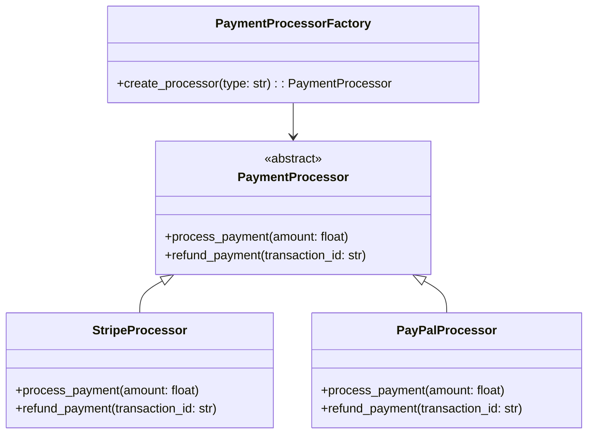

<!-- ## Common Patterns and Best Practices <a name="patterns"></a>

### 1. Builder Pattern

Encapsulating object construction:

```java
public class Person {
    private final String name;
    private final int age;
    private final String address;

    private Person(Builder builder) {
        this.name = builder.name;
        this.age = builder.age;
        this.address = builder.address;
    }

    public static class Builder {
        private String name;
        private int age;
        private String address;

        public Builder name(String name) {
            this.name = name;
            return this;
        }

        public Builder age(int age) {
            this.age = age;
            return this;
        }

        public Builder address(String address) {
            this.address = address;
            return this;
        }

        public Person build() {
            return new Person(this);
        }
    }
}
```

### 2. Factory Pattern

Encapsulating object creation:

```python
class DocumentFactory:
    @staticmethod
    def create_document(doc_type):
        if doc_type == "pdf":
            return PDFDocument()
        elif doc_type == "word":
            return WordDocument()
        else:
            raise ValueError("Unknown document type")

class PDFDocument:
    def __init__(self):
        self._content = []

    def add_content(self, content):
        self._content.append(content)
``` -->


## Best Practices and Design Patterns

### 1. The Template Method Pattern

The Template Method pattern is a classic example of abstraction in action:

```python
from abc import ABC, abstractmethod

class DataMiner(ABC):
    """
    Template method pattern example
    Defines the skeleton of an algorithm in a method
    """
    def mine_data(self, path: str) -> dict:
        """
        Template method that defines the algorithm's skeleton
        """
        # Open the file
        data = self._open_file(path)

        # Extract the data
        extracted_data = self._extract_data(data)

        # Parse the data
        parsed_data = self._parse_data(extracted_data)

        # Analyze the data
        analysis = self._analyze_data(parsed_data)

        # Send report
        self._send_report(analysis)

        return analysis

    @abstractmethod
    def _open_file(self, path: str):
        """Each concrete class must implement file opening"""
        pass

    @abstractmethod
    def _extract_data(self, data: str):
        """Each concrete class must implement data extraction"""
        pass

    @abstractmethod
    def _parse_data(self, data: str):
        """Each concrete class must implement data parsing"""
        pass

    def _analyze_data(self, data: dict) -> dict:
        """
        Optional hook - concrete classes can override if needed
        Provides default implementation
        """
        return {"analysis": "default", "data": data}

    def _send_report(self, analysis: dict):
        """
        Optional hook - concrete classes can override if needed
        Provides default implementation
        """
        print(f"Sending report: {analysis}")

class PDFMiner(DataMiner):
    """Concrete implementation for PDF files"""
    def _open_file(self, path: str):
        return f"Opening PDF file: {path}"

    def _extract_data(self, data: str):
        return f"Extracting data from PDF: {data}"

    def _parse_data(self, data: str):
        return {"type": "PDF", "content": data}

    def _analyze_data(self, data: dict) -> dict:
        # Override default analysis for PDF-specific analysis
        return {"analysis": "PDF specific", "data": data}

class CSVMiner(DataMiner):
    """Concrete implementation for CSV files"""
    def _open_file(self, path: str):
        return f"Opening CSV file: {path}"

    def _extract_data(self, data: str):
        return f"Extracting data from CSV: {data}"

    def _parse_data(self, data: str):
        return {"type": "CSV", "content": data}
```

### 2. The Factory Pattern

The Factory pattern is another excellent example of abstraction:



```python
from abc import ABC, abstractmethod
from typing import Dict, Any

class PaymentProcessor(ABC):
    @abstractmethod
    def process_payment(self, amount: float) -> Dict[str, Any]:
        pass

    @abstractmethod
    def refund_payment(self, transaction_id: str) -> bool:
        pass

class StripeProcessor(PaymentProcessor):
    def __init__(self, api_key: str):
        self.api_key = api_key

    def process_payment(self, amount: float) -> Dict[str, Any]:
        # Complex Stripe API interaction hidden from users
        return {
            "processor": "Stripe",
            "amount": amount,
            "status": "success",
            "transaction_id": "stripe_123"
        }

    def refund_payment(self, transaction_id: str) -> bool:
        # Complex refund logic hidden from users
        return True

class PayPalProcessor(PaymentProcessor):
    def __init__(self, client_id: str, client_secret: str):
        self.client_id = client_id
        self.client_secret = client_secret

    def process_payment(self, amount: float) -> Dict[str, Any]:
        # Complex PayPal API interaction hidden from users
        return {
            "processor": "PayPal",
            "amount": amount,
            "status": "success",
            "transaction_id": "paypal_123"
        }

    def refund_payment(self, transaction_id: str) -> bool:
        # Complex refund logic hidden from users
        return True

class PaymentProcessorFactory:
    @staticmethod
    def create_processor(processor_type: str, **kwargs) -> PaymentProcessor:
        """
        Factory method to create payment processors
        Abstracts away the complexity of processor creation
        """
        if processor_type.lower() == "stripe":
            return StripeProcessor(api_key=kwargs.get("api_key"))
        elif processor_type.lower() == "paypal":
            return PayPalProcessor(
                client_id=kwargs.get("client_id"),
                client_secret=kwargs.get("client_secret")
            )
        else:
            raise ValueError(f"Unsupported payment processor: {processor_type}")

# Example usage of the factory pattern
def process_order(amount: float, processor_type: str, **kwargs):
    """
    High-level function showing how abstraction simplifies the payment process
    """
    # Create the appropriate processor without knowing its specific implementation
    processor = PaymentProcessorFactory.create_processor(processor_type, **kwargs)

    # Process payment using a common interface
    result = processor.process_payment(amount)

    return result
```
