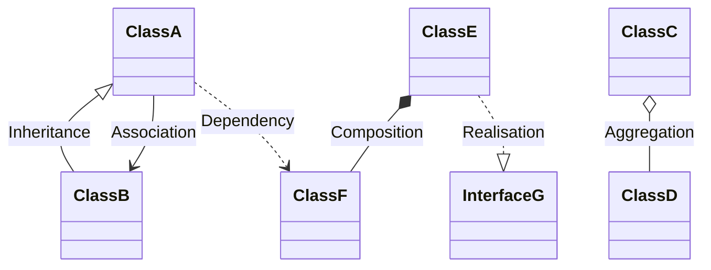

In Object-Oriented Programming, classes don't exist in isolation. They interact and relate to each other in various ways to model complex systems and relationships. Understanding these relationships is crucial for designing effective and maintainable object-oriented systems.

The main types of class relationships we'll explore in depth are:

1. Association (**"uses-a"**)
2. Aggregation (weak **"has-a"** relationship)
3. Composition (strong **"has-a"** relationship)
4. Inheritance (**"is-a"** relationship)
5. Realisation (Implementation)
6. Dependency

Each of these relationships represents a different way that classes can be connected and interact with each other. They vary in terms of the strength of the coupling between classes, the lifecycle dependencies, and the nature of the relationship.

Before we dive into each type of relationship, let's visualise them using a UML class diagram:

This diagram provides a high-level overview of the different types of class relationships. In the following sections, we'll explore each of these relationships in detail, providing explanations, examples, and more specific UML diagrams.
