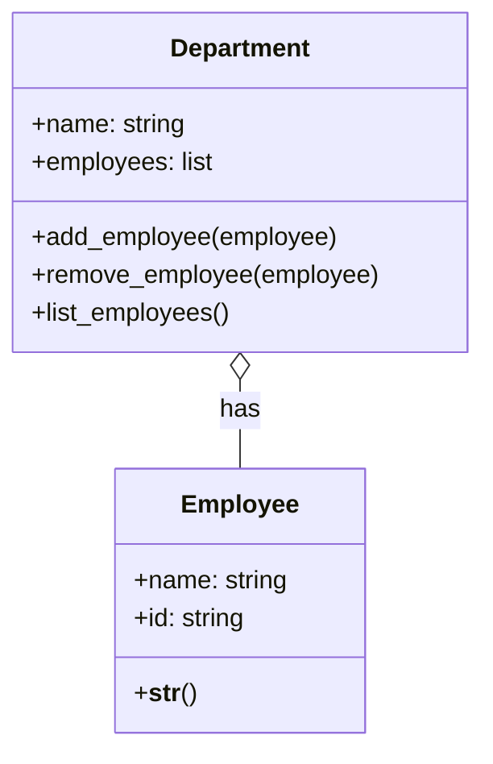

Key characteristics of aggregation:
- It's a stronger relationship than a simple association, but weaker than composition.
- The "part" object can exist independently of the "whole" object.
- Multiple "whole" objects can share the same "part" object.
- If the "whole" object is destroyed, the "part" object continues to exist.

Let's look at an example to illustrate aggregation:

```python
class Department:
    def __init__(self, name):
        self.name = name
        self.employees = []

    def add_employee(self, employee):
        self.employees.append(employee)

    def remove_employee(self, employee):
        self.employees.remove(employee)

    def list_employees(self):
        return f"Department {self.name} has employees: {', '.join(emp.name for emp in self.employees)}"

class Employee:
    def __init__(self, name, id):
        self.name = name
        self.id = id

    def __str__(self):
        return f"Employee(name={self.name}, id={self.id})"

# Creating instances
hr_dept = Department("Human Resources")
it_dept = Department("Information Technology")

emp1 = Employee("Alice", "E001")
emp2 = Employee("Bob", "E002")
emp3 = Employee("Charlie", "E003")

# Adding employees to departments
hr_dept.add_employee(emp1)
hr_dept.add_employee(emp2)
it_dept.add_employee(emp2)  # Note: Bob works in both HR and IT
it_dept.add_employee(emp3)

print(hr_dept.list_employees())
print(it_dept.list_employees())

# If we remove the HR department, the employees still exist
del hr_dept
print(emp1)  # Employee still exists
```

In this example, we have an aggregation relationship between `Department` and `Employee`. A `Department` has `Employee`s, but `Employee`s can exist independently of any particular `Department`. Also, an `Employee` can belong to multiple `Department`s (as we see with Bob).

Here's a UML diagram representing this aggregation relationship:



In this diagram, the open diamond on the `Department` side of the relationship indicates aggregation. This shows that `Department` is the "whole" and `Employee` is the "part" in this relationship.

It's important to note that while aggregation implies a whole-part relationship, the "part" (in this case, `Employee`) can exist independently and can even be part of multiple "wholes" (multiple `Department`s).

---

## References

1. Gamma, E., Helm, R., Johnson, R., & Vlissides, J. (1994). Design Patterns: Elements of Reusable Object-Oriented Software. Addison-Wesley.
2. Martin, R. C. (2017). Clean Architecture: A Craftsman's Guide to Software Structure and Design. Prentice Hall.
3. Fowler, M. (2002). Patterns of Enterprise Application Architecture. Addison-Wesley.
4. Bloch, J. (2018). Effective Java (3rd ed.). Addison-Wesley.
5. Phillips, D. (2018). Python 3 Object-Oriented Programming (3rd ed.). Packt Publishing.
6. Lott, S. F. (2020). Object-Oriented Python: Master OOP by Building Games and GUIs. No Starch Press.
7. Booch, G., Rumbaugh, J., & Jacobson, I. (2005). The Unified Modeling Language User Guide (2nd ed.). Addison-Wesley.

---

{}
Cheers for making it this far! I hope this journey through the programming universe has been as fascinating for you as it was for me to write down.

We're keen to hear your thoughts, so don't be shy – drop your comments, suggestions, and those bright ideas you're bound to have.

Also, to delve deeper than these lines, take a stroll through the practical examples we've cooked up for you. You'll find all the code and projects in our GitHub repository [learn-software-engineering/examples-programming](https://github.com/learn-software-engineering/examples-programming).

Thanks for being part of this learning community. Keep coding and exploring new territories in this captivating world of software!
{}

---
