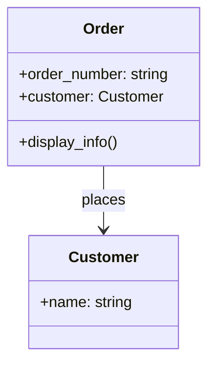
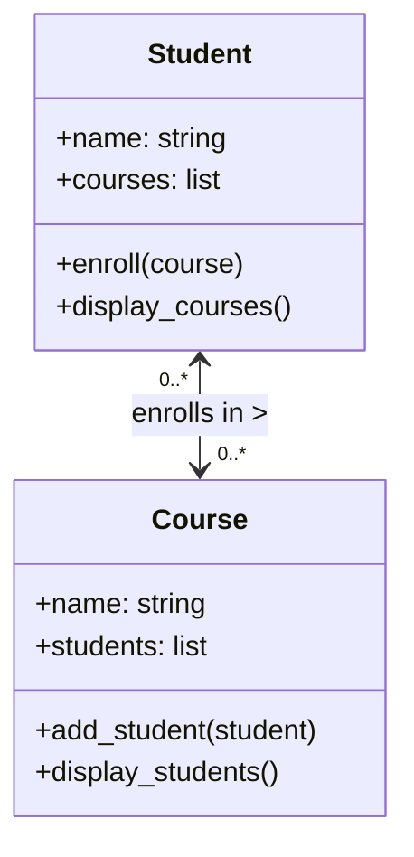

Key characteristics of association:
- It represents a loose coupling between classes.
- The associated classes can exist independently of each other.
- The lifetime of one class is not tied to the lifetime of the other.
- It can be unidirectional or bidirectional.

There are two main types of association:

1. Unidirectional Association
2. Bidirectional Association

Let's explore each of these in more detail.

### Unidirectional association

In a unidirectional association, one class knows about and can interact with another class, but not vice versa. This is a one-way relationship.

Here's an example in Python:

```python
class Customer:
    def __init__(self, name):
        self.name = name

class Order:
    def __init__(self, order_number, customer):
        self.order_number = order_number
        self.customer = customer  # This creates an association

    def display_info(self):
        return f"Order {self.order_number} placed by {self.customer.name}"

# Creating instances
customer = Customer("John Doe")
order = Order("12345", customer)

print(order.display_info())  # Output: Order 12345 placed by John Doe
```

In this example, the `Order` class has a unidirectional association with the `Customer` class. An `Order` knows about its associated `Customer`, but a `Customer` doesn't know about its `Order`s.

Here's a UML diagram representing this relationship:



The arrow in the diagram points from `Order` to `Customer`, indicating that `Order` knows about `Customer`, but not the other way around.

### Bidirectional association

In a bidirectional association, both classes are aware of each other and can interact with each other. This is a two-way relationship.

Here's an example in Python:

```python
class Student:
    def __init__(self, name):
        self.name = name
        self.courses = []

    def enroll(self, course):
        self.courses.append(course)
        course.add_student(self)

    def display_courses(self):
        return f"{self.name} is enrolled in: {', '.join(course.name for course in self.courses)}"

class Course:
    def __init__(self, name):
        self.name = name
        self.students = []

    def add_student(self, student):
        self.students.append(student)

    def display_students(self):
        return f"{self.name} has students: {', '.join(student.name for student in self.students)}"

# Creating instances
student1 = Student("Alice")
student2 = Student("Bob")
math_course = Course("Mathematics")
physics_course = Course("Physics")

# Enrolling students in courses
student1.enroll(math_course)
student1.enroll(physics_course)
student2.enroll(math_course)

print(student1.display_courses())
print(math_course.display_students())
```

In this example, there's a bidirectional association between `Student` and `Course`. A `Student` knows about their `Course`s, and a `Course` knows about its `Student`s.

Here's a UML diagram representing this relationship:



The double-headed arrow in the diagram indicates that both `Student` and `Course` are aware of each other. The "0..*" notation indicates that a `Student` can be enrolled in zero or more `Course`s, and a `Course` can have zero or more `Student`s.

Association is a flexible relationship that can represent many real-world connections between objects. It's important to choose between unidirectional and bidirectional associations carefully, as bidirectional associations can introduce more complexity and potential for errors if not managed properly.

---

## References

1. Gamma, E., Helm, R., Johnson, R., & Vlissides, J. (1994). Design Patterns: Elements of Reusable Object-Oriented Software. Addison-Wesley.
2. Martin, R. C. (2017). Clean Architecture: A Craftsman's Guide to Software Structure and Design. Prentice Hall.
3. Fowler, M. (2002). Patterns of Enterprise Application Architecture. Addison-Wesley.
4. Bloch, J. (2018). Effective Java (3rd ed.). Addison-Wesley.
5. Phillips, D. (2018). Python 3 Object-Oriented Programming (3rd ed.). Packt Publishing.
6. Lott, S. F. (2020). Object-Oriented Python: Master OOP by Building Games and GUIs. No Starch Press.
7. Booch, G., Rumbaugh, J., & Jacobson, I. (2005). The Unified Modeling Language User Guide (2nd ed.). Addison-Wesley.

---

{}
Cheers for making it this far! I hope this journey through the programming universe has been as fascinating for you as it was for me to write down.

We're keen to hear your thoughts, so don't be shy – drop your comments, suggestions, and those bright ideas you're bound to have.

Also, to delve deeper than these lines, take a stroll through the practical examples we've cooked up for you. You'll find all the code and projects in our GitHub repository [learn-software-engineering/examples-programming](https://github.com/learn-software-engineering/examples-programming).

Thanks for being part of this learning community. Keep coding and exploring new territories in this captivating world of software!
{}

---
