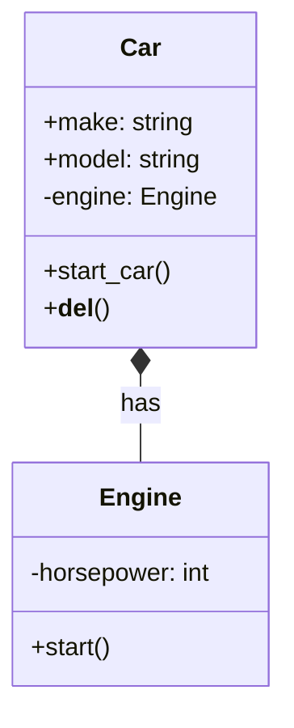

Key characteristics of composition:
- It represents a strong "has-a" relationship.
- The "part" object cannot exist independently of the "whole" object.
- When the "whole" object is destroyed, all its "part" objects are also destroyed.
- A "part" object belongs to only one "whole" object at a time.

Let's look at an example to illustrate composition:

```python
class Engine:
    def __init__(self, horsepower):
        self.horsepower = horsepower

    def start(self):
        return "Engine started"

class Car:
    def __init__(self, make, model, horsepower):
        self.make = make
        self.model = model
        self.engine = Engine(horsepower)  # Composition: Car creates its own Engine

    def start_car(self):
        return f"{self.make} {self.model}: {self.engine.start()}"

    def __del__(self):
        print(f"{self.make} {self.model} is being destroyed, and so is its engine.")

# Creating a Car instance
my_car = Car("Toyota", "Corolla", 150)
print(my_car.start_car())  # Output: Toyota Corolla: Engine started

# When we delete the Car, its Engine is also deleted
del my_car  # This will print: Toyota Corolla is being destroyed, and so is its engine.
```

In this example, we have a composition relationship between `Car` and `Engine`. A `Car` has an `Engine`, and the `Engine` cannot exist independently of the `Car`. When a `Car` object is created, it creates its own `Engine`. When the `Car` object is destroyed, its `Engine` is also destroyed.

Here's a UML diagram representing this composition relationship:



In this diagram, the filled diamond on the `Car` side of the relationship indicates composition. This shows that `Car` is the "whole" and `Engine` is the "part" in this relationship, and that the `Engine`'s lifetime is tied to the `Car`'s lifetime.

The key difference between aggregation and composition is the strength of the relationship and the lifecycle dependency. In aggregation, the "part" can exist independently of the "whole", while in composition, the "part" cannot exist without the "whole".

---

## References

1. Gamma, E., Helm, R., Johnson, R., & Vlissides, J. (1994). Design Patterns: Elements of Reusable Object-Oriented Software. Addison-Wesley.
2. Martin, R. C. (2017). Clean Architecture: A Craftsman's Guide to Software Structure and Design. Prentice Hall.
3. Fowler, M. (2002). Patterns of Enterprise Application Architecture. Addison-Wesley.
4. Bloch, J. (2018). Effective Java (3rd ed.). Addison-Wesley.
5. Phillips, D. (2018). Python 3 Object-Oriented Programming (3rd ed.). Packt Publishing.
6. Lott, S. F. (2020). Object-Oriented Python: Master OOP by Building Games and GUIs. No Starch Press.
7. Booch, G., Rumbaugh, J., & Jacobson, I. (2005). The Unified Modeling Language User Guide (2nd ed.). Addison-Wesley.

---

{}
Cheers for making it this far! I hope this journey through the programming universe has been as fascinating for you as it was for me to write down.

We're keen to hear your thoughts, so don't be shy – drop your comments, suggestions, and those bright ideas you're bound to have.

Also, to delve deeper than these lines, take a stroll through the practical examples we've cooked up for you. You'll find all the code and projects in our GitHub repository [learn-software-engineering/examples](https://github.com/learn-software-engineering/examples).

Thanks for being part of this learning community. Keep coding and exploring new territories in this captivating world of software!
{}

---
