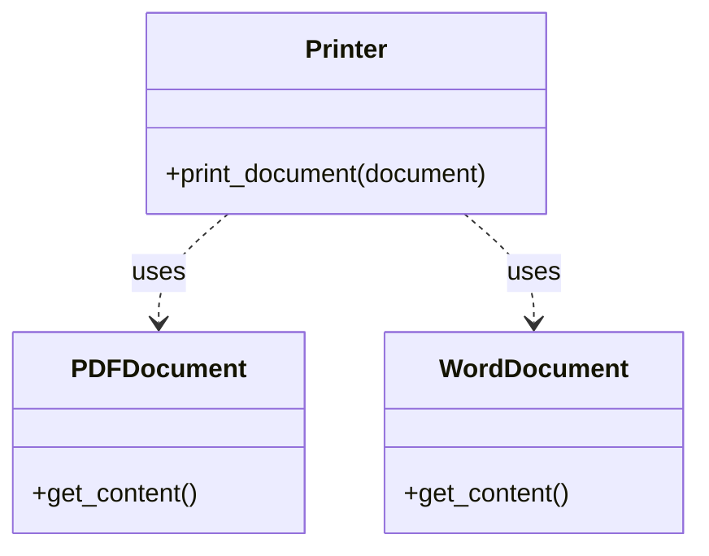

Key characteristics of dependency:
- It represents a "uses" relationship between classes.
- It's a weaker relationship compared to association, aggregation, or composition.
- Changes in the used class may affect the using class.

Here's an example to illustrate dependency:

```python
class Printer:
    def print_document(self, document):
        return f"Printing: {document.get_content()}"

class PDFDocument:
    def get_content(self):
        return "PDF content"

class WordDocument:
    def get_content(self):
        return "Word document content"

# Using the Printer
printer = Printer()
pdf = PDFDocument()
word = WordDocument()

print(printer.print_document(pdf))   # Output: Printing: PDF content
print(printer.print_document(word))  # Output: Printing: Word document content
```

In this example, the `Printer` class has a dependency on both `PDFDocument` and `WordDocument` classes. The `Printer` uses these classes in its `print_document` method, but it doesn't maintain a long-term relationship with them.

Here's a UML diagram representing these dependency relationships:



In this diagram, the dashed arrows pointing from `Printer` to `PDFDocument` and `WordDocument` indicate dependency. This shows that `Printer` uses these classes, but doesn't have a stronger relationship with them.

Dependency is often used to reduce coupling between classes. By depending on abstractions (like interfaces) rather than concrete classes, we can make our code more flexible and easier to change.

---

## References

1. Gamma, E., Helm, R., Johnson, R., & Vlissides, J. (1994). Design Patterns: Elements of Reusable Object-Oriented Software. Addison-Wesley.
2. Martin, R. C. (2017). Clean Architecture: A Craftsman's Guide to Software Structure and Design. Prentice Hall.
3. Fowler, M. (2002). Patterns of Enterprise Application Architecture. Addison-Wesley.
4. Bloch, J. (2018). Effective Java (3rd ed.). Addison-Wesley.
5. Phillips, D. (2018). Python 3 Object-Oriented Programming (3rd ed.). Packt Publishing.
6. Lott, S. F. (2020). Object-Oriented Python: Master OOP by Building Games and GUIs. No Starch Press.
7. Booch, G., Rumbaugh, J., & Jacobson, I. (2005). The Unified Modeling Language User Guide (2nd ed.). Addison-Wesley.

---

{}
Cheers for making it this far! I hope this journey through the programming universe has been as fascinating for you as it was for me to write down.

We're keen to hear your thoughts, so don't be shy – drop your comments, suggestions, and those bright ideas you're bound to have.

Also, to delve deeper than these lines, take a stroll through the practical examples we've cooked up for you. You'll find all the code and projects in our GitHub repository [learn-software-engineering/examples-programming](https://github.com/learn-software-engineering/examples-programming).

Thanks for being part of this learning community. Keep coding and exploring new territories in this captivating world of software!
{}

---
