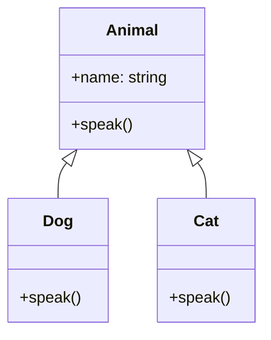

Key characteristics of inheritance:
- It promotes code reuse and establishes a hierarchy between classes.
- The subclass inherits all public and protected members from the superclass.
- The subclass can add its own members and override inherited members.
- It supports the concept of polymorphism.

Let's look at an example to illustrate inheritance:

```python
class Animal:
    def __init__(self, name):
        self.name = name

    def speak(self):
        pass

class Dog(Animal):
    def speak(self):
        return f"{self.name} says Woof!"

class Cat(Animal):
    def speak(self):
        return f"{self.name} says Meow!"

# Creating instances
dog = Dog("Buddy")
cat = Cat("Whiskers")

print(dog.speak())  # Output: Buddy says Woof!
print(cat.speak())  # Output: Whiskers says Meow!

# Demonstrating polymorphism
def animal_sound(animal):
    print(animal.speak())

animal_sound(dog)  # Output: Buddy says Woof!
animal_sound(cat)  # Output: Whiskers says Meow!
```

In this example, we have a base class `Animal` and two derived classes `Dog` and `Cat`. Both `Dog` and `Cat` inherit from `Animal` and override the `speak` method.

Here's a UML diagram representing this inheritance relationship:



In this diagram, the arrows pointing from `Dog` and `Cat` to `Animal` indicate inheritance. This shows that `Dog` and `Cat` are subclasses of `Animal`.

Inheritance is a powerful feature of OOP, but it should be used judiciously. Overuse of inheritance can lead to complex class hierarchies that are difficult to understand and maintain. The principle of **"composition over inheritance"** suggests that it's often better to use composition (*has-a* relationship) rather than inheritance (*is-a* relationship) when designing class relationships.

---

## References

1. Gamma, E., Helm, R., Johnson, R., & Vlissides, J. (1994). Design Patterns: Elements of Reusable Object-Oriented Software. Addison-Wesley.
2. Martin, R. C. (2017). Clean Architecture: A Craftsman's Guide to Software Structure and Design. Prentice Hall.
3. Fowler, M. (2002). Patterns of Enterprise Application Architecture. Addison-Wesley.
4. Bloch, J. (2018). Effective Java (3rd ed.). Addison-Wesley.
5. Phillips, D. (2018). Python 3 Object-Oriented Programming (3rd ed.). Packt Publishing.
6. Lott, S. F. (2020). Object-Oriented Python: Master OOP by Building Games and GUIs. No Starch Press.
7. Booch, G., Rumbaugh, J., & Jacobson, I. (2005). The Unified Modeling Language User Guide (2nd ed.). Addison-Wesley.

---

{}
Cheers for making it this far! I hope this journey through the programming universe has been as fascinating for you as it was for me to write down.

We're keen to hear your thoughts, so don't be shy – drop your comments, suggestions, and those bright ideas you're bound to have.

Also, to delve deeper than these lines, take a stroll through the practical examples we've cooked up for you. You'll find all the code and projects in our GitHub repository [learn-software-engineering/examples](https://github.com/learn-software-engineering/examples).

Thanks for being part of this learning community. Keep coding and exploring new territories in this captivating world of software!
{}

---
