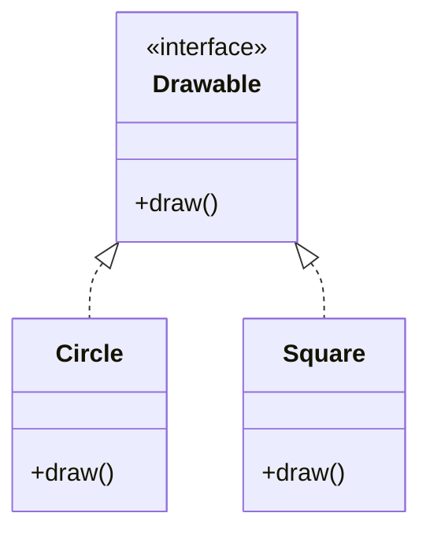

Key characteristics of realisation:
- It represents a contract that the implementing class must fulfil.
- The class must provide implementations for all methods declared in the interface.
- It allows for polymorphism through interfaces.

Python doesn't have a built-in interface concept like some other languages (e.g., Java), but we can simulate interfaces using abstract base classes. Here's an example:

```python
from abc import ABC, abstractmethod

class Drawable(ABC):
    @abstractmethod
    def draw(self):
        pass

class Circle(Drawable):
    def draw(self):
        return "Drawing a circle"

class Square(Drawable):
    def draw(self):
        return "Drawing a square"

def draw_shape(shape: Drawable):
    print(shape.draw())

# Creating instances
circle = Circle()
square = Square()

# Using polymorphism through the interface
draw_shape(circle)  # Output: Drawing a circle
draw_shape(square)  # Output: Drawing a square
```

In this example, `Drawable` is an abstract base class that acts like an interface. Both `Circle` and `Square` implement the `Drawable` interface by providing their own implementation of the `draw` method.

Here's a UML diagram representing this realisation relationship:



In this diagram, the dashed arrows pointing from `Circle` and `Square` to `Drawable` indicate realisation. This shows that `Circle` and `Square` implement the `Drawable` interface.

Realisation is a powerful concept that allows for designing loosely coupled systems. By programming to interfaces rather than concrete implementations, we can create more flexible and extensible software.

---

## References

1. Gamma, E., Helm, R., Johnson, R., & Vlissides, J. (1994). Design Patterns: Elements of Reusable Object-Oriented Software. Addison-Wesley.
2. Martin, R. C. (2017). Clean Architecture: A Craftsman's Guide to Software Structure and Design. Prentice Hall.
3. Fowler, M. (2002). Patterns of Enterprise Application Architecture. Addison-Wesley.
4. Bloch, J. (2018). Effective Java (3rd ed.). Addison-Wesley.
5. Phillips, D. (2018). Python 3 Object-Oriented Programming (3rd ed.). Packt Publishing.
6. Lott, S. F. (2020). Object-Oriented Python: Master OOP by Building Games and GUIs. No Starch Press.
7. Booch, G., Rumbaugh, J., & Jacobson, I. (2005). The Unified Modeling Language User Guide (2nd ed.). Addison-Wesley.

---

{}
Cheers for making it this far! I hope this journey through the programming universe has been as fascinating for you as it was for me to write down.

We're keen to hear your thoughts, so don't be shy – drop your comments, suggestions, and those bright ideas you're bound to have.

Also, to delve deeper than these lines, take a stroll through the practical examples we've cooked up for you. You'll find all the code and projects in our GitHub repository [learn-software-engineering/examples-programming](https://github.com/learn-software-engineering/examples-programming).

Thanks for being part of this learning community. Keep coding and exploring new territories in this captivating world of software!
{}

---
