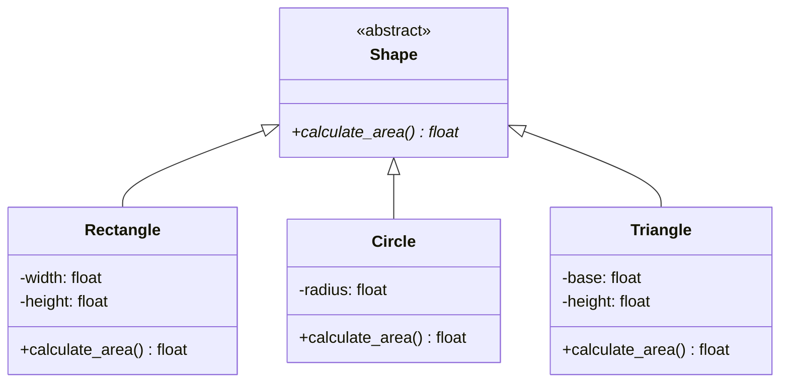
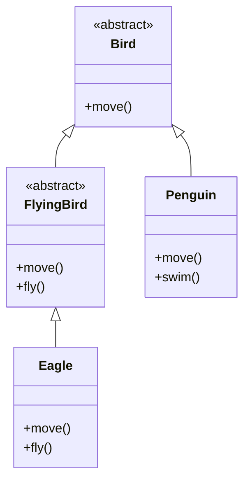
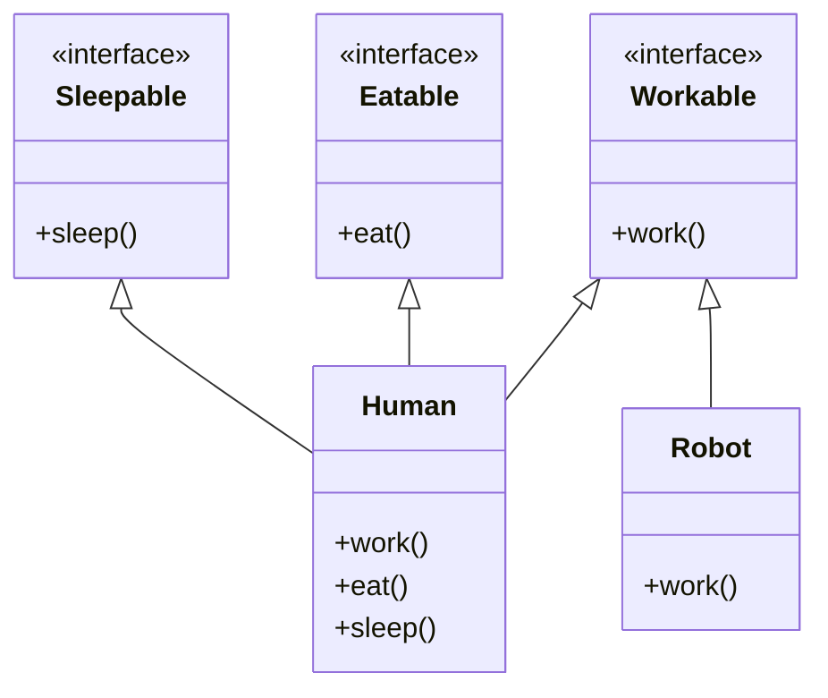
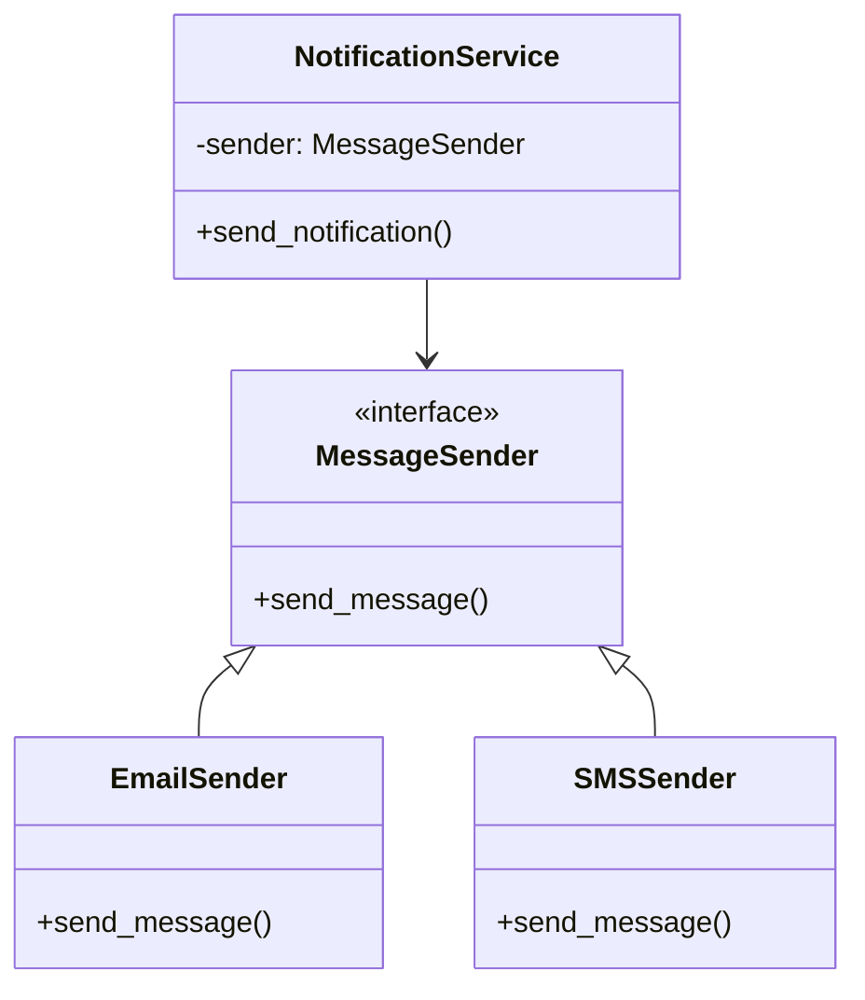
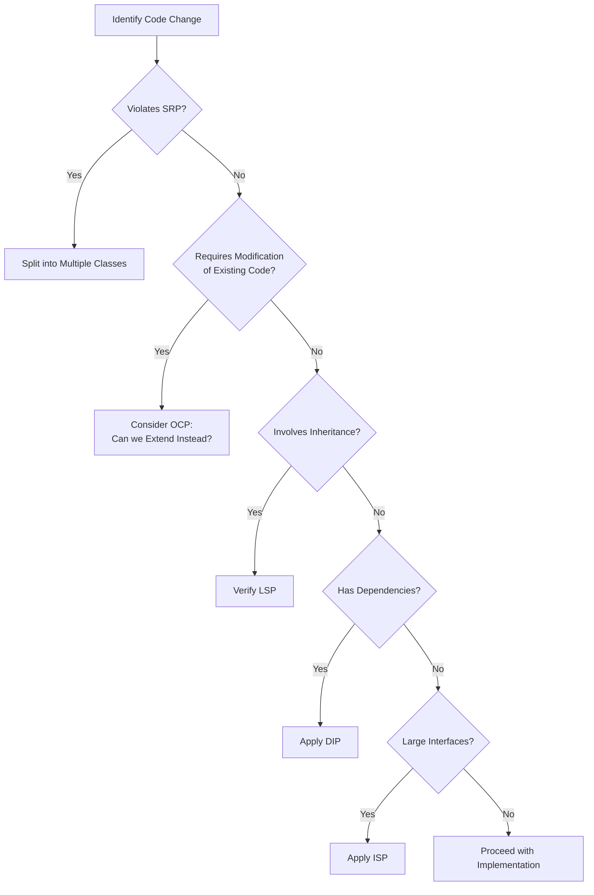

### Open-Closed Principle

#### Definition
"Software entities (classes, modules, functions, etc.) should be open for extension but closed for modification." - Bertrand Meyer

This principle suggests that you should be able to add new functionality to your code without changing existing code.

#### Visual Representation



#### Example Implementation

```python
from abc import ABC, abstractmethod
from typing import List

# Open-Closed Principle Example
class Shape(ABC):
    @abstractmethod
    def calculate_area(self) -> float:
        pass

class Rectangle(Shape):
    def __init__(self, width: float, height: float):
        self.width = width
        self.height = height

    def calculate_area(self) -> float:
        return self.width * self.height

class Circle(Shape):
    def __init__(self, radius: float):
        self.radius = radius

    def calculate_area(self) -> float:
        return 3.14159 * self.radius ** 2

class AreaCalculator:
    def calculate_total_area(self, shapes: List[Shape]) -> float:
        """
        This method is closed for modification but open for extension.
        We can add new shapes without modifying this code.
        """
        return sum(shape.calculate_area() for shape in shapes)

# Adding a new shape without modifying existing code
class Triangle(Shape):
    def __init__(self, base: float, height: float):
        self.base = base
        self.height = height

    def calculate_area(self) -> float:
        return 0.5 * self.base * self.height
```

### Liskov Substitution Principle

#### Definition
"Objects in a program should be replaceable with instances of their subtypes without altering the correctness of that program." - Barbara Liskov

This principle ensures that derived classes can substitute their base classes without affecting the program's behaviour.

#### Visual Representation



#### Example Implementation

```python
from abc import ABC, abstractmethod
from typing import List

# BAD EXAMPLE - Violating LSP
class Bird:
    def fly(self):
        pass

class Penguin(Bird):
    def fly(self):
        raise NotImplementedError("Penguins can't fly!")  # Violates LSP

# GOOD EXAMPLE - Following LSP
class Bird(ABC):
    @abstractmethod
    def move(self):
        pass

class FlyingBird(Bird):
    def move(self):
        return self.fly()

    def fly(self):
        return "Flying in the air"

class SwimmingBird(Bird):
    def move(self):
        return self.swim()

    def swim(self):
        return "Swimming in the water"

class Eagle(FlyingBird):
    def fly(self):
        return "Soaring high in the sky"

class Penguin(SwimmingBird):
    def swim(self):
        return "Swimming in cold waters"

def make_bird_move(bird: Bird) -> str:
    """
    This function works correctly with any subtype of Bird
    """
    return bird.move()
```

### Interface Segregation Principle

#### Definition
"Clients should not be forced to depend upon interfaces they do not use." - Robert C. Martin

This principle advocates for creating small, specific interfaces rather than large, monolithic ones.

#### Visual Representation



#### Example Implementation

```python
from abc import ABC, abstractmethod

# BAD EXAMPLE - Violating ISP
class Worker(ABC):
    @abstractmethod
    def work(self):
        pass

    @abstractmethod
    def eat(self):
        pass

    @abstractmethod
    def sleep(self):
        pass

# This class is forced to implement methods it doesn't need
class Robot(Worker):
    def work(self):
        return "Robot working"

    def eat(self):
        raise NotImplementedError("Robots don't eat")

    def sleep(self):
        raise NotImplementedError("Robots don't sleep")

# GOOD EXAMPLE - Following ISP
class Workable(ABC):
    @abstractmethod
    def work(self):
        pass

class Eatable(ABC):
    @abstractmethod
    def eat(self):
        pass

class Sleepable(ABC):
    @abstractmethod
    def sleep(self):
        pass

class Human(Workable, Eatable, Sleepable):
    def work(self):
        return "Human working"

    def eat(self):
        return "Human eating"

    def sleep(self):
        return "Human sleeping"

class Robot(Workable):
    def work(self):
        return "Robot working"
```

### Dependency Inversion Principle

#### Definition
"High-level modules should not depend on low-level modules. Both should depend on abstractions. Abstractions should not depend on details. Details should depend on abstractions." - Robert C. Martin

This principle helps in achieving loose coupling between components.

#### Visual Representation



#### Example Implementation

```python
from abc import ABC, abstractmethod

# BAD EXAMPLE - Violating DIP
class EmailSender:
    def send_email(self, message: str):
        print(f"Sending email: {message}")

class NotificationService:
    def __init__(self):
        self.email_sender = EmailSender()  # Direct dependency on concrete class

    def send_notification(self, message: str):
        self.email_sender.send_email(message)

# GOOD EXAMPLE - Following DIP
class MessageSender(ABC):
    @abstractmethod
    def send_message(self, message: str):
        pass

class EmailSender(MessageSender):
    def send_message(self, message: str):
        print(f"Sending email: {message}")

class SMSSender(MessageSender):
    def send_message(self, message: str):
        print(f"Sending SMS: {message}")

class NotificationService:
    def __init__(self, message_sender: MessageSender):
        self.message_sender = message_sender  # Dependency on abstraction

    def send_notification(self, message: str):
        self.message_sender.send_message(message)

# Usage
email_sender = EmailSender()
sms_sender = SMSSender()

# Can easily switch between different implementations
notification_service = NotificationService(email_sender)
notification_service.send_notification("Hello!")

notification_service = NotificationService(sms_sender)
notification_service.send_notification("Hello!")
```

## Common Pitfalls and Anti-patterns

### Over-engineering
One common mistake is applying SOLID principles too rigidly, leading to:
- Excessive abstraction
- Unnecessary complexity
- Too many small classes and interfaces
- Reduced code readability

### Under-engineering
Not applying SOLID principles enough can result in:
- Tight coupling
- Difficult-to-maintain code
- Hard-to-test components
- Inflexible designs

### Finding the Balance
The key is to find the right balance:
1. Start simple
2. Refactor when needed
3. Apply principles gradually
4. Consider the project context
5. Focus on maintainability

## Real-world Applications

### Example: E-commerce System

```python
from abc import ABC, abstractmethod
from typing import List, Dict

# Interfaces
class PaymentProcessor(ABC):
    @abstractmethod
    def process_payment(self, amount: float) -> bool:
        pass

class InventoryManager(ABC):
    @abstractmethod
    def check_availability(self, product_id: str) -> bool:
        pass

    @abstractmethod
    def update_stock(self, product_id: str, quantity: int):
        pass

# Implementations
class StripePaymentProcessor(PaymentProcessor):
    def process_payment(self, amount: float) -> bool:
        # Stripe-specific implementation
        print(f"Processing ${amount} payment via Stripe")
        return True

class DatabaseInventoryManager(InventoryManager):
    def check_availability(self, product_id: str) -> bool:
        # Database check implementation
        return True

    def update_stock(self, product_id: str, quantity: int):
        # Database update implementation
        print(f"Updating stock for product {product_id}")

# Domain Objects
class Product:
    def __init__(self, id: str, name: str, price: float):
        self.id = id
        self.name = name
        self.price = price

class Order:
    def __init__(self, products: List[Product]):
        self.products = products

    def total_amount(self) -> float:
        return sum(product.price for product in self.products)

# Service Layer
class OrderProcessor:
    def __init__(self,
                 payment_processor: PaymentProcessor,
                 inventory_manager: InventoryManager):
        self.payment_processor = payment_processor
        self.inventory_manager = inventory_manager

    def process_order(self, order: Order) -> bool:
        # Check inventory
        for product in order.products:
            if not self.inventory_manager.check_availability(product.id):
                return False

        # Process payment
        if not self.payment_processor.process_payment(order.total_amount()):
            return False

        # Update inventory
        for product in order.products:
            self.inventory_manager.update_stock(product.id, -1)

        return True

# Usage
payment_processor = StripePaymentProcessor()
inventory_manager = DatabaseInventoryManager()
order_processor = OrderProcessor(payment_processor, inventory_manager)

products = [
    Product("1", "Laptop", 999.99),
    Product("2", "Mouse", 29.99),
    Product("3", "Keyboard", 59.99)
]

order = Order(products)
success = order_processor.process_order(order)
print(f"Order processed successfully: {success}")
```

This e-commerce example demonstrates:
- SRP: Each class has a single responsibility
- OCP: New payment processors can be added without modifying existing code
- LSP: Different payment processors can be substituted
- ISP: Interfaces are specific to their use cases
- DIP: High-level modules depend on abstractions

### Example: Logging System

```python
from abc import ABC, abstractmethod
from datetime import datetime
from typing import List

# Interfaces
class LogFormatter(ABC):
    @abstractmethod
    def format(self, message: str, level: str) -> str:
        pass

class LogDestination(ABC):
    @abstractmethod
    def write(self, message: str):
        pass

# Implementations
class JSONFormatter(LogFormatter):
    def format(self, message: str, level: str) -> str:
        return f'{{"timestamp": "{datetime.now()}", "level": "{level}", "message": "{message}"}}'

class PlainTextFormatter(LogFormatter):
    def format(self, message: str, level: str) -> str:
        return f"[{datetime.now()}] {level}: {message}"

class ConsoleDestination(LogDestination):
    def write(self, message: str):
        print(message)

class FileDestination(LogDestination):
    def __init__(self, filename: str):
        self.filename = filename

    def write(self, message: str):
        with open(self.filename, 'a') as f:
            f.write(message + '\n')

# Main Logger Class
class Logger:
    def __init__(self, formatter: LogFormatter, destinations: List[LogDestination]):
        self.formatter = formatter
        self.destinations = destinations

    def log(self, message: str, level: str = "INFO"):
        formatted_message = self.formatter.format(message, level)
        for destination in self.destinations:
            destination.write(formatted_message)

# Usage
json_formatter = JSONFormatter()
console = ConsoleDestination()
file_dest = FileDestination("app.log")

logger = Logger(json_formatter, [console, file_dest])
logger.log("User logged in", "INFO")
logger.log("Database connection failed", "ERROR")
```

## Best Practices and Guidelines

### When to Apply SOLID Principles

1. **During Initial Design**
   - Consider SOLID principles during architecture planning
   - Design interfaces and abstractions thoughtfully
   - Plan for future extensions

2. **During Refactoring**
   - Identify violation of principles in existing code
   - Refactor gradually, one principle at a time
   - Maintain comprehensive tests during refactoring

3. **Code Review**
   - Use SOLID principles as review criteria
   - Look for potential violations
   - Suggest improvements based on principles

### Decision Making Framework



## Testing SOLID Code

### Unit Testing Benefits
- SRP makes classes easier to test
- OCP allows testing new functionality in isolation
- LSP ensures consistent behaviour in tests
- ISP reduces test complexity
- DIP enables effective mocking

### Example Test Cases

```python
import unittest
from unittest.mock import Mock

class OrderProcessorTests(unittest.TestCase):
    def setUp(self):
        self.payment_processor = Mock(spec=PaymentProcessor)
        self.inventory_manager = Mock(spec=InventoryManager)
        self.order_processor = OrderProcessor(
            self.payment_processor,
            self.inventory_manager
        )

    def test_successful_order_processing(self):
        # Arrange
        products = [Product("1", "Test Product", 100.0)]
        order = Order(products)
        self.payment_processor.process_payment.return_value = True
        self.inventory_manager.check_availability.return_value = True

        # Act
        result = self.order_processor.process_order(order)

        # Assert
        self.assertTrue(result)
        self.payment_processor.process_payment.assert_called_once_with(100.0)
        self.inventory_manager.update_stock.assert_called_once()

    def test_failed_payment_processing(self):
        # Arrange
        products = [Product("1", "Test Product", 100.0)]
        order = Order(products)
        self.payment_processor.process_payment.return_value = False
        self.inventory_manager.check_availability.return_value = True

        # Act
        result = self.order_processor.process_order(order)

        # Assert
        self.assertFalse(result)
        self.inventory_manager.update_stock.assert_not_called()
```

## Performance Considerations

### Potential Overhead
1. **Abstraction Layers**
   - Additional method calls
   - Memory usage for extra objects
   - Complexity in dependency injection

2. **Mitigation Strategies**
   - Use appropriate design patterns
   - Consider object pooling for frequent instantiation
   - Profile and optimize critical paths

### Balance with Requirements
- Consider performance requirements early
- Document performance-related decisions
- Make informed trade-offs between principles and performance

## Further Reading

### Books
1. "Clean Architecture" by Robert C. Martin
2. "Design Patterns: Elements of Reusable Object-Oriented Software" by Gang of Four
3. "Agile Software Development: Principles, Patterns, and Practices" by Robert C. Martin

### Online Resources
1. [Martin Fowler's Blog](https://martinfowler.com)
2. [Clean Code Blog](https://blog.cleancoder.com)
3. [Python Design Patterns](https://python-patterns.guide)

## Conclusion

The SOLID principles provide a robust foundation for creating maintainable, flexible, and scalable object-oriented systems. While they may seem complex at first, their consistent application leads to:

1. More maintainable code
2. Better testability
3. Easier refactoring
4. Improved code reuse
5. Reduced technical debt

Remember that SOLID principles are guidelines, not strict rules. Apply them thoughtfully and pragmatically, always considering the specific context and requirements of your project.

The key to success with SOLID principles is practice and gradual implementation. Start with simple applications of these principles and progressively incorporate more advanced patterns as your understanding grows.
