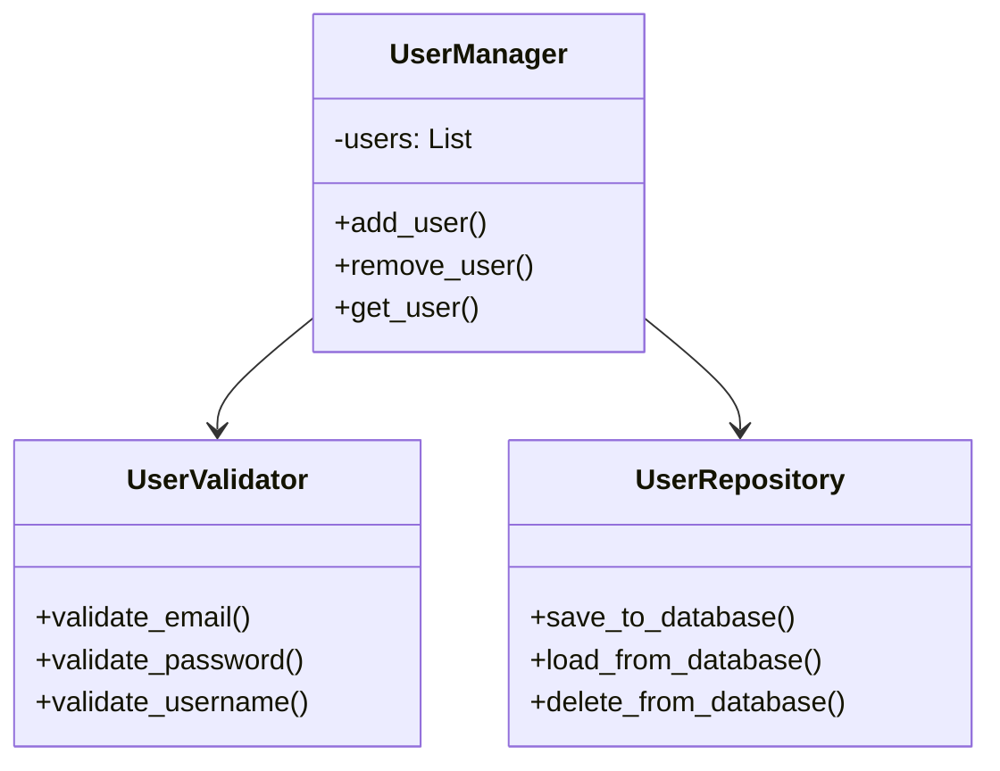

"A class should have one, and only one, reason to change." - Robert C. Martin

The key benefits of following this principle are:

1. Improved maintainability
2. Easier testing
3. Reduced coupling
4. Better code organization
5. Simplified debugging

Some common pitfalls include:

- Creating classes that are too granular
- Misidentifying responsibilities
- Confusing SRP with single method or single purpose

## Examples

Visual representation



Bad example, violating the Single Responsibility Principle

```python
class User:
    def __init__(self, name: str, email: str):
        self.name = name
        self.email = email

    def save_to_database(self):
        # Database logic here
        pass

    def send_email(self):
        # Email sending logic here
        pass

    def generate_report(self):
        # Report generation logic here
        pass
```

Good example following the Single Responsibility principle.

```python
class User:
    def __init__(self, name: str, email: str):
        self.name = name
        self.email = email

class UserRepository:
    def save_user(self, user: User):
        # Database logic here
        pass

    def get_user(self, user_id: int) -> User:
        # Database retrieval logic
        pass

class EmailService:
    def send_email(self, user: User, message: str):
        # Email sending logic here
        pass

class ReportGenerator:
    def generate_user_report(self, user: User) -> str:
        # Report generation logic here
        pass
```
