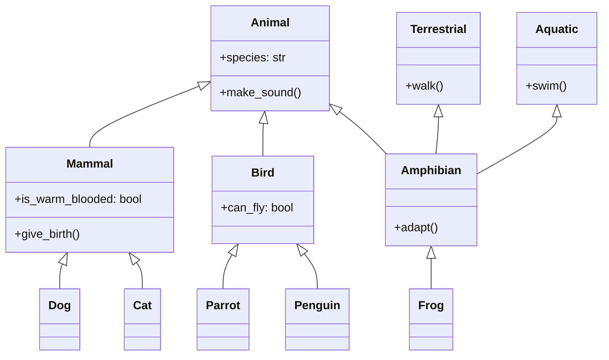

Key aspects of inheritance include:

1. **Code reusability**: Inheritance allows us to reuse code from existing classes, reducing redundancy and promoting efficient development.
2. **Hierarchical classification**: It enables the creation of class hierarchies, representing relationships and commonalities among objects.
3. **Extensibility**: New functionality can be added to existing classes without modifying them, following the open-closed principle.
4. **Polymorphism**: Inheritance is a prerequisite for runtime polymorphism (which we'll discuss in detail later).

### Types of inheritance

There are several types of inheritance, though not all programming languages support all types. The main types are:

1. **Single inheritance**: A derived class inherits from a single base class.
2. **Multiple inheritance**: A derived class inherits from multiple base classes.
3. **Multilevel inheritance**: A derived class inherits from another derived class.
4. **Hierarchical inheritance**: Multiple derived classes inherit from a single base class.
5. **Hybrid inheritance**: A combination of two or more types of inheritance.

Python supports all these types of inheritance. Let's explore each with examples.

#### Single inheritance

Single inheritance is the simplest form of inheritance, where a class inherits from one base class.

```python
class Animal:
    def __init__(self, species):
        self.species = species

    def make_sound(self):
        pass

class Dog(Animal):
    def __init__(self, name):
        super().__init__("Canine")
        self.name = name

    def make_sound(self):
        return "Woof!"

# Usage
dog = Dog("Buddy")
print(f"{dog.name} is a {dog.species}")  # Output: Buddy is a Canine
print(dog.make_sound())  # Output: Woof!
```

In this example:
- `Animal` is the base class with a generic `make_sound` method.
- `Dog` is derived from `Animal`, inheriting its attributes and methods.
- `Dog` overrides the `make_sound` method with its own implementation.
- We use `super().__init__()` to call the initialiser of the base class.

#### Multiple inheritance

Multiple inheritance allows a class to inherit from multiple base classes.

```python
class Flyer:
    def fly(self):
        return "I can fly!"

class Swimmer:
    def swim(self):
        return "I can swim!"

class Duck(Animal, Flyer, Swimmer):
    def __init__(self, name):
        Animal.__init__(self, "Aves")
        self.name = name

    def make_sound(self):
        return "Quack!"

# Usage
duck = Duck("Donald")
print(f"{duck.name} is a {duck.species}")  # Output: Donald is a Aves
print(duck.make_sound())  # Output: Quack!
print(duck.fly())  # Output: I can fly!
print(duck.swim())  # Output: I can swim!
```

Here, `Duck` inherits from `Animal`, `Flyer`, and `Swimmer`, combining attributes and methods from all three.

#### Multilevel inheritance

In multilevel inheritance, a derived class inherits from another derived class.

```python
class Mammal(Animal):
    def __init__(self, species, is_warm_blooded=True):
        super().__init__(species)
        self.is_warm_blooded = is_warm_blooded

    def give_birth(self):
        return "Giving birth to live young"

class Cat(Mammal):
    def __init__(self, name):
        super().__init__("Feline")
        self.name = name

    def make_sound(self):
        return "Meow!"

# Usage
cat = Cat("Whiskers")
print(f"{cat.name} is a {cat.species}")  # Output: Whiskers is a Feline
print(cat.make_sound())  # Output: Meow!
print(cat.give_birth())  # Output: Giving birth to live young
print(f"Is warm-blooded: {cat.is_warm_blooded}")  # Output: Is warm-blooded: True
```

In this example, `Cat` inherits from `Mammal`, which in turn inherits from `Animal`, forming a multilevel inheritance chain.

#### Hierarchical inheritance

Hierarchical inheritance involves multiple derived classes inheriting from a single base class.

```python
class Bird(Animal):
    def __init__(self, species, can_fly=True):
        super().__init__(species)
        self.can_fly = can_fly

class Parrot(Bird):
    def __init__(self, name):
        super().__init__("Psittacine", can_fly=True)
        self.name = name

    def make_sound(self):
        return "Squawk!"

class Penguin(Bird):
    def __init__(self, name):
        super().__init__("Spheniscidae", can_fly=False)
        self.name = name

    def make_sound(self):
        return "Honk!"

# Usage
parrot = Parrot("Polly")
penguin = Penguin("Pingu")

print(f"{parrot.name} can fly: {parrot.can_fly}")  # Output: Polly can fly: True
print(f"{penguin.name} can fly: {penguin.can_fly}")  # Output: Pingu can fly: False
```

Here, both `Parrot` and `Penguin` inherit from `Bird`, which demonstrates hierarchical inheritance.

#### Hybrid inheritance

Hybrid inheritance is a combination of multiple inheritance types. Let's create a more complex example to illustrate this:

```python
class Terrestrial:
    def walk(self):
        return "Walking on land"

class Aquatic:
    def swim(self):
        return "Swimming in water"

class Amphibian(Animal, Terrestrial, Aquatic):
    def __init__(self, species):
        Animal.__init__(self, species)

    def adapt(self):
        return "Can survive both on land and in water"

class Frog(Amphibian):
    def __init__(self, name):
        super().__init__("Anura")
        self.name = name

    def make_sound(self):
        return "Ribbit!"

# Usage
frog = Frog("Kermit")
print(f"{frog.name} is a {frog.species}")  # Output: Kermit is a Anura
print(frog.make_sound())  # Output: Ribbit!
print(frog.walk())  # Output: Walking on land
print(frog.swim())  # Output: Swimming in water
print(frog.adapt())  # Output: Can survive both on land and in water
```

This example demonstrates hybrid inheritance:
- `Frog` inherits from `Amphibian`
- `Amphibian` inherits from `Animal`, `Terrestrial`, and `Aquatic`
- This creates a combination of multilevel and multiple inheritance

### Considerations

Inheritance offers several advantages. However, there are also important considerations:

1. **Complexity**: Deep inheritance hierarchies can become difficult to understand and maintain.
2. **Tight coupling**: Inheritance creates a tight coupling between base and derived classes.
3. **Fragile base class problem**: Changes in the base class can unexpectedly affect derived classes.
4. **Diamond problem**: In multiple inheritance, conflicts can arise if two base classes have methods with the same name.

To address these considerations:

- Prefer composition over inheritance when possible.
- Keep inheritance hierarchies shallow and focused.
- Use abstract base classes to define clear interfaces.
- Be cautious with multiple inheritance and resolve conflicts explicitly.

Let's visualise the inheritance relationships we've discussed using an UML class diagram:



This diagram illustrates the inheritance relationships between the classes we've discussed, showing both single and multiple inheritance.

---

## References

1. Gamma, E., Helm, R., Johnson, R., & Vlissides, J. (1994). Design Patterns: Elements of Reusable Object-Oriented Software. Addison-Wesley.
2. Martin, R. C. (2017). Clean Architecture: A Craftsman's Guide to Software Structure and Design. Prentice Hall.
3. Phillips, D. (2010). Python 3 Object Oriented Programming. Packt Publishing.
4. Lutz, M. (2013). Learning Python: Powerful Object-Oriented Programming. O'Reilly Media.
5. Ramalho, L. (2015). Fluent Python: Clear, Concise, and Effective Programming. O'Reilly Media.
6. Van Rossum, G., Warsaw, B., & Coghlan, N. (2001). PEP 8 -- Style Guide for Python Code. Python.org. https://www.python.org/dev/peps/pep-0008/
7. Python Software Foundation. (n.d.). The Python Standard Library. Python.org. https://docs.python.org/3/library/

---

{}
Cheers for making it this far! I hope this journey through the programming universe has been as fascinating for you as it was for me to write down.

We're keen to hear your thoughts, so don't be shy – drop your comments, suggestions, and those bright ideas you're bound to have.

Also, to delve deeper than these lines, take a stroll through the practical examples we've cooked up for you. You'll find all the code and projects in our GitHub repository [learn-software-engineering/examples](https://github.com/learn-software-engineering/examples).

Thanks for being part of this learning community. Keep coding and exploring new territories in this captivating world of software!
{}

---
