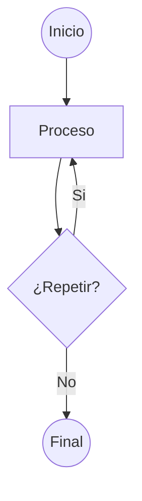
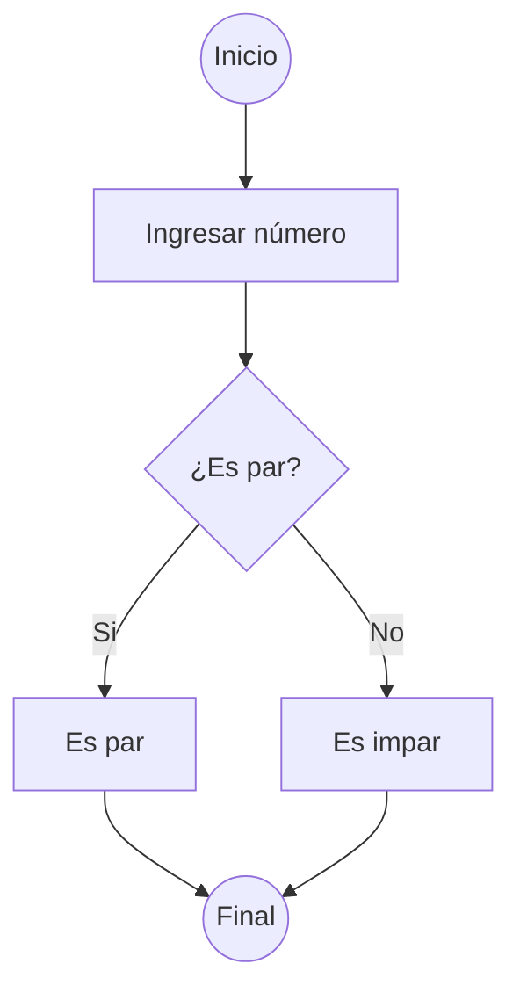
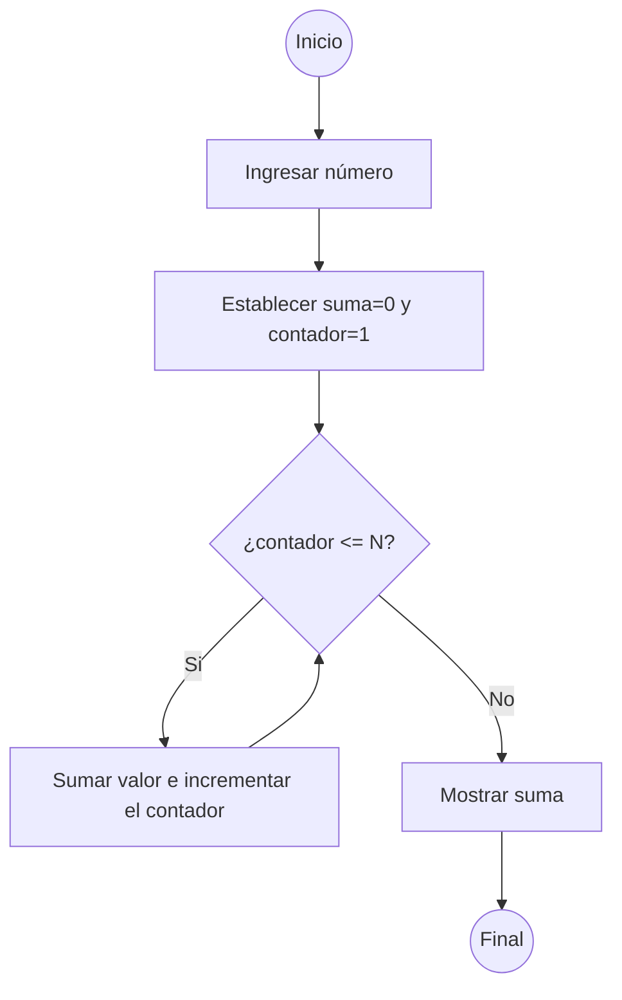

## Condiciones: tomando decisiones en el código

La vida está llena de decisiones: "Si llueve, llevaré un paraguas. De lo contrario, usaré anteojos de sol". Estas decisiones también están presentes en el mundo de la programación. Las condiciones son como preguntas que la computadora se hace. Nos permiten tomar decisiones y ejecutar código específico dependiendo de una condición[^1]. Pueden ser simples como "¿Está lloviendo?" o complejas como "¿Es fin de semana y tengo menos de $100 en mi cuenta bancaria?".

### if

La estructura `if` nos permite evaluar condiciones y tomar decisiones basadas en el resultado de esa evaluación.

```python
edad = 15

if edad >= 18:
    print("Eres mayor de edad")
```

El código anterior permite ejecutar una porción de código si la edad de una persona es mayo o igual a 18 años.

### if-else

Cuando se desea ejecutar un código alternativo si la condición es falsa, utilizamos la estructura `if-else`

```python
edad = 21
if edad >= 18:
    print("Eres mayor de edad")
else:
    print("Eres menor de edad")
```

En este caso, se determina si la persona es mayor de edad, o menor de edad, el mensaje mostrado es diferente

### if-elif-else

Cuando las condiciones son múltiples y no es suficientes con dos caminos, se utiliza la estructura `if-elif-else` para evaluarlas forma encadenada.

```python
edad = 5
if edad <= 13:
    print("Eres un niño")
elif edad > 13 and edad < 18:
    print("Eres un adolescente")
else:
    print("Eres un adulto")
```

En el código anterior se observan tres caminos claros, uno para cuando la edad es menor o igual a 13 años, otro para cuando la edad esta entre 13 y 18 y otro para cuando es mayor o igual a 18.

Otra manera de resolver este problema es mediante la estructura `switch-case`, que, aunque Python no incorpora de manera nativa, como si lo hacen otros lenguajes como Java o C++, es una herramienta importante para conocer. Esta estructura permite a los programadores manejar múltiples condiciones de manera más organizada que una serie de `if-elif-else`.

En Java, por ejemplo:

```java
int dia = 3;
switch(dia) {
    case 1:
        System.out.println("Lunes");
        break;
    case 2:
        System.out.println("Martes");
        break;
    case 3:
        System.out.println("Miércoles");
        break;
    // ... y así sucesivamente
    default:
        System.out.println("Día no válido");
}
```

En el ejemplo anterior, dependiendo del valor de `dia`, se imprimirá el día correspondiente[^2].

---

## Bucles: repitiendo acciones

A veces, en programación, necesitamos repetir una acción varias veces. En lugar de escribir el mismo código varias veces, podemos usar bucles. Estos, permiten repetir la ejecución de un bloque de código mientras se cumpla una condición[^3].

### while

El bucle `while` es útil cuando queremos repetir una acción basada en una condición.

```python
# Imprime del 1 al 5
i = 1
while i <= 5:
    print(i)
    i = i + 1
```

### do-while

Similar a `while` pero garantiza al menos una ejecución dado que primero se ejecuta el bloque de código y luego se evalúa la condición. Python no implementa esta estructura, pero otros lenguajes como Java y C++ sí lo hacen.

```java
int i = 1;

do {
    System.out.println(i);
    i++;
} while(i <= 5);
```

```c++
int numero = 0;
do {
    std::cout << "Hola, mundo!" << std::endl;
    numero++;
} while (numero < 5);
```

### for

El bucle `for` es útil cuando sabemos cuántas veces queremos repetir una acción.

```python
for i in range(5):
    print("Hola, mundo!")
```

El código anterior imprimirá "Hola, mundo!" cinco veces.

También podemos iterar sobre los elementos de una lista u objeto iterable:

```python
nombres = ["María", "Florencia", "Julián"]
for nombre in nombres:
    print(f"Hola {nombre}")

# Imprime
# Hola María
# Hola Florencia
# Hola Julián
```

### Las sentencias `break` y `continue`

Podemos usar `break` para terminar el bucle y `continue` para saltar a la siguiente iteración.

El `break` se usa para terminar completamente el bucle cuando se cumple una condición, en el ejemplo siguiente, cuando `i` llega a 5.

```python
# Ejemplo de break
i = 0
while i < 10:
    print(i)
    if i == 5:
        break
    i += 1

# Imprime:
# 0
# 1
# 2
# 3
# 4
# 5
```

El `continue` se usa para saltarse una iteración del bucle y continuar con la siguiente cuando se cumple una condición. Aquí lo usamos para saltarnos los números pares.

```python
# Ejemplo de continue
i = 0
while i < 10:
    i += 1
    if i % 2 == 0:
        continue
    print(i)

# Imprime:
# 1
# 3
# 5
# 7
# 9
```

---

## Anidamiento: combinando estructuras

Las estructuras de control de flujo pueden anidarse dentro de otras. Por ejemplo, podemos tener bucles dentro de bucles o condiciones dentro de bucles.

```python
for i in range(5):
    for j in range(10):
        if (i % 2 == 0 and j % 3 == 0):
            print(f"i = {i}, j = {j}")
```

Este código imprimirá combinaciones de `i` y `j` sólo cuando `i` sea divisible por 2 y `j` sea divisible por 3, demostrando cómo los bucles se anidan y se ejecutan[^3].

---

## Patrones de uso comunes

Existen patrones específicos para resolver necesidades habituales con control de flujo.

### Búsqueda

Buscar un valor en una colección:

```python
frutas = ["manzana", "naranja"]

buscando = "naranja"
encontrado = False

for fruta in frutas:
    if fruta == buscando:
        encontrado = True
        break

if encontrado:
    print("Fruta encontrada!")
```

### Acumulación

Acumular valores incrementales en un bucle.

```python
total = 0

for i in range(10):
    total += i

print(total) # Suma de 0..9 = 45
```

---

## Diagramas de flujo: la ruta visual hacia el entendimiento del código

Los programadores, sin importar si son principiantes o expertos, a menudo se encuentran enfrentando desafíos que requieren una planificación detallada antes de sumergirse en el código. Aquí es donde los diagramas de flujo entran en juego como una herramienta esencial. Estos diagramas son representaciones gráficas de los procesos y la lógica detrás de un programa o sistema. En este artículo, desentrañaremos el mundo de los diagramas de flujo, desde sus conceptos básicos hasta las técnicas avanzadas, y cómo pueden beneficiar a programadores de todos los niveles.

Un diagrama de flujo es una representación gráfica de un proceso. Utiliza símbolos específicos para representar diferentes tipos de instrucciones o acciones. Su objetivo principal es simplificar la comprensión de un proceso, mostrando paso a paso cómo fluye la información o las decisiones. Estos diagramas:
- Facilitan la comprensión de procesos complejos.
- Ayudan en la fase de diseño y planificación de un programa.
- Sirven como documentación y referencia para futuros desarrollos.

Los diagramas de flujo son una herramienta poderosa que no solo beneficia a los principiantes, sino también a los programadores experimentados. Ofrecen una visión clara y estructurada de un proceso o programa, facilitando la planificación, el diseño y la comunicación entre los miembros del equipo.

### Elementos básicos

Los diagramas de flujo constan de varios símbolos, cada uno con un significado específico:

- **Ovalo**: Representa el inicio o el fin de un proceso.
- **Rectángulo**: Denota una operación o instrucción.
- **Diamante**: Indica una decisión basada en una condición.
- **Flechas**: Muestran la dirección del flujo.



### Ejemplos

Vamos a diseñar un diagrama de flujo para un programa que pida un número y nos diga si es par o impar.



Conforme los programas se vuelven más complejos, es posible que necesites incorporar bucles, múltiples condiciones y otros elementos avanzados en tu diagrama de flujo. Por ejemplo, aquí diagramamos un programa que sume los números desde  el 1 al número ingresado por el usuario.



---

## Conclusión

El control de flujo es el corazón de la programación. Sin él, los programas serían secuencias lineales de acciones sin la capacidad de tomar decisiones o repetir tareas. Al dominar estas estructuras, no solo mejoras tu capacidad para escribir código, sino también tu capacidad para pensar lógicamente y resolver problemas complejos.

---

{}
¡Felicitaciones por llegar hasta acá! Espero que este recorrido por el universo de la programación te haya resultado tan interesante como lo fue para mí al escribirlo.

Queremos conocer tu opinión, así que no dudes en compartir tus comentarios, sugerencias y esas ideas brillantes que seguro tenés.

Además, para explorar más allá de estas líneas, date una vuelta por los ejemplos prácticos que armamos para vos. Todo el código y los proyectos los encontrarás en nuestro repositorio de GitHub [learn-software-engineering/examples-programming](https://github.com/learn-software-engineering/examples-programming).

Gracias por ser parte de esta comunidad de aprendizaje. ¡Seguí programando y explorando nuevas areas en este fascinante mundo del software!
{}

---

## Referencias

[^1]: Lutz, M. (2013). Learning Python: Powerful Object-Oriented Programming. O'Reilly Media, Incorporated.
[^2]: Deitel, P., & Deitel, H. (2012). Java: How to program. Upper Saddle River, NJ: Prentice Hall.
[^3]: Matthes, E. (2015). Python crash course: A hands-on, project-based introduction to programming. San Francisco, CA: No Starch Press.
