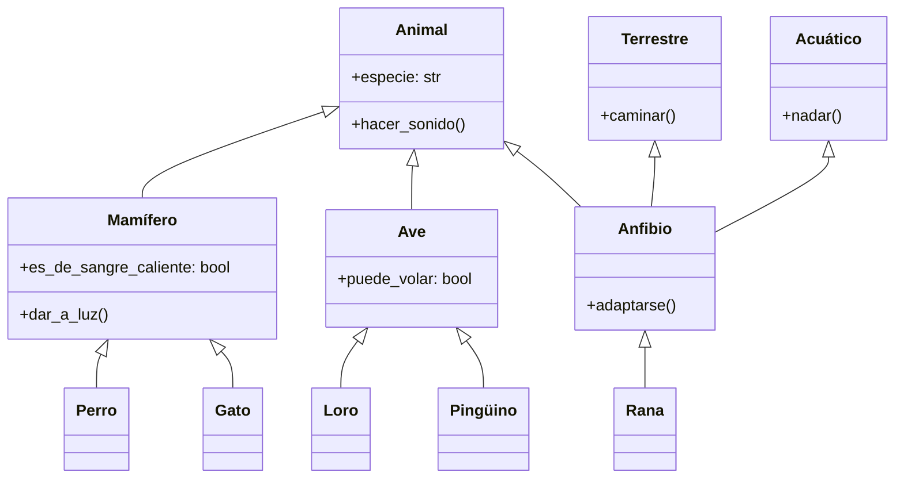

## Encapsulamiento

El encapsulamiento es frecuentemente descripto como el primer pilar de la programación orientada a objetos. Es el mecanismo de agrupar los datos (atributos) y los métodos (funciones) que operan sobre esos datos dentro de una única unidad u objeto. Este concepto también se conoce como ocultamiento de datos, ya que la representación interna del objeto se oculta al mundo exterior.

La importancia del encapsulamiento radica en varios aspectos clave:

1. **Protección de datos**: Al controlar el acceso a los datos del objeto a través de métodos, podemos asegurar que los datos se mantengan consistentes y válidos.
2. **Modularidad**: El encapsulamiento permite que los objetos sean autocontenidos, facilitando la comprensión y el mantenimiento del código.
3. **Flexibilidad**: La implementación interna puede ser modificada sin afectar otras partes del código que utilizan el objeto.
4. **Reducción de complejidad**: Al ocultar los detalles del funcionamiento interno, el encapsulamiento reduce la complejidad del sistema desde una perspectiva externa.

### Implementación en Python

Python ofrece varios mecanismos para implementar el encapsulamiento. Exploremos estos con ejemplos:

#### 1. Uso de atributos privados

En Python, podemos crear atributos privados prefijando el nombre del atributo con doble guion bajo (`__`). Esto activa el "name mangling", que hace que el atributo sea más difícil de acceder desde fuera de la clase.

```python
class CuentaBancaria:
    def __init__(self, numero_cuenta, saldo):
        self.__numero_cuenta = numero_cuenta  # Atributo privado
        self.__saldo = saldo  # Atributo privado

    def depositar(self, cantidad):
        if cantidad > 0:
            self.__saldo += cantidad
            return True
        return False

    def retirar(self, cantidad):
        if 0 < cantidad <= self.__saldo:
            self.__saldo -= cantidad
            return True
        return False

    def obtener_saldo(self):
        return self.__saldo

# Uso
cuenta = CuentaBancaria("1234567890", 1000)
print(cuenta.obtener_saldo())  # Salida: 1000
cuenta.depositar(500)
print(cuenta.obtener_saldo())  # Salida: 1500
cuenta.retirar(200)
print(cuenta.obtener_saldo())  # Salida: 1300

# Esto generará un AttributeError
# print(cuenta.__saldo)
```

En este ejemplo:
- `__numero_cuenta` y `__saldo` son atributos privados.
- Proporcionamos métodos públicos (`depositar`, `retirar`, `obtener_saldo`) para interactuar con estos atributos privados.
- El acceso directo a `__saldo` desde fuera de la clase generará una excepción `AttributeError`.

#### 2. Uso de propiedades

El decorador `@property` de Python nos permite definir métodos que pueden ser accedidos como atributos, proporcionando una forma más pythonica de implementar getters y setters.

```python
class Circulo:
    def __init__(self, radio):
        self._radio = radio

    @property
    def radio(self):
        return self._radio

    @radio.setter
    def radio(self, valor):
        if valor > 0:
            self._radio = valor
        else:
            raise ValueError("El radio debe ser positivo")

    @property
    def area(self):
        return 3.14159 * self._radio ** 2

# Uso
circulo = Circulo(5)
print(circulo.radio)  # Salida: 5
print(circulo.area)   # Salida: 78.53975

circulo.radio = 7
print(circulo.radio)  # Salida: 7
print(circulo.area)   # Salida: 153.93791

# Esto generará un ValueError
# circulo.radio = -1
```

En este ejemplo:
- `_radio` es un atributo protegido (el guion bajo simple es una convención para atributos protegidos en Python).
- La propiedad `radio` proporciona acceso de lectura y escritura a `_radio` con validación.
- La propiedad `area` es de solo lectura y se calcula al vuelo.

### Beneficios y mejores prácticas

Los beneficios del encapsulamiento son numerosos:

1. **Mejora de la mantenibilidad**: Los cambios en la implementación interna no afectan al código externo que utiliza la clase.
2. **Mayor seguridad**: Los atributos privados no pueden ser modificados accidentalmente desde fuera de la clase.
3. **Flexibilidad en la implementación**: Puedes cambiar cómo se almacenan o calculan los datos sin cambiar la interfaz pública.
4. **Mejor abstracción**: Los usuarios de la clase no necesitan conocer su funcionamiento interno.

Las mejores prácticas para el encapsulamiento en Python incluyen:

- Usar atributos privados (prefijo de doble guion bajo) para datos que no deben ser accedidos directamente desde fuera de la clase.
- Proporcionar métodos públicos o propiedades para el acceso controlado a los datos internos.
- Usar propiedades en lugar de métodos get/set para un enfoque más propio del paradigma Python.
- Documentar claramente la interfaz pública, incluyendo cualquier efecto secundario de los métodos.

Veamos un ejemplo más complejo que demuestra estas prácticas:

```python
class Empleado:
    def __init__(self, nombre, salario):
        self.__nombre = nombre
        self.__salario = salario
        self.__proyectos = []

    @property
    def nombre(self):
        return self.__nombre

    @property
    def salario(self):
        return self.__salario

    @salario.setter
    def salario(self, valor):
        if valor > 0:
            self.__salario = valor
        else:
            raise ValueError("El salario debe ser positivo")

    def agregar_proyecto(self, proyecto):
        """
        Agrega un proyecto a la lista de proyectos del empleado.

        :param proyecto: cadena que representa el nombre del proyecto
        """
        self.__proyectos.append(proyecto)

    def eliminar_proyecto(self, proyecto):
        """
        Elimina un proyecto de la lista de proyectos del empleado.

        :param proyecto: cadena que representa el nombre del proyecto
        :return: True si el proyecto fue eliminado, False si no se encontró
        """
        if proyecto in self.__proyectos:
            self.__proyectos.remove(proyecto)
            return True
        return False

    @property
    def cantidad_proyectos(self):
        return len(self.__proyectos)

    def __str__(self):
        return f"Empleado: {self.__nombre}, Salario: ${self.__salario}, Proyectos: {self.cantidad_proyectos}"

# Uso
emp = Empleado("Juan Pérez", 50000)
print(emp.nombre)  # Salida: Juan Pérez
print(emp.salario)  # Salida: 50000

emp.agregar_proyecto("Proyecto A")
emp.agregar_proyecto("Proyecto B")
print(emp.cantidad_proyectos)  # Salida: 2

emp.salario = 55000
print(emp)  # Salida: Empleado: Juan Pérez, Salario: $55000, Proyectos: 2

emp.eliminar_proyecto("Proyecto A")
print(emp.cantidad_proyectos)  # Salida: 1

# Esto generará un AttributeError
# print(emp.__proyectos)
```

Este ejemplo demuestra:
- Atributos privados (`__nombre`, `__salario`, `__proyectos`)
- Propiedades para acceso controlado (`nombre`, `salario`, `cantidad_proyectos`)
- Métodos públicos para manipular datos privados (`agregar_proyecto`, `eliminar_proyecto`)
- Documentación clara del comportamiento de los métodos
- Un método `__str__` personalizado para una representación de cadena agradable del objeto

Siguiendo estas prácticas, creamos una clase que es flexible y robusta, encarnando el principio de encapsulamiento.

---

## Herencia

La herencia es un concepto fundamental en la programación orientada a objetos que permite que una nueva clase se base en una clase existente. La nueva clase, conocida como clase derivada o clase hija, hereda atributos y métodos de la clase existente, llamada clase base o clase padre. Este mecanismo promueve la reutilización de código y establece una relación entre clases.

Los aspectos clave de la herencia incluyen:

1. **Reutilización de código**: La herencia permite reutilizar código de clases existentes, reduciendo la redundancia y promoviendo un desarrollo eficiente.
2. **Clasificación jerárquica**: Permite la creación de jerarquías de clases, representando relaciones y características comunes entre objetos.
3. **Extensibilidad**: Se puede agregar nueva funcionalidad a las clases existentes sin modificarlas, siguiendo el principio abierto-cerrado.
4. **Polimorfismo**: La herencia es un prerrequisito para el polimorfismo en tiempo de ejecución (que discutiremos en detalle más adelante).

### Tipos de herencia

Existen varios tipos de herencia, aunque no todos los lenguajes de programación admiten todos los tipos. Los principales tipos son:

1. **Herencia simple**: Una clase derivada hereda de una sola clase base.
2. **Herencia múltiple**: Una clase derivada hereda de múltiples clases base.
3. **Herencia multinivel**: Una clase derivada hereda de otra clase derivada.
4. **Herencia jerárquica**: Múltiples clases derivadas heredan de una sola clase base.
5. **Herencia híbrida**: Una combinación de dos o más tipos de herencia.

Python admite todos estos tipos de herencia. Exploremos cada uno con ejemplos.

#### Herencia simple

La herencia simple es la forma más básica de herencia, donde una clase hereda de una sola clase base.

```python
class Animal:
    def __init__(self, especie):
        self.especie = especie

    def hacer_sonido(self):
        pass

class Perro(Animal):
    def __init__(self, nombre):
        super().__init__("Canino")
        self.nombre = nombre

    def hacer_sonido(self):
        return "¡Guau!"

# Uso
perro = Perro("Buddy")
print(f"{perro.nombre} es un {perro.especie}")  # Salida: Buddy es un Canino
print(perro.hacer_sonido())  # Salida: ¡Guau!
```

En este ejemplo:
- `Animal` es la clase base con un método genérico `hacer_sonido`.
- `Perro` es derivado de `Animal`, heredando sus atributos y métodos.
- `Perro` sobrescribe el método `hacer_sonido` con su propia implementación.
- Usamos `super().__init__()` para llamar al inicializador de la clase base.

#### Herencia múltiple

La herencia múltiple permite que una clase herede de múltiples clases base. Algunos lenguajes no permiten este tipo de herencia.

```python
class Volador:
    def volar(self):
        return "¡Puedo volar!"

class Nadador:
    def nadar(self):
        return "¡Puedo nadar!"

class Pato(Animal, Volador, Nadador):
    def __init__(self, nombre):
        Animal.__init__(self, "Ave")
        self.nombre = nombre

    def hacer_sonido(self):
        return "¡Cuac!"

# Uso
pato = Pato("Donald")
print(f"{pato.nombre} es un {pato.especie}")  # Salida: Donald es un Ave
print(pato.hacer_sonido())  # Salida: ¡Cuac!
print(pato.volar())  # Salida: ¡Puedo volar!
print(pato.nadar())  # Salida: ¡Puedo nadar!
```

Aquí, `Pato` hereda de `Animal`, `Volador` y `Nadador`, combinando atributos y métodos de las tres clases.

#### Herencia multinivel

En la herencia multinivel, una clase derivada hereda de otra clase derivada.

```python
class Mamifero(Animal):
    def __init__(self, especie, es_de_sangre_caliente=True):
        super().__init__(especie)
        self.es_de_sangre_caliente = es_de_sangre_caliente

    def dar_a_luz(self):
        return "Dando a luz crías vivas"

class Gato(Mamifero):
    def __init__(self, nombre):
        super().__init__("Felino")
        self.nombre = nombre

    def hacer_sonido(self):
        return "¡Miau!"

# Uso
gato = Gato("Bigotes")
print(f"{gato.nombre} es un {gato.especie}")  # Salida: Bigotes es un Felino
print(gato.hacer_sonido())  # Salida: ¡Miau!
print(gato.dar_a_luz())  # Salida: Dando a luz crías vivas
print(f"¿Es de sangre caliente? {gato.es_de_sangre_caliente}")  # Salida: ¿Es de sangre caliente? True
```

En este ejemplo, `Gato` hereda de `Mamifero`, que a su vez hereda de `Animal`, formando una cadena de herencia multinivel.

#### Herencia jerárquica

La herencia jerárquica implica múltiples clases derivadas heredando de una sola clase base.

```python
class Ave(Animal):
    def __init__(self, especie, puede_volar=True):
        super().__init__(especie)
        self.puede_volar = puede_volar

class Loro(Ave):
    def __init__(self, nombre):
        super().__init__("Psitácido", puede_volar=True)
        self.nombre = nombre

    def hacer_sonido(self):
        return "¡Squawk!"

class Pinguino(Ave):
    def __init__(self, nombre):
        super().__init__("Esfenisciforme", puede_volar=False)
        self.nombre = nombre

    def hacer_sonido(self):
        return "¡Honk!"

# Uso
loro = Loro("Polly")
pinguino = Pinguino("Pingu")

print(f"{loro.nombre} puede volar: {loro.puede_volar}")  # Salida: Polly puede volar: True
print(f"{pinguino.nombre} puede volar: {pinguino.puede_volar}")  # Salida: Pingu puede volar: False
```

Aquí, tanto `Loro` como `Pinguino` heredan de `Ave`, lo que demuestra la herencia jerárquica.

#### Herencia híbrida

La herencia híbrida es una combinación de múltiples tipos de herencia. Veamos un ejemplo más complejo para ilustrar esto:

```python
class Terrestre:
    def caminar(self):
        return "Caminando en tierra"

class Acuatico:
    def nadar(self):
        return "Nadando en el agua"

class Anfibio(Animal, Terrestre, Acuatico):
    def __init__(self, especie):
        Animal.__init__(self, especie)

    def adaptarse(self):
        return "Puede sobrevivir tanto en tierra como en agua"

class Rana(Anfibio):
    def __init__(self, nombre):
        super().__init__("Anuro")
        self.nombre = nombre

    def hacer_sonido(self):
        return "¡Croac!"

# Uso
rana = Rana("Kermit")
print(f"{rana.nombre} es un {rana.especie}")  # Salida: Kermit es un Anuro
print(rana.hacer_sonido())  # Salida: ¡Croac!
print(rana.caminar())  # Salida: Caminando en tierra
print(rana.nadar())  # Salida: Nadando en el agua
print(rana.adaptarse())  # Salida: Puede sobrevivir tanto en tierra como en agua
```

Este ejemplo demuestra la herencia híbrida:
- `Rana` hereda de `Anfibio`
- `Anfibio` hereda de `Animal`, `Terrestre`, y `Acuatico`
- Esto crea una combinación de herencia multinivel y múltiple

### Consideraciones

La herencia ofrece varias ventajas. Sin embargo, también hay consideraciones importantes:

1. **Complejidad**: Las jerarquías de herencia profundas pueden volverse difíciles de entender y mantener.
2. **Acoplamiento fuerte**: La herencia crea un acoplamiento fuerte entre las clases base y derivadas.
3. **Problema de la clase base frágil**: Los cambios en la clase base pueden afectar inesperadamente a las clases derivadas.
4. **Problema del diamante**: En la herencia múltiple, pueden surgir conflictos si dos clases base tienen métodos con el mismo nombre.

Para abordar estas consideraciones:

- Prefiere la composición sobre la herencia cuando sea posible.
- Mantén las jerarquías de herencia poco profundas y enfocadas.
- Utiliza clases base abstractas para definir interfaces claras.
- Ten cuidado con la herencia múltiple y resuelve los conflictos explícitamente.

Visualicemos las relaciones de herencia que hemos discutido utilizando un diagrama de clases UML:



Este diagrama ilustra las relaciones de herencia entre las clases que hemos discutido, mostrando tanto la herencia simple como la múltiple.

---

## Polimorfismo

El polimorfismo es un concepto fundamental en la programación orientada a objetos que permite que objetos de diferentes clases sean tratados como objetos de una clase base común. El término "polimorfismo" proviene del griego y significa "muchas formas". En POO, se refiere a la capacidad de una única interfaz para representar diferentes formas subyacentes (tipos de datos o clases).

El polimorfismo permite escribir código flexible y reutilizable al permitirnos trabajar con objetos a un nivel más abstracto, sin necesidad de conocer sus tipos específicos.

Existen dos tipos principales de polimorfismo en la programación orientada a objetos:

1. **Polimorfismo en tiempo de compilación (Polimorfismo estático)**
   - Se logra a través de la *sobrecarga* de métodos.
   - Se resuelve en tiempo de compilación.

2. **Polimorfismo en tiempo de ejecución (Polimorfismo dinámico)**
   - Se logra a través de la *sobrescritura* de métodos.
   - Se resuelve en tiempo de ejecución.

Python admite principalmente el polimorfismo en tiempo de ejecución, ya que es un lenguaje de tipado dinámico. Sin embargo, podemos demostrar conceptos similares al polimorfismo en tiempo de compilación también.

Exploremos diferentes aspectos del polimorfismo en Python:

### Duck typing

Python utiliza el duck typing, que es una forma de polimorfismo. La idea es: "Si camina como un pato y grazna como un pato, entonces debe ser un pato". En otras palabras, Python se preocupa más por los métodos que tiene un objeto que por el tipo del objeto en sí.

```python
class Pato:
    def hablar(self):
        return "¡Cuac cuac!"

class Perro:
    def hablar(self):
        return "¡Guau guau!"

class Gato:
    def hablar(self):
        return "¡Miau miau!"

def sonido_animal(animal):
    return animal.hablar()

# Uso
pato = Pato()
perro = Perro()
gato = Gato()

print(sonido_animal(pato))   # Salida: ¡Cuac cuac!
print(sonido_animal(perro))  # Salida: ¡Guau guau!
print(sonido_animal(gato))   # Salida: ¡Miau miau!
```

En este ejemplo, `sonido_animal()` funciona con cualquier objeto que tenga un método `hablar()`, independientemente de su clase.

### Sobrescritura de métodos

La sobrescritura de métodos es un aspecto clave del polimorfismo en tiempo de ejecución. Ocurre cuando una clase derivada define un método con el mismo nombre que un método en su clase base.

```python
class Figura:
    def area(self):
        pass

class Rectangulo(Figura):
    def __init__(self, ancho, alto):
        self.ancho = ancho
        self.alto = alto

    def area(self):
        return self.ancho * self.alto

class Circulo(Figura):
    def __init__(self, radio):
        self.radio = radio

    def area(self):
        return 3.14159 * self.radio ** 2

# Uso
figuras = [Rectangulo(5, 4), Circulo(3)]

for figura in figuras:
    print(f"Área: {figura.area()}")

# Salida:
# Área: 20
# Área: 28.27431
```

Aquí, `Rectangulo` y `Circulo` sobrescriben el método `area()` de la clase `Figura`.

### Sobrecarga de operadores

Python permite la sobrecarga de operadores, que es una forma de polimorfismo en tiempo de compilación. Permite que el mismo operador tenga diferentes significados según los operandos.

```python
class Vector:
    def __init__(self, x, y):
        self.x = x
        self.y = y

    def __add__(self, otro):
        return Vector(self.x + otro.x, self.y + otro.y)

    def __str__(self):
        return f"Vector({self.x}, {self.y})"

# Uso
v1 = Vector(2, 3)
v2 = Vector(3, 4)
v3 = v1 + v2

print(v3)  # Salida: Vector(5, 7)
```

Aquí, hemos sobrecargado el operador `+` para nuestra clase `Vector`.

### Clases base abstractas

El módulo `abc` de Python proporciona infraestructura para definir clases base abstractas, que son una forma poderosa de definir interfaces en Python.

```python
from abc import ABC, abstractmethod

class Animal(ABC):
    @abstractmethod
    def hacer_sonido(self):
        pass

class Perro(Animal):
    def hacer_sonido(self):
        return "¡Guau!"

class Gato(Animal):
    def hacer_sonido(self):
        return "¡Miau!"

# Uso
def sonido_animal(animal):
    return animal.hacer_sonido()

perro = Perro()
gato = Gato()

print(sonido_animal(perro))  # Salida: ¡Guau!
print(sonido_animal(gato))   # Salida: ¡Miau!

# Esto generará un TypeError
# animal = Animal()
```

Las clases base abstractas no pueden ser instanciadas y obligan a las clases derivadas a implementar ciertos métodos, asegurando una interfaz consistente.

### Aplicaciones en el mundo real

El polimorfismo se utiliza ampliamente en aplicaciones del mundo real:

1. **Frameworks de GUI**: Diferentes widgets (botones, cajas de texto) pueden responder a eventos comunes (clic, hover) de sus propias maneras.
2. **Interfaces de bases de datos**: Diferentes sistemas de bases de datos pueden implementar una interfaz común para consultas, permitiendo que las aplicaciones trabajen con varias bases de datos sin cambiar el código.
3. **Sistemas de plugins**: Las aplicaciones pueden trabajar con plugins a través de una interfaz común, independientemente de la implementación específica de cada plugin.
4. **Desarrollo de juegos**: Diferentes entidades del juego pueden compartir comportamientos comunes (mover, colisionar) pero implementarlos de manera diferente.

Aquí hay un ejemplo simple de un sistema de plugins:

```python
class Plugin(ABC):
    @abstractmethod
    def procesar(self, datos):
        pass

class PluginMayusculas(Plugin):
    def procesar(self, datos):
        return datos.upper()

class PluginInvertir(Plugin):
    def procesar(self, datos):
        return datos[::-1]

class Aplicacion:
    def __init__(self):
        self.plugins = []

    def agregar_plugin(self, plugin):
        self.plugins.append(plugin)

    def procesar_datos(self, datos):
        for plugin in self.plugins:
            datos = plugin.procesar(datos)
        return datos

# Uso
app = Aplicacion()
app.agregar_plugin(PluginMayusculas())
app.agregar_plugin(PluginInvertir())

resultado = app.procesar_datos("Hola, Mundo!")
print(resultado)  # Salida: !ODNUM ,ALOH
```

Este ejemplo demuestra cómo el polimorfismo permite que la clase `Aplicacion` trabaje con diferentes plugins a través de una interfaz común.

---

## Abstracción

La abstracción es el proceso de ocultar los detalles complejos de implementación y mostrar solo las características necesarias de un objeto. Se trata de crear una vista simplificada de un objeto que represente sus características esenciales sin incluir detalles de fondo o explicaciones.

Los aspectos clave de la abstracción incluyen:

1. **Simplificación**: La abstracción reduce la complejidad ocultando detalles innecesarios.
2. **Enfoque en características esenciales**: Enfatiza lo que hace un objeto en lugar de cómo lo hace.
3. **Separación de preocupaciones**: Permite separar la interfaz de una clase de su implementación.
4. **Modularidad**: La abstracción promueve el diseño modular al definir límites claros entre componentes.

### Clases abstractas e interfaces

En muchos lenguajes orientados a objetos, la abstracción se implementa a través de clases abstractas e interfaces. Aunque Python no tiene un concepto integrado de interfaz, podemos lograr una funcionalidad similar usando clases base abstractas. El módulo `abc` de Python proporciona infraestructura para definir clases base abstractas:

```python
from abc import ABC, abstractmethod

class Figura(ABC):
    @abstractmethod
    def area(self):
        pass

    @abstractmethod
    def perimetro(self):
        pass

class Rectangulo(Figura):
    def __init__(self, ancho, alto):
        self.ancho = ancho
        self.alto = alto

    def area(self):
        return self.ancho * self.alto

    def perimetro(self):
        return 2 * (self.ancho + self.alto)

class Circulo(Figura):
    def __init__(self, radio):
        self.radio = radio

    def area(self):
        return 3.14159 * self.radio ** 2

    def perimetro(self):
        return 2 * 3.14159 * self.radio

# Uso
# figuras = [Figura()]  # Esto generaría TypeError
figuras = [Rectangulo(5, 4), Circulo(3)]

for figura in figuras:
    print(f"Área: {figura.area()}, Perímetro: {figura.perimetro()}")

# Salida:
# Área: 20, Perímetro: 18
# Área: 28.27431, Perímetro: 18.84954
```

En este ejemplo:
- `Figura` es una clase base abstracta que define la interfaz para todas las figuras.
- `Rectangulo` y `Circulo` son clases concretas que implementan la interfaz `Figura`.
- No podemos instanciar `Figura` directamente, pero podemos usarla como un tipo común para todas las figuras.

### Implementando abstracción en Python

Aunque Python proporciona clases base abstractas para definir interfaces formalmente, también podemos lograr la abstracción mediante convenciones y documentación. Veamos un ejemplo sin utilizar `ABC`:

```python
class BaseDeDatos:
    def conectar(self):
        raise NotImplementedError("La subclase debe implementar este método abstracto")

    def ejecutar(self, consulta):
        raise NotImplementedError("La subclase debe implementar este método abstracto")

class BaseDeDatosMySQL(BaseDeDatos):
    def conectar(self):
        print("Conectando a la base de datos MySQL...")

    def ejecutar(self, consulta):
        print(f"Ejecutando consulta MySQL: {consulta}")

class BaseDeDatosPostgreSQL(BaseDeDatos):
    def conectar(self):
        print("Conectando a la base de datos PostgreSQL...")

    def ejecutar(self, consulta):
        print(f"Ejecutando consulta PostgreSQL: {consulta}")

def realizar_operacion_en_bd(base_de_datos):
    base_de_datos.conectar()
    base_de_datos.ejecutar("SELECT * FROM usuarios")

# Uso
bd_mysql = BaseDeDatosMySQL()
bd_postgres = BaseDeDatosPostgreSQL()

realizar_operacion_en_bd(bd_mysql)
realizar_operacion_en_bd(bd_postgres)

# Salida:
# Conectando a la base de datos MySQL...
# Ejecutando consulta MySQL: SELECT * FROM usuarios
# Conectando a la base de datos PostgreSQL...
# Ejecutando consulta PostgreSQL: SELECT * FROM usuarios
```

En este ejemplo:
- `BaseDeDatos` es una clase base abstracta (aunque no usa `ABC`) que define la interfaz para todos los tipos de bases de datos.
- `BaseDeDatosMySQL` y `BaseDeDatosPostgreSQL` son implementaciones concretas.
- `realizar_operacion_en_bd` trabaja con cualquier objeto que cumpla con la interfaz de `BaseDeDatos`.

### Principios de diseño y patrones

La abstracción es un componente clave de varios principios y patrones de diseño importantes:

1. **Principios SOLID**:
   - Principio de Responsabilidad Única (SRP).
   - Principio de Abierto/Cerrado (OCP).
   - Principio de Sustitución de Liskov (LSP).
   - Principio de Segregación de Interfaces (ISP).
   - Principio de Inversión de Dependencias (DIP).

2. **Patrones de Diseño**:
   - Patrón método de fábrica.
   - Patrón fábrica abstracta.
   - Patrón estrategia.
   - Patrón método plantilla.

Veamos una implementación del patrón estrategia:

```python
from abc import ABC, abstractmethod

class EstrategiaOrdenamiento(ABC):
    @abstractmethod
    def ordenar(self, datos):
        pass

class OrdenamientoBurbuja(EstrategiaOrdenamiento):
    def ordenar(self, datos):
        print("Realizando ordenamiento de burbuja")
        return sorted(datos)  # Usamos sorted() de Python por simplicidad

class OrdenamientoRapido(EstrategiaOrdenamiento):
    def ordenar(self, datos):
        print("Realizando ordenamiento rápido")
        return sorted(datos)  # Usamos sorted() de Python por simplicidad

class Ordenador:
    def __init__(self, estrategia):
        self.estrategia = estrategia

    def ordenar(self, datos):
        return self.estrategia.ordenar(datos)

# Uso
datos = [3, 1, 4, 1, 5, 9, 2, 6, 5, 3, 5]

ordenador_burbuja = Ordenador(OrdenamientoBurbuja())
print(ordenador_burbuja.ordenar(datos))

ordenador_rapido = Ordenador(OrdenamientoRapido())
print(ordenador_rapido.ordenar(datos))

# Salida:
# Realizando ordenamiento de burbuja
# [1, 1, 2, 3, 3, 4, 5, 5, 5, 6, 9]
# Realizando ordenamiento rápido
# [1, 1, 2, 3, 3, 4, 5, 5, 5, 6, 9]
```

Este ejemplo del Patrón Estrategia muestra cómo la abstracción nos permite definir una familia de algoritmos, encapsular cada uno y hacerlos intercambiables. La clase `Ordenador` no necesita conocer los detalles de cómo funciona cada algoritmo de ordenamiento; solo sabe que puede llamar al método `ordenar` en cualquier objeto `EstrategiaOrdenamiento`.

---

## Interacción de los conceptos de POO

Aunque hemos discutido el encapsulamiento, herencia, polimorfismo y abstracción por separado, en la práctica estos conceptos trabajan juntos para crear diseños de software potentes y flexibles. Veamos cómo interactúan estos conceptos:

### Encapsulamiento y Abstracción

El encapsulamiento y la abstracción a menudo trabajan de la mano. El encapsulamiento proporciona el mecanismo para ocultar los detalles de implementación, mientras que la abstracción decide qué ocultar y qué exponer.

```python
class Coche:
    def __init__(self):
        self.__nivel_combustible = 0  # Atributo encapsulado

    def agregar_combustible(self, cantidad):
        if cantidad > 0:
            self.__nivel_combustible += cantidad

    def conducir(self):
        if self.__nivel_combustible > 0:
            print("El coche está en marcha.")
            self.__consumir_combustible()
        else:
            print("El coche se ha quedado sin combustible.")

    def __consumir_combustible(self):
        self.__nivel_combustible -= 1

# Uso
coche = Coche()
coche.agregar_combustible(10)
coche.conducir()  # Salida: El coche está en marcha.
```

En este ejemplo, `__nivel_combustible` y `__consumir_combustible()` están encapsulados (ocultos), mientras que `agregar_combustible()` y `conducir()` proporcionan una abstracción del comportamiento del coche.

### Herencia y Polimorfismo

La herencia proporciona la estructura para que opere el polimorfismo. La sobrescritura de métodos, un aspecto clave del polimorfismo, solo es posible gracias a la herencia.

```python
class Animal:
    def hablar(self):
        pass

class Perro(Animal):
    def hablar(self):
        return "¡Guau!"

class Gato(Animal):
    def hablar(self):
        return "¡Miau!"

def sonido_animal(animal):
    return animal.hablar()

# Uso
perro = Perro()
gato = Gato()

print(sonido_animal(perro))  # Salida: ¡Guau!
print(sonido_animal(gato))   # Salida: ¡Miau!
```

Aquí, la herencia permite que `Perro` y `Gato` hereden de `Animal`, mientras que el polimorfismo permite que `sonido_animal()` funcione con cualquier subclase de `Animal`.

### Abstracción y Polimorfismo

Las clases base abstractas proporcionan una poderosa forma de definir interfaces que soporten el polimorfismo:

```python
from abc import ABC, abstractmethod
import math

class Figura(ABC):
    @abstractmethod
    def area(self):
        pass

class Rectangulo(Figura):
    def __init__(self, ancho, alto):
        self.ancho = ancho
        self.alto = alto

    def area(self):
        return self.ancho * self.alto

class Circulo(Figura):
    def __init__(self, radio):
        self.radio = radio

    def area(self):
        return math.pi * self.radio ** 2

def imprimir_area(figura):
    print(f"El área es: {figura.area()}")

# Uso
rectangulo = Rectangulo(5, 4)
circulo = Circulo(3)

imprimir_area(rectangulo)  # Salida: El área es: 20
imprimir_area(circulo)     # Salida: El área es: 28.274333882308138
```

La clase abstracta `Figura` define una interfaz que permite el comportamiento polimórfico en la función `imprimir_area()`.

### Encapsulamiento y Herencia

El encapsulamiento afecta cómo se heredan los atributos y métodos:

```python
class Padre:
    def __init__(self):
        self.atributo_publico = "Soy público"
        self._atributo_protegido = "Soy protegido"
        self.__atributo_privado = "Soy privado"

    def metodo_publico(self):
        return "Método público"

    def _metodo_protegido(self):
        return "Método protegido"

    def __metodo_privado(self):
        return "Método privado"

class Hijo(Padre):
    def acceder_miembros_padre(self):
        print(self.atributo_publico)
        print(self._atributo_protegido)
        # print(self.__atributo_privado)  # Esto lanzaría un AttributeError
        print(self.metodo_publico())
        print(self._metodo_protegido())
        # print(self.__metodo_privado())  # Esto lanzaría un AttributeError

# Uso
hijo = Hijo()
hijo.acceder_miembros_padre()
```

En este ejemplo, la clase hija puede acceder a los miembros públicos y protegidos de la clase padre, pero no a los miembros privados.

---

## Conclusión

La Programación Orientada a Objetos es un paradigma poderoso que proporciona una forma de estructurar el código que refleja estrechamente las entidades del mundo real y sus interacciones. Los cuatro conceptos fundamentales que hemos explorado - encapsulamiento, herencia, polimorfismo y abstracción - trabajan juntos para crear código flexible, mantenible y reutilizable.

- El **encapsulamiento** nos permite agrupar datos y métodos, ocultando detalles internos y protegiendo la integridad de los datos.
- La **herencia** permite la reutilización de código y la creación de relaciones jerárquicas entre clases.
- El **polimorfismo** proporciona una forma de usar objetos de diferentes tipos a través de una interfaz común, mejorando la flexibilidad y extensibilidad.
- La **abstracción** nos permite crear modelos simplificados de sistemas complejos, enfocándonos en las características esenciales y ocultando los detalles innecesarios.

A medida que continúes tu viaje en el desarrollo de software, descubrirás que dominar estos conceptos abre nuevas formas de pensar y resolver problemas. Recuerda que la POO no se trata solo de sintaxis o características del lenguaje; es una mentalidad para modelar sistemas complejos y gestionar la complejidad en el software.

---

## Referencias

1. Gamma, E., Helm, R., Johnson, R., & Vlissides, J. (1994). Design Patterns: Elements of Reusable Object-Oriented Software. Addison-Wesley.
2. Martin, R. C. (2017). Clean Architecture: A Craftsman's Guide to Software Structure and Design. Prentice Hall.
3. Phillips, D. (2010). Python 3 Object Oriented Programming. Packt Publishing.
4. Lutz, M. (2013). Learning Python: Powerful Object-Oriented Programming. O'Reilly Media.
5. Ramalho, L. (2015). Fluent Python: Clear, Concise, and Effective Programming. O'Reilly Media.
6. Van Rossum, G., Warsaw, B., & Coghlan, N. (2001). PEP 8 -- Style Guide for Python Code. Python.org. https://www.python.org/dev/peps/pep-0008/
7. Python Software Foundation. (n.d.). The Python Standard Library. Python.org. https://docs.python.org/3/library/

---

{}
¡Felicitaciones por llegar hasta acá! Espero que este recorrido por el universo de la programación te haya resultado tan interesante como lo fue para mí al escribirlo.

Queremos conocer tu opinión, así que no dudes en compartir tus comentarios, sugerencias y esas ideas brillantes que seguro tenés.

Además, para explorar más allá de estas líneas, date una vuelta por los ejemplos prácticos que armamos para vos. Todo el código y los proyectos los encontrarás en nuestro repositorio de GitHub [learn-software-engineering/examples-programming](https://github.com/learn-software-engineering/examples-programming).

Gracias por ser parte de esta comunidad de aprendizaje. ¡Seguí programando y explorando nuevas areas en este fascinante mundo del software!
{}

---
