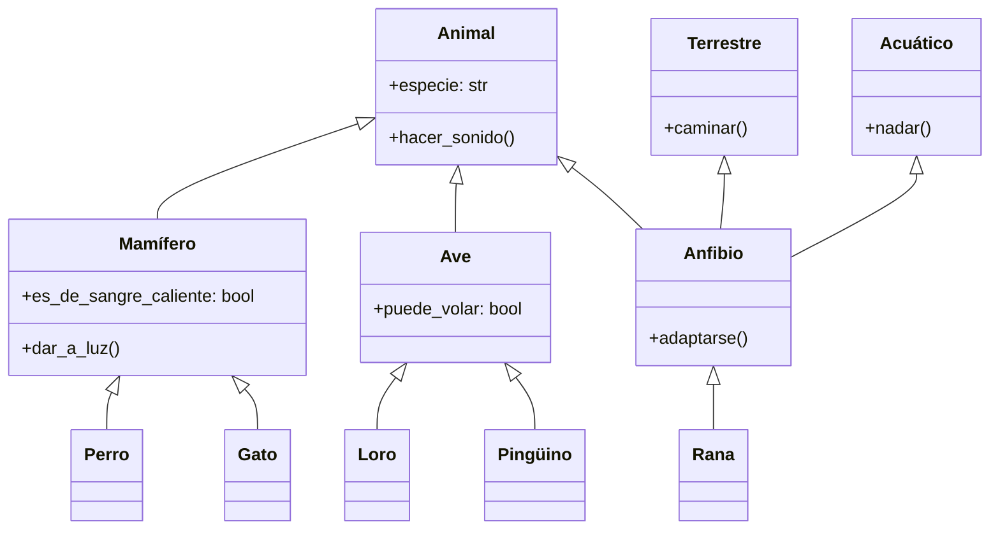

Los aspectos clave de la herencia incluyen:

1. **Reutilización de código**: La herencia permite reutilizar código de clases existentes, reduciendo la redundancia y promoviendo un desarrollo eficiente.
2. **Clasificación jerárquica**: Permite la creación de jerarquías de clases, representando relaciones y características comunes entre objetos.
3. **Extensibilidad**: Se puede agregar nueva funcionalidad a las clases existentes sin modificarlas, siguiendo el principio abierto-cerrado.
4. **Polimorfismo**: La herencia es un prerrequisito para el polimorfismo en tiempo de ejecución (que discutiremos en detalle más adelante).

### Tipos de herencia

Existen varios tipos de herencia, aunque no todos los lenguajes de programación admiten todos los tipos. Los principales tipos son:

1. **Herencia simple**: Una clase derivada hereda de una sola clase base.
2. **Herencia múltiple**: Una clase derivada hereda de múltiples clases base.
3. **Herencia multinivel**: Una clase derivada hereda de otra clase derivada.
4. **Herencia jerárquica**: Múltiples clases derivadas heredan de una sola clase base.
5. **Herencia híbrida**: Una combinación de dos o más tipos de herencia.

Python admite todos estos tipos de herencia. Exploremos cada uno con ejemplos.

#### Herencia simple

La herencia simple es la forma más básica de herencia, donde una clase hereda de una sola clase base.

```python
class Animal:
    def __init__(self, especie):
        self.especie = especie

    def hacer_sonido(self):
        pass

class Perro(Animal):
    def __init__(self, nombre):
        super().__init__("Canino")
        self.nombre = nombre

    def hacer_sonido(self):
        return "¡Guau!"

# Uso
perro = Perro("Buddy")
print(f"{perro.nombre} es un {perro.especie}")  # Salida: Buddy es un Canino
print(perro.hacer_sonido())  # Salida: ¡Guau!
```

En este ejemplo:
- `Animal` es la clase base con un método genérico `hacer_sonido`.
- `Perro` es derivado de `Animal`, heredando sus atributos y métodos.
- `Perro` sobrescribe el método `hacer_sonido` con su propia implementación.
- Usamos `super().__init__()` para llamar al inicializador de la clase base.

#### Herencia múltiple

La herencia múltiple permite que una clase herede de múltiples clases base. Algunos lenguajes no permiten este tipo de herencia.

```python
class Volador:
    def volar(self):
        return "¡Puedo volar!"

class Nadador:
    def nadar(self):
        return "¡Puedo nadar!"

class Pato(Animal, Volador, Nadador):
    def __init__(self, nombre):
        Animal.__init__(self, "Ave")
        self.nombre = nombre

    def hacer_sonido(self):
        return "¡Cuac!"

# Uso
pato = Pato("Donald")
print(f"{pato.nombre} es un {pato.especie}")  # Salida: Donald es un Ave
print(pato.hacer_sonido())  # Salida: ¡Cuac!
print(pato.volar())  # Salida: ¡Puedo volar!
print(pato.nadar())  # Salida: ¡Puedo nadar!
```

Aquí, `Pato` hereda de `Animal`, `Volador` y `Nadador`, combinando atributos y métodos de las tres clases.

#### Herencia multinivel

En la herencia multinivel, una clase derivada hereda de otra clase derivada.

```python
class Mamifero(Animal):
    def __init__(self, especie, es_de_sangre_caliente=True):
        super().__init__(especie)
        self.es_de_sangre_caliente = es_de_sangre_caliente

    def dar_a_luz(self):
        return "Dando a luz crías vivas"

class Gato(Mamifero):
    def __init__(self, nombre):
        super().__init__("Felino")
        self.nombre = nombre

    def hacer_sonido(self):
        return "¡Miau!"

# Uso
gato = Gato("Bigotes")
print(f"{gato.nombre} es un {gato.especie}")  # Salida: Bigotes es un Felino
print(gato.hacer_sonido())  # Salida: ¡Miau!
print(gato.dar_a_luz())  # Salida: Dando a luz crías vivas
print(f"¿Es de sangre caliente? {gato.es_de_sangre_caliente}")  # Salida: ¿Es de sangre caliente? True
```

En este ejemplo, `Gato` hereda de `Mamifero`, que a su vez hereda de `Animal`, formando una cadena de herencia multinivel.

#### Herencia jerárquica

La herencia jerárquica implica múltiples clases derivadas heredando de una sola clase base.

```python
class Ave(Animal):
    def __init__(self, especie, puede_volar=True):
        super().__init__(especie)
        self.puede_volar = puede_volar

class Loro(Ave):
    def __init__(self, nombre):
        super().__init__("Psitácido", puede_volar=True)
        self.nombre = nombre

    def hacer_sonido(self):
        return "¡Squawk!"

class Pinguino(Ave):
    def __init__(self, nombre):
        super().__init__("Esfenisciforme", puede_volar=False)
        self.nombre = nombre

    def hacer_sonido(self):
        return "¡Honk!"

# Uso
loro = Loro("Polly")
pinguino = Pinguino("Pingu")

print(f"{loro.nombre} puede volar: {loro.puede_volar}")  # Salida: Polly puede volar: True
print(f"{pinguino.nombre} puede volar: {pinguino.puede_volar}")  # Salida: Pingu puede volar: False
```

Aquí, tanto `Loro` como `Pinguino` heredan de `Ave`, lo que demuestra la herencia jerárquica.

#### Herencia híbrida

La herencia híbrida es una combinación de múltiples tipos de herencia. Veamos un ejemplo más complejo para ilustrar esto:

```python
class Terrestre:
    def caminar(self):
        return "Caminando en tierra"

class Acuatico:
    def nadar(self):
        return "Nadando en el agua"

class Anfibio(Animal, Terrestre, Acuatico):
    def __init__(self, especie):
        Animal.__init__(self, especie)

    def adaptarse(self):
        return "Puede sobrevivir tanto en tierra como en agua"

class Rana(Anfibio):
    def __init__(self, nombre):
        super().__init__("Anuro")
        self.nombre = nombre

    def hacer_sonido(self):
        return "¡Croac!"

# Uso
rana = Rana("Kermit")
print(f"{rana.nombre} es un {rana.especie}")  # Salida: Kermit es un Anuro
print(rana.hacer_sonido())  # Salida: ¡Croac!
print(rana.caminar())  # Salida: Caminando en tierra
print(rana.nadar())  # Salida: Nadando en el agua
print(rana.adaptarse())  # Salida: Puede sobrevivir tanto en tierra como en agua
```

Este ejemplo demuestra la herencia híbrida:
- `Rana` hereda de `Anfibio`
- `Anfibio` hereda de `Animal`, `Terrestre`, y `Acuatico`
- Esto crea una combinación de herencia multinivel y múltiple

### Consideraciones

La herencia ofrece varias ventajas. Sin embargo, también hay consideraciones importantes:

1. **Complejidad**: Las jerarquías de herencia profundas pueden volverse difíciles de entender y mantener.
2. **Acoplamiento fuerte**: La herencia crea un acoplamiento fuerte entre las clases base y derivadas.
3. **Problema de la clase base frágil**: Los cambios en la clase base pueden afectar inesperadamente a las clases derivadas.
4. **Problema del diamante**: En la herencia múltiple, pueden surgir conflictos si dos clases base tienen métodos con el mismo nombre.

Para abordar estas consideraciones:

- Prefiere la composición sobre la herencia cuando sea posible.
- Mantén las jerarquías de herencia poco profundas y enfocadas.
- Utiliza clases base abstractas para definir interfaces claras.
- Ten cuidado con la herencia múltiple y resuelve los conflictos explícitamente.

Visualicemos las relaciones de herencia que hemos discutido utilizando un diagrama de clases UML:



Este diagrama ilustra las relaciones de herencia entre las clases que hemos discutido, mostrando tanto la herencia simple como la múltiple.

---

## Referencias

1. Gamma, E., Helm, R., Johnson, R., & Vlissides, J. (1994). Design Patterns: Elements of Reusable Object-Oriented Software. Addison-Wesley.
2. Martin, R. C. (2017). Clean Architecture: A Craftsman's Guide to Software Structure and Design. Prentice Hall.
3. Phillips, D. (2010). Python 3 Object Oriented Programming. Packt Publishing.
4. Lutz, M. (2013). Learning Python: Powerful Object-Oriented Programming. O'Reilly Media.
5. Ramalho, L. (2015). Fluent Python: Clear, Concise, and Effective Programming. O'Reilly Media.
6. Van Rossum, G., Warsaw, B., & Coghlan, N. (2001). PEP 8 -- Style Guide for Python Code. Python.org. https://www.python.org/dev/peps/pep-0008/
7. Python Software Foundation. (n.d.). The Python Standard Library. Python.org. https://docs.python.org/3/library/

---

{}
¡Felicitaciones por llegar hasta acá! Espero que este recorrido por el universo de la programación te haya resultado tan interesante como lo fue para mí al escribirlo.

Queremos conocer tu opinión, así que no dudes en compartir tus comentarios, sugerencias y esas ideas brillantes que seguro tenés.

Además, para explorar más allá de estas líneas, date una vuelta por los ejemplos prácticos que armamos para vos. Todo el código y los proyectos los encontrarás en nuestro repositorio de GitHub [learn-software-engineering/examples-programming](https://github.com/learn-software-engineering/examples-programming).

Gracias por ser parte de esta comunidad de aprendizaje. ¡Seguí programando y explorando nuevas areas en este fascinante mundo del software!
{}

---
